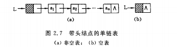
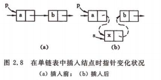
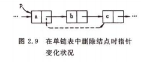
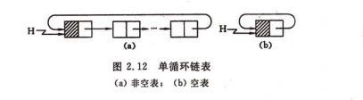
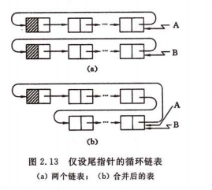
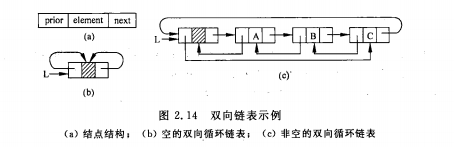
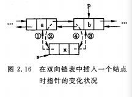

# 线性表

## 线性表的定义类型

线性表：n个数据元素的有限序列。

长度为0称为空表。

## 线性表的顺序表示和实现

线性表的顺序表示指的是同一组地址连续的存储单元依次存储线性表的数据元素。

假设每个元素占l个存储单元，以所占的第一个单元的存储地址作为数据元素的存储位置，则线性表中第i+1个元素的存储位置LOC（a<sub>i+1</sub>）和第i个数据元素的存储位置LOC（a<sub>i</sub>）之间满足下列关系：
> LOC(a<sub>i+1</sub>)=LOC(a<sub>i</sub>)+l

一般的，线性表的第`i`个数据元素a<sub>i</sub>的存储位置为：
> LOC(a<sub>i</sub>)=LOC(a<sub>1</sub>)+(i-1)*l

LOC(a<sub>1</sub>)是线性表的第一个数据元素a<sub>1</sub>的存储位置，通常称做起始位置或基地址。

顺序表特点：表中相邻的元素赋以相邻的存储位置

### 数组定义：
```
#define LIST.INIT_SIZE  100 //线性表存储空间的初始化分配量
#define LISTINCREMENT  10  //线性表存储空间的分配增量
typedef struct{
    ElemType * elem;  //存储空间基址
    int length;       //当前长度
    int listsize;     //当前分配的存储容量
}

```

### 初始化

```
Status InitList.Sq(SqList &L){
  //构造一个空的线性表L
   L.elem = (ElemType *)malloc(LIST.INIT.SIZE * sizeof(ElemType));
   if(!L.elem) exit(OVERFLOW);//存储分配失败
    L.length=0 //空白长度为0
    L.listsize = LIST.INIT.SIZE; //初始存储容量
    return OK;
}//InitList.sq
```

### 插入一个元素 
> 在第i(1<=i<=n)个元素之前插入一个元素时，需要将第n至第i(共n-i+1)个元素向后移动一个位置

>时间复杂度为O（n）[n/2]


```
Status ListInsert.Sq(SqList &L,int i,ElemType e){
   //在源顺序线性表L中第i个位置之前插入新的元素e
   //i的合法性为1<=i<=ListLength.Sq(L)+1
   if(i<1||i>L.length+1) return ERROR;//i值不合法
   if(L.length>=L.listsize){//存储空间已满，增加分配
       newbase = (ElemType*) realloc(L.elem,(L.listsize+LISTINCREMENT)*sizeof(ElemType));
       if(!newbase) exit(OVERFLOW);//存储分配失败
       L.elem=newbase;//新基址
       L.listsize+=LISTINCRMENT;//增加存储容量
   }
   q=&(L.elem[i-1]);
   for(p=&(L.elem[L.length-1]);p>=q;--p){
      *(p+1)=*p; 
   }

   *p=e;//插入e
    ++L.length;//表长增1
    return  OK;
}//ListInsert.Sq


```

### 删除一个元素
> 删除第i(1<=i<=n)个元素时需将从第i+1至第n(共n-i)个元素依次向前移动一个位置

>时间复杂度为O（n）[(n-1)/2]
```
Status ListDelete.Sq(SqList &L,int i,ElemType &e){
    //在顺序线性表L中删除第i个元素，并用e返回其值
    //i和合法值为1<=i<=ListLength.Sq(L)
    if((i<1)||(i>L.length)) return ERROR; //i不合法
    p=&（L.elem[i-1]）;   //p为被删除元素的位置
    e=*p;  //被删除元素的值赋给e
    q=L.elem+L.length-1;  //表尾元素的位置
    for(++p;p<=q;++p) *(p-1)=*p;  //被删除元素之后的元素左移
    --L.length;  //表长减1
    return OK;
}//ListDelete.Sq
```

### 查找一个元素

> 依次比较

> 时间复杂度O（L.length）

```
int LocateElem.Sq(SqList L,ElemType e,Status(*compare)(ElemType,ElemType)){
    //若找到，返回其在L中的位序，否则返回0
    i=1;//i的初值为第1个元素的位序
    p=L.elem;  //p的初值为第1个元素的存储位置
    while(i<=L.length && !(*compare)(*p++,e)) ++i;
    if(i<=L.length)  return i;
    else  return 0;
}//LocateElem.Sq
```

### 顺序表合并

> 时间复杂度 O（La.length+Lb.length）

```
void MergeList.Sq(SqList La,SqList Lb,SqList &Lc){
    pa = La.elem;pb=Lb.elem;
    Lc.listsize = Lc.lemgth=La.length+Lb.length;
    pc = Lc.elem=(ElemType*) malloc(Lc.listsize*sizeof(ElemType));
    if(!Lc.elem) exit(OVERFLOW);
    pa.last = La.elem+La.length-1;
    pb.last=Lb.elem+Lb.length-1;
    while(pa<=pa.last &&pb<=pb.last){
        if(*pa<=*pb) *pc++=*pa++;
        else *pc++ = *pb++;
   }
    while(pa<=pa.last) *pc++=*pa++; //插入la的剩余元素
    while(pb<=pb.last) *pc++=*pb++;//插入lb的剩余元素
}MergeList.Sq
```

## 线性表的链式表示和实现

> 不要求逻辑上相邻的元素在物理位置上相邻，是去了顺序表的随机存取的优点

### 线性链表

为了表示每个数据元素a<sub>i</sub>与其直接后继数据元素a<sub>i+1</sub>之间的逻辑关系，对数据元素a<sub>i</sub>来说，除了存储其本身的信息之外，还需存储一个指示其直接后继的信息。这两部分构成元素a<sub>i</sub>的数据映像，称为**节点**，包括：存储数据的数据域，存储后继的指针域、

```
//-----线性表的单链表存储结构-----
typedef struct LNode{
    ElemType data;
    struct LNode *next;
}LNode, *LinkList
```

假设L是LinkList型的变量，则L为单链表的头指针，他指向表中第一个结点，若L为空。则所表示的线性表为空表，其长度n为0，

有时候我们在第一个结点之前附设一个结点，称之为**头结点**，头结点的数据域可以不存储任何信息，也可存储如线性表的长度等类的附加信息，头结点的指针域存储指向第一个结点的指针，若线性表为空表，则头结点的指针域为空。


与顺序存储结构不同，链式存储结构元素位置之间没有特定的关系，假设p是指向线性表中第i个数据元素（结点a<sub>i</sub>）的指针，则p->next是指向第i+1个数据元素（结点a<sub>i+1</sub>）的指针。换句话说，若p->data=a<sub>i</sub>,则p->next->next=a<sub>i+1</sub>。所以，在单链表中，取的第i个数据元素必须从头指针出发寻找，所以，单链表是非随机存储的。
### 查找元素
> 时间复杂度O（n） while循环体的语句频度与被查元素在表中位置有关，若1<=i<=n则频度为i-1.否则频度为n
```
Status GetElem.L(LinkList L,int i,ElemType &e){
    //L为带头结点的单链表的头指针
    //当第i个元素存在时，其值赋给e并返回ok,否则返回error
    p=L->next;j=1;//初始化，p指向第一个结点，j为计数器
    while(p&&j<i){ //顺指针向后查找，直到p指向第i个元素或p为空
        p=p->next;++j;
    }
    if(!p||j>i) return ERROR;//第i个元素不存在
    e=p->data;取第i个元素
    return OK;
}//GetElem.L
```

### 插入元素

>时间复杂度O（n） 



p后插入s
```
s->next = p->next;    p->next=s;
```

```
Status ListInsert.L(LinkList &L,int i,ElemType e){
    //在带头结点的但链线性表L中第i个位置之前插入e
    p=L;j=0;
    while(p&&j<i-1){
        p=p->next;++j; //寻址第i-1个节点
    }
    if(!p||j>i) return ERROR ;//i小于1或者大于表长
    s=(LinkList)malloc(sizeof(LNode));//生成新节点
    s->data=e; s-<next=p->next;//插入L中
    p->next = s;
    return OK;
}//ListInsert L
```

### 删除元素

> 时间复杂度O（n）



`p->next=p->next->next`

```
Status ListDelete L(LinkList &L,int i;ElemType &e){
    //在带头结点的单链线性表L中，删除第i个元素，并由e返回其值
    p=L;j=0;
    while(p->next&&j<i-1){
        p=p->next;++j;
    }
    if(!(p->next)||j>i-1){ return ERROR;}
    q=p->next;p->next=q->next;//删除并释放节点
    e=q->data;free(q);
    return OK;
}//ListDelete L;
```

### 头插法建立新链表 

> 时间复杂度O（n）
```
void CreateList L(LinkList &L,int n){
    //逆位序输入n个元素的值，建立带头结点的单链线性表L
    L=(LickList)malloc(sizeof(LNode));
    L->next=NULL;//建立带头结点的单链表
    for(i=n;i>=0;--i){
        p=(LinkList)malloc(sizeof(LNode));//生成新节点
        scanf(&p->data);//输入元素值
        p->next=L->next;L->next=p;//插入到表头    
    }
}
```

### 链表合并

```
void MergeList L(LinkList &La,LinkList &Lb,LinkList &Lc){
    //已知单链线性表La和Lb的元素按值非递减排列
    //归并La和Lb得到新的单链线性表Lc,Lc的元素也按值非递减排列
    pa=La->next;pb=Lb->next;
    Lc=pc=La;//用La的头结点作为Lc的头结点
    while(pa&&pb){
        if(pa->data<=pb->data){
            pc->next=pa;pc=pa;pa=pa->next;
        }else{
            pc->next=pb;pc=pb;pb=pb->next;
        }
    }
    pc->next=pa?pa:pb;//插入剩余段
    free(Lb);//释放Lb的头结点
}//MergeList.L
```

## 循环链表

> 表中最后一个结点的指针指向头结点，整个链表形成一个环，所以从表中任何一个结点出发均可找到其他结点。



操作与线性链表一致，区别在于循环条件下不是p或p->next是否为空，而是他们是否等于头指针，

若在循环链表中设立尾指针而不设置头指针可以使操作简化。比如线性表合并时，仅需将一个表的表尾和另一个表的表头相接。




## 双向链表

上述只有后继指针，查找下一个为O（1） ，查找前驱为O（n）.为克服这种缺点，有了双向链表。

> d->next->prior=d->prior->next=d
### 定义

```
typedef struct DuLNode{
    ElemType data;
    struct DuLode *prior;
    struct DuLNode *next;
}DuLNode ,*DuLinkList
```
与单循环链表一样，双向链表也可以有循环表。



### 双向链表插入



```
Status ListInsert_Dul(DuLinkList &L,int i,ElemType e){
    //在带头结点的双链循环线性表L中第i个位置之前插入元素e
    if(!(p=GetElemP.DuL(L,i))) //在L中确定插入位置
        return ERROR;//p=NULL;即插入位置不合法
    if(!(s=(DuLinkList)malloc(sizeof(DuLNode)))) return ERROR;
    s->data=e;
    s->prior=p->prior;p->prior->next=s;
    s->next=p;p->prior=s;
    return OK;
}//ListInsert_Dul
```

### 双向链表删除

```
Status ListDelete.DuL(DuLinkList &L,int i,ElemType &e){
    //删除带头结点的双链循环线性表L的第i个元素
    if(!(p=GetElemP.Dul(L,i)))//在L中确定第i个元素的位置指针p
        return ERROR; //p=NULL 即第i个元素不存在
    e=p->data;
    p->prior->next=p->next;
    p->next->prior=p->prior;
    free(p);
    return OK;
}//ListDelete.DuL
```

### 带头结点的线性链表定义

```
typedef struct LNode{ //节点类型
    ElemType  data;
    struct LNode *next;
}*Link, *Position
```

```
typedef struct{ //链表类型
    Link head,tail;//分别指向头结点和最后一个节点
    int len;//元素个数
}
```