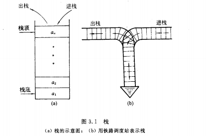
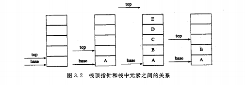
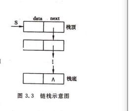
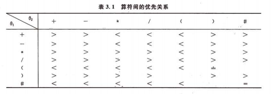
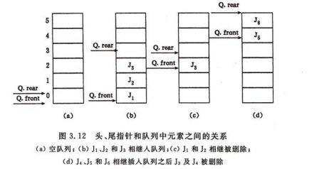
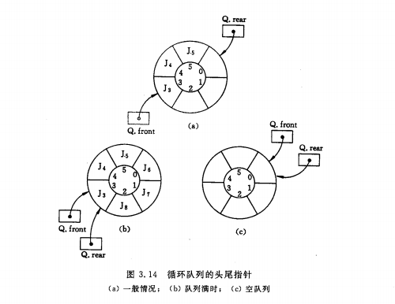

# 栈和队列

## 3.1、栈

### 3.1.1 抽象数据类型栈的定义

栈是限定仅在表尾进行插入或删除操作的线性表。表尾端称为**栈顶**，表头段称为**栈底**，不含元素的空表称为空栈。

栈的修改是按照**后进先出**的原则进行的。



### 3.1.2 栈的表示和实现

存储方法也分两种。

- 顺序栈：利用一组地址连续的存储单元依次存放自栈底到栈顶的数据元素，同时附设指针top指示栈顶元素在顺序栈中的位置。常用top=0表示空栈。

  ```c++
  typedef struct{
      SElemType *base;  //在栈构造之前和销毁之后，base的值为NULL
      SElemType *top;   //栈顶指针
      int stacksize;   //表示栈的当前可使用的最大容量
  }SqStack;
  ```

  - 初始化操作：按设定的初始分配量进行第一次存储分配，base可称为栈底指针，在顺序栈中，它始终指向栈底的位置，若base的值为NULL，则表示栈结构不存在。称top为栈顶指针，其初始值指向栈底，即top=base可作为栈空的标记，每当**插入**新的栈顶元素时，指针top**增1**；**删除**栈顶元素时指针top**减1**，所以，非空栈的栈顶指针始终在栈顶元素的下一个位置。
  
    
  
    ```c++
    Status InitStack(SqStack &S){
        S.base=(SElemType *) malloc(STACK.INIT.SIZE*sizeof(SElemType));
        if(!S.base) exit (OVERFLOW);//存储分配失败
        S.top=S.base;
        S.stacksize = STACK.INIT.SIZE;
        return OK;
    }//InitStack
    ```

- 顺序栈的基本操作

  - 获取栈顶元素

    ```c++
    Status GetTop(SqStack S,SElemType &e){
        //若栈不空，则用e返回S的栈顶元素，并返回OK，否则返回ERROR
        if(S.top==s.base) return ERROR;
        e = *(S.top-1);
        return OK;
    }
    ```

    

  - 插入元素

    ```c++
    Status Push(SqStack &S,SElemType e){
        //插入元素e为新的栈顶元素
        if(S.top-S.base>=S.stacksize){//栈满，追加存储空间
            S.base=(SElemType *)realloc(S.base,(S.stacksize+STACKINCREMENT)*sizeof(SElemType));
            if(!S.base) exit(OVERFLOW);//存储分配失败
            S.top=S.base+S.stacksize;
            S.stacksize+=STACKINCREMENT;
        }
        *S.top++=e;
        return OK;
    }
    ```

  - 删除栈顶元素

    ```c
    Status Pop(SqStack &S,SElemType &e){
        //若栈不空，则删除S的栈顶元素，用e返回其值并返回OK，否则返回ERROR
        if(S.top==S.base) return ERROR;
        e=* --S.top;
        return OK;
    }
    ```

    

- 链栈

  

## 3.2、 栈的应用

### 3.2.1 数制转换

> 原理：N=(N div d) *d+N mod d(其中：div为整除运算，mod为求余运算)

```c++
void conversion(){
    //对于输入的任意一个非负十进制整数，打印出与其等值的八进制数
    InitStack(S);
    scanf("%d",N);
    while(N){
        Push(S,N%8);
        N=N/8;
    }
    while(!StackEmpty(s)){
        Pop(S,e);
        print("%d",e);
    }
}
```

### 3.2.2 括号匹配的检验

### 3.2.3 行编辑程序

接受用户从终端输入的程序或数据，并存入用户的数据区，由于可能输入有误，因此好的做法是使用一个缓存区，当用户发现错误时可以及时更正，例如，当发现有误时可以输入一个退格键#来表示前一个字符无效。

```c++
void LineEdit(){
    //利用字符串栈，从终端接收一行并传送至调用过程的数据区
    InitStack(S);//构造空栈
    ch=getchar();//从终端接收第一个字符
    while(ch!=EOF){
        while(ch！=EOF&&ch!='\n'){
            switch(ch){
                case '#' :Pop(S,c);  break;//仅当栈非空时退栈
                case '@': ClearStack(S); break;//重置S为空栈
                default :Pust(S,ch);     break;//有效字符进栈 未考虑栈满清形
            }
            ch=getchar();//接收下一个字符
        }
        ClearStack(S);//重置为空栈
        if(ch!=EOF) ch=getchar();
    }
    DestroyStack(S);
}
```

### 3.2.4 迷宫求解

### 3.2.5 表达式求值

 

- “+” “-” “*”  “/” 优先级低于“（” 但是大于"）"

使用两个工作栈来进行运算。OPTR：寄存运算符；OPND：寄存操作数或运算结果。

- 算法思想：
  - 首先置操作数栈为空栈，表达式起始符“#”为运算符栈的栈底元素
  - 依次读入表达式中每个字符，若是操作数则进OPND栈，若是运算符则和OPTR栈的栈顶运算符比较优先权后做相应的操作，直到整个表达式求值完毕（即OPTR栈的栈顶元素和当前读入的字符均为“#”）；

```c
OperandType EvaluateExpression(){
    //算术表达式求值的算符优先算法，设OPTR和OPND分别为运算符栈和运算数栈
    InitStack(OPTR); Push(OPTR,'#');
    InitStack(OPND); c=getchar();
    while(c!='#'||GetTop(OPTR)!='#'){
        if(!In(c,OP)){
            Push((OPND,c));c=getchar();//不是运算符则进栈
        }else
            switch(Precede(GetTop(OPTR),c)){
                case '<' ://栈顶元素优先权低
                    Push(OPTR,c); c=getcgar();
                    break;
                case '='://脱括号并接收下一个字符
                    Pop(OPTR,x);c=getchar();
                    break;
                case '>' ://退栈并将运算结果入栈
                    Pop(OPTR,theta);
                    Pop(OPND,b);Pop(OPND,a);
                    Push(OPND,Operate(a,theta,b));
                    break;
            }
    }
    return GetTop(OPND);
}
```

## 3.3、栈与递归的实现

汉诺塔问题：大梵天创造世界时造了三根金钢石柱子X Y X，其中X自底向上叠着n片黄金圆盘。大梵天命令婆罗门把圆盘从下面开始按大小顺序重新摆放在另一根柱子Z上。并且规定，在小圆盘上不能放大圆盘，在三根柱子之间一次只能移动一个圆盘。

> n=1时，将圆盘从X直接移到Z上；n>1时，利用Y做辅助设法将压在编号为n的圆盘上的n-1个圆盘从塔座X移到Y上，则可将n移至Z，然后再将中间Y上的n-1个移到Z，这就可以转化为相同特征但规模较小的问题。

```c
void hanoi(int n,char x,char y,char z){
    //将塔座x上按照有小到大且自上而下编号为1至n的n个圆盘按规则搬到塔座z上，y可做辅助塔座
    //搬到操作move(x,n,z)可定义为（c是初值为0的全局变量，对搬动计数） ：
    //printf("%i move disk %i from %c to %c \n" ,++c,n,x,z)
    if(n==1){
        move(x,1,z);//编号为1的圆盘从x移到z
    }else{
        hanoi(n-1,x,z,y);//将x上编号为1至n-1的圆盘移到y,z做辅助塔
        move(x,n,z);//将编号为n的圆盘从x移到z
        hanoi(n-1,y,x,z);//将y上编号为1至n-1的圆盘移到z,x做辅助塔
    }
}
```

## 3.4、队列

队列是一种先进先出的线性表，只允许在表的一端进行插入，而在另一端进行删除，允许插入的一端叫**队尾**

，允许删除的一端叫**队头**;

除了栈和队列之外，还有一种限定性数据结构是**双端队列**。

### 3.4.2、链队列-队列的链式表示和实现

```c
typedef struct QNode{
    QElemType data;
    struct QNode *next;
}QNode ,*QueuePtr

typedef struct{
	QueuePtr front;//队头指针
	QueuePtr rear;//队尾指针
}LinkQueue
```

- 基本操作算法

  - 初始化

    ```c
    Status InitQueue(LinkQueue &Q){
        //构造一个空队列
        Q.front=Q.rear=(QueuePtr)malloc(sizeof(QNode));
        if(!Q.front) exit(OVERFLOW);//存储分配失败
        Q.front->next=NULL;
        return OK;
    }
    ```

    

  - 销毁队列

    ```c++
    Status DestroyQueue(LinkQueue &Q){
        while(Q.front){
            Q.rear=Q.front->next;
            free(Q.front);
            Q.front=Q.rear;
        }
        retur OK;
    }
    ```

    

  - 入队

    ```c
    Status EnQueue(LinkQueue &Q,QElemType e){
        //插入元素e为Q的新的队尾元素
        p=(QueuePtr)malloc(sizeof(QNode));
        if(!p) exit(OVERFLOW);//存储分配失败
        p->data=e;p->next=NULL;
        Q.rear->next=p; //移动队尾
        Q.rear=p;
        return OK;
    }
    ```

    

  - 出队

    ```c
    Status DeQueue(LinkQueue &Q,QElemType &e){
        //若队列不空，则删除Q的队头元素，用e返回其值，并返回OK
        if(Q.front==Q.rear) return ERROR;
        p=Q.front->next;
        e=p->data;
        Q.fromt->next=p->next;
        if(Q.rear==p)Q.rear=Q.front;
        free(p);
        return OK;
    }
    ```

    

### 3.4.3、循环队列-队列的顺序表示和实现

初始化时front=rear=0;队尾插入元素时，尾指针增1；删除队头元素时，头指针增1.



在d的情况下队列实际上空间未满，为了解决这种情况引入了循环队列。


队满和队空：



这种情况无法区分队满和队空，解决方案有两种：①：设一个标志位区分满还是空；②：少用一个元素空间；

```c
#define MAXSIZE 100;//最大队列长度
typedef struct{
    QElemType * base;//初始化的动态分配存储空间
    int front;//头指针 若队列不空，指向队列头元素
    int rear;//尾指针，若队列不空指向队列为元素的下一个位置
}SqQueue
```

- 基本操作

  - 初始化队列

    ```c
    Status InitQueue(SqQueue &Q){
        Q.base = (QElemType *)malloc(MAXSIZE *sizeof(QElemType));
        if(!Q.base) exit(OVERFLOW);
        Q.front=Q.rear=0;
        return OK;
    }
    ```

    

  - 队列长度

    ```c
    int QueueLength(SqQueue Q){
        return (Q.rear-Q.front+MAXSIZE)%MAXSIZE;
    }
    ```

    

  - 入队

    ```c
    Status EnQueue(SqQueue &Q,QElemType e){
       if((Q.rear+1)%MAXSIZE==Q.front) return ERROR;//队列满
        Q.base[Q.rear]=e;
        Q.rear=(Q.rear+1)%MAXSIZE;
        return OK;
    }
    ```

    

  - 出队

    ```c
    Status DeQueue(SqQueue &Q,QElemType &e){
        if(Q.front == Q.rear) return ERROR;
        e=Q.base[Q.front];
        Q.front=(Q.front+1)%MAXSIZE;
        return OK;
    }
    ```

    

  - 