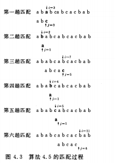
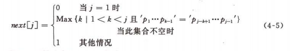
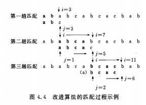

# 串

## 4.1 串类型的定义

串是由**0**个或**多**个字符组成的有限序列

s='a<sub>1</sub>a<sub>2</sub>...a<sub>n</sub>'  s是串名，用单引号括起来的字符序列是串的值，a<sub>i</sub>可以是字母、数字或其他字母；n为串的长度、零个字符的传称为空串，他的长度为0.

串中任意个连续的字符组成的子序列称为该串的**子串**，包含子串的串相应的称为**主串**。

当且仅当两个传的值相等称为两个串为**相等**的。

由一个或多个空格字符组成的串称为**空格串**。

## 4.2 串的表示和实现

### 4.2.1 定长顺序存储表示

由一组地址连续的存储单元存储串值的字符序列。

```c
#defile MAXSIZE 255;//用户可在255以内定义最大串长
typedef unsigned char SString[MAXSTRLEN+1];//0号单元存放串的长度
```

- 串联接`S1`和`S2`合并为`T`

  ```c
  Status Concat(SString &T,SString S1,SString S2){
      if(S1[0]+S2[0]<=MAXSTRLEN){//未截断
          T[1...S1[0]]=S1[1...S1[0]];
          T[S1[0]+1..S1[0]+S2[0]]=S2[1..S2[0]];
          T[0]=S1[0]+S2[0];
          uncat = TRIE;
      }else if(S1[0]<MAXSTRLEN){
          T[1..S1[0]]=S1[1..S1[0]];
          T[S1[0]+1..MAXSTRLEN]=S2[1..MAXSTRLEN-S1[0]];
          T[0]=MAXSTRLEN;
          uncut=FALSE;
      }else{
          T[0..MAXSTRLEN]=S1[0..MAXSTRLEN];
          uncut = FALSE;
      }
      return uncut;
  }
  ```

  

- 求子串

  ```c
  Status SubString(SString &Sub,SString S,int pos ,int len){
      if(pos<1||pos>S[0]||len<0||len>s[0]-pos+1){
          return ERROR;
      }
      Sub[1..len]=S[pos..pos+len-1];
      Sub[0]=len;
      return OK;
  }
  ```

  

### 4.2.2 堆分配存储表示

仍然以一组地址连续的存储单元存放串值字符序列，但他们的空间是在程序执行过程中动态分配而得。

```c
typedef struct{
    char * ch;//若非空串，则按串长分配存储区，否侧ch为NULL
    int length;//串长度
}HString
```

- 串插入

  ```c
  Status StrInsert(HString &S,int pos ,HString T){
      if(pos<1||pos>S.ength+1){
          return ERROR;
      }
      if(T.length){
          if(!(S.ch=(char*)realloc(S.ch,(S.length+T.length)*sizeof(char)))){
              exit(OVERFLOW);
          }
          for(i=S.length-1;i>=pos-1;--i){//为插入T而腾出位置
              S.ch[i+T.length]=S.ch[i];
          }
          S.ch[pos-1..pos+T.length-2]=T.ch[0..T.length-1];//插入T
          S.length+=T.length;
      }
      return OK;
  }
  ```

  

### 4.2.3 串的块链存储表示

```c
#define SHUNKSIZE 80;
typedef struct Chunk{
    char ch[CHUNKSIZE];
    struct Chunk *next;
}Chunk;

typedef struct{
    Chunk *head ,*tail;//串的头和尾指针
    int curlen;//串的当前长度
}
```

## 4.3 串的模式匹配算法

### 4.3.1 求子串位置的定位函数Index(S,T,pos)

子串的定位操作通常称为串的模式匹配（T称为模式串）

> 从主串S的第pos个字符起和模式的第一个字符比较，若相等，则继续逐个比较后续字符，否则从主串的下一个字符起再重新调用和模式的字符比较之。依次类推，直至模式T中的每个字符依次和主串S中的一个连续的字符序列相等，则匹配成功，否则匹配不成功返回0.

- 时间复杂度**O(n+m)**;n和m分别为主串和模式的长度。

```c
int Index(SString S,SString T,int pos){
    i=pos;j=1;
    while(i<=S[0]&&j<=T[0]){
        if(S[i]==T[j]){
            ++i;++j;//继续比较后续
        }else{
            i=i-j+2;j=1;//指针后退 重新开始
        }
        if(j>T[0]){
            return i-T[0];
        }else{
            return 0;
        }
    }
}
```



### 4.3.2 模式匹配的一种改进算法

KMP算法：在`O（n+m）`量级上完成串的模式匹配操作。改进的地方在于：每当一趟匹配过程中出现字符比较不等时，不需回溯i指针，而是利用已经得到的部分匹配的结果将模式向右滑动尽可能远的一段距离后，继续进行比较。

我们需要解决的问题是当匹配过程中失配时，模式串向右滑动可行的距离多远，也就是当主串中第`i`个字符与模式中第`j`个字符失配时，主串中第`i`个字符应与模式中哪个字符再比较。

假设此时应与模式中第k(k<j)个字符继续比较，则模式中前k-1个字符的子串必须满足：

> p<sub>1</sub>p<sub>2</sub>...p<sub>k-1</sub>=s<sub>i-k+1</sub>s<sub>i-k+2</sub>...s<sub>i-1</sub>

而已经得到的部分匹配的结果是：

> p<sub>j-k+1</sub>p<sub>j-k+2</sub>...p<sub>j-1</sub>=s<sub>i-k+1</sub>s<sub>i-k+2</sub>...s<sub>i-1</sub>

由上式可得出：

> p<sub>1</sub>p<sub>2</sub>...p<sub>k-1</sub>=p<sub>j-k+1</sub>p<sub>j-k+2</sub>...p<sub>j-1</sub>

若令next[j]=k,则next[j]表明当模式中第j个字符与主串中相应字符与主串中相应字符失配时，在模式中需重新和主串中该字符进行比较的字符的位置。由此可以引出模式串的next函数的定义：



求得next数组之后，匹配如下：假设以指针i和j分别指示主串和模式串中正待比较的字符，令i的初值为pos,j的初值为1，若在匹配的过程中s<sub>i</sub>=p<sub>j</sub>,则i和j分别增1，否则i不变，而j回退到next[j]的位置再比较，若相等，则指针各自增1，否则j再退到下一个next值的位置



```c
int Index.KMP(SString S,SString T,int pos){
    i=pos;j=1;
    while(i<=S[0]&&j<=T[0]){
        if(j==0||S[i]==T[j]){
            ++i;++j;//继续向后比较
        }else{
            j=next[j];//模式串右移
        }
        if(j>T[0]){
            return i-T[0];
        }else{
            return 0;
        }
    }
}
```

> 如何求next数组?

由定义知next[1]=0;

设next[j]=k,这表明在模式串中存在下列关系：

‘p<sub>1</sub>...p<sub>k-1</sub>’='p<sub>j-k+1</sub>...p<sub>j-1</sub>' 其中k满足1<k<j的某个值，并且不可能存在k1>1满足该关系式。此时next[j+1]=?有两种情况

1. 如果p<sub>k</sub>=p<sub>j</sub>,则表明在模式串中‘p<sub>1</sub>...p<sub>k</sub>’='p<sub>j-k+1</sub>...p<sub>j</sub>'并且不存在k1>k满足该关系式。这时next[j+1]=k+1也就是next[j+1]=next[j]+1
2. 若p<sub>k</sub>!=p<sub>j</sub>,则表明在模式串中‘p<sub>1</sub>...p<sub>k</sub>’!='p<sub>j-k+1</sub>...p<sub>j</sub>',此时应当把next函数值的问题看成一个模式匹配的问题，整个模式串既是主串也是模式串，这是一个递归的过程next[j+1]=next[k]+1,若都不匹配则next[j+1]=1

```c
void get.next(SString T,int next[]){
    i=1;next[1]=0;j=1;
    while(i<T[0]){
        if(j==0||T[i]==T[j]){
            ++i;++j;next[i]=j;
        }else{
            j=next[j];
        }
    }
}
```


> 升级版的next数组

上述求next数组的算法有缺陷例如aaaab和主串aaabaaaab匹配时。

```c
void get_nextval(SString T,int nectval[]){
    i=1;nextval[1]=0;j=0;
    while(i<T[0]){
        if(j==0||T[i]==T[j]){
            ++i;++j;
            if(T[i]!=T[j]){
                nextval[i]=j;
            }else{
                nextval[i]=nextval[j];
            }
        }else{
            j==nextval[j];
        }
    }
}
```

## 4.4 串操作应用举例

### 4.4.1 文本编辑

### 4.4.2 建立词索引表

