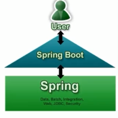

## SpringBoot 入门

SpringBoot来简化Spring应用开发，约定大于配置，去繁从简，just run就能创建一个独立的，产品级别的应用。

### 一、背景

J2EE笨重的开发，繁多的配置、地下的开发效率、复杂的部署流程、第三方技术集成难度大。

### 二、解决

Spring全家桶时代。

Spring Boot -> J2EE一站式解决方案

Spring Cloud ->分布式整体解决方案

> https://spring.io/projects 
>
> 可以访问spring的所有项目



###　三、优点

- 快速创建独立运行的Spring项目以及与主流框架集成
- 使用嵌入式的Servelt容器，应用无需打成war包
- starters自动依赖与版本控制
- 大量的自动配置，简化开发，也可修改默认值
- 无需配置xml,无代码生成，开箱即用
- 准生产环境的运行时应用监控
- 与云计算的天然集成

### 四、环境准备

- intellij/eclipse

  修改idea中的maven设置

  

- maven3.9

maven设置：在setting.xml配置文件的profilers标签添加

>	<profile>
>		<id>jdk-1.8</id>
>	
>		<activation>
>			<activeByDefault>true</activeByDefault>
>			<jdk>1.8</jdk>
>		</activation>
>	
>		<properties>
>			<maven.compiler.source>1.8</maven.compiler.source>
>			<maven.compiler.target>1.8</maven.compiler.target>
>			<maven.compiler.compilerVersion>1.8</maven.compiler.compilerVersion>
>		</properties>
>	</profile>
>
>
>

### 五、HelloWorld

> 实现一个功能：浏览器发送一个请求，并处理响应

#### 1.创建一个maven工程

#### 2.导入spring boot的相关依赖

```
<parent>
    <groupId>org.springframework.boot</groupId>
    <artifactId>spring-boot-starter-parent</artifactId>
    <version>2.2.2.RELEASE</version>
    <relativePath/> <!-- lookup parent from repository -->
  </parent>
  <dependencies>
    <dependency>
      <groupId>org.springframework.boot</groupId>
      <artifactId>spring-boot-starter-web</artifactId>
    </dependency>

    <dependency>
      <groupId>org.springframework.boot</groupId>
      <artifactId>spring-boot-starter-test</artifactId>
      <scope>test</scope>
      <exclusions>
        <exclusion>
          <groupId>org.junit.vintage</groupId>
          <artifactId>junit-vintage-engine</artifactId>
        </exclusion>
      </exclusions>
    </dependency>
    <dependency>
      <groupId>junit</groupId>
      <artifactId>junit</artifactId>
      <version>4.11</version>
      <scope>test</scope>
    </dependency>
  </dependencies>
```


#### 3.编写一个主程序，启动Spring Boot的应用

```
package com.slp;

import org.springframework.boot.SpringApplication;
import org.springframework.boot.autoconfigure.SpringBootApplication;

/**
 * @SpringBootApplication 来标注一个主程序，说明这是一个springboot程序
 */
@SpringBootApplication
public class HelloWorldMainApplication {

    /**
     * 启动程序
     * @param args
     */
    public static void main(String[] args){
        SpringApplication.run(HelloWorldMainApplication.class,args);
    }
}

```

#### 4.编写实现

```
package com.slp.controller;

import org.springframework.stereotype.Controller;
import org.springframework.web.bind.annotation.RequestMapping;
import org.springframework.web.bind.annotation.ResponseBody;

@Controller
public class HelloController {
    @ResponseBody
    @RequestMapping("/hello")
    public String hello(){
        return "hello";
    }
}

```

#### 5.测试

#### 6.简化部署

```j
<build>
    <!--这个插件可以将应用打包成可执行的jar包-->
    <plugins>
        <plugin>
            <groupId>org.springframework.boot</groupId>
          <artifactId>spring-boot-maven-plugin</artifactId>
        </plugin>
      
    </plugins>
    
  </build>
```

将这个应用打成jar包，直接使用java -jar的命令来进行执行

### 六、Hello World探究

#### 1.pom文件

##### 1.1 父项目

```
<parent>
    <groupId>org.springframework.boot</groupId>
    <artifactId>spring-boot-starter-parent</artifactId>
    <version>2.2.2.RELEASE</version>
    <relativePath/> <!-- lookup parent from repository -->
  </parent>
  
他的父项目
<parent>
    <groupId>org.springframework.boot</groupId>
    <artifactId>spring-boot-dependencies</artifactId>
    <version>2.2.2.RELEASE</version>
    <relativePath>../../spring-boot-dependencies</relativePath>
  </parent>
  
  它来真正管理SpringBoot应用里面的所有依赖
  <properties>
    <activemq.version>5.15.11</activemq.version>
    <antlr2.version>2.7.7</antlr2.version>
    <appengine-sdk.version>1.9.77</appengine-sdk.version>
    <artemis.version>2.10.1</artemis.version>
    <aspectj.version>1.9.5</aspectj.version>
    <assertj.version>3.13.2</assertj.version>
    <atomikos.version>4.0.6</atomikos.version>
    <awaitility.version>4.0.1</awaitility.version>
    <bitronix.version>2.1.4</bitronix.version>
    ...
  </properties>
```

SpringBoot的版本仲裁中心；

以后我们导入依赖默认是不需要版本号的，（没有在dependencies里面管理的依赖需要声明）

##### 1.2 导入的依赖

```java
<dependency>
      <groupId>org.springframework.boot</groupId>
      <artifactId>spring-boot-starter-web</artifactId>
    </dependency>
```

spring-boot-starter-web:

​	spring-boot-starter:spring-boot场景启动器，帮我们导入了web模块正常运行所依赖的组件；

> https://docs.spring.io/spring-boot/docs/2.2.2.RELEASE/reference/htmlsingle/#using-boot-starter 
>
> 可以查看所有的启动器模块

Spring Boot将所有的功能场景都抽取出来，做出一个个的starter,只需要在项目里引入这些starter相关场景所需的依赖就会导入进来。