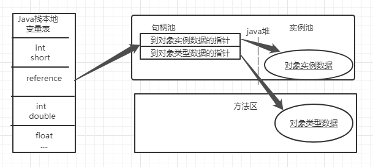
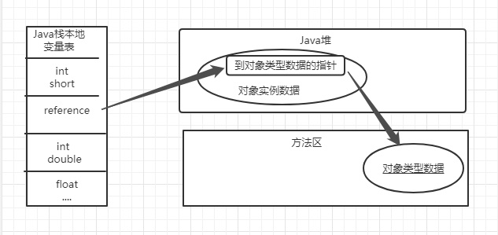

# 内存管理

## HotSpot虚拟机

> HotSpot虚拟机在Java堆中对象分配。布局和访问的全过程。

### 对象的创建

在语言层面上，创建对象通常（例外：复制、反序列化）仅仅是一个new关键字而已，而在虚拟机中，对象（文中讨论的对象限于普通Java对象，不包括数组和Class对象等）的创建又是怎样一个过程呢？

当Java虚拟机遇到一条字节码new指令时，首先将去检查这个指令的参数是否能在常量池中定位到一个类的符号引用，并且检查这个符号引用代表的类是否已被加载、解析和初始化过。如果没有，那必须先执行相应的类加载过程。

在类加载检查通过后，接下来虚拟机将为新生对象分配内存。对象所需内存的大小在类加载完成后便可完全确定，为对象分配空间的任务实际上便等同于把一块确定大小的内存块从Java堆中划分出来。

1. 如何划分空间

   假设Java堆中内存是**绝对规整**的，所有被使用过的内存都被放在一边，空闲的内存被放在另一边，中间放着一个指针作为分界点的指示器，那所分配内存就仅仅是把那个指针向空闲空间方向挪动一段与对象大小相等的距离，这种分配方式称为**“指针碰撞”**（Bump ThePointer）。但如果Java堆中的内存并**不是规整**的，已被使用的内存和空闲的内存相互交错在一起，那就没有办法简单地进行指针碰撞了，虚拟机就必须维护一个列表，记录上哪些内存块是可用的，在分配的时候从列表中找到一块足够大的空间划分给对象实例，并更新列表上的记录，这种分配方式称为**“空闲列表”**（Free List）。

[^空闲列表]: 组成原理中的空闲链表法

- 指针碰撞
  - Serial
  - ParNew
- 空闲列表
  - CMS

2. 线程安全问题

   对象创建在虚拟机中是非常频繁的行为，即使仅仅修改一个指针所指向的位置，在并发情况下也并不是线程安全的，可能出现正在给对象A分配内存，指针还没来得及修改，对象B又同时使用了原来的指针来分配内存的情况。

   - 解决方案
     - 一种是对分配内存空间的动作进行同步处理——实际上虚拟机是采用**CAS**配上失败重试的方式保证更新操作的原子性；
     - 另外一种是把内存分配的动作按照线程划分在不同的空间之中进行，即每个线程在Java堆中预先分配一小块内存，称为**本地线程分配缓冲**（Thread Local Allocation Buffer，TLAB），哪个线程要分配内存，就在哪个线程的本地缓冲区中分配，只有本地缓冲区用完了，分配新的缓存区时才需要同步锁定。虚拟机是否使用TLAB，可以通过**-XX：+/-UseTLAB**参数来设定。

   **内存分配完成之后**，虚拟机必须将分配到的内存空间（但不包括对象头）都**初始化为零值**，如果使用了TLAB的话，这一项工作也可以提前至TLAB分配时顺便进行。这步操作保证了对象的实例字段在Java代码中可以不赋初始值就直接使用，使程序能访问到这些字段的数据类型所对应的零值。

3. 对对象进行必要的设置

   这个对象是哪个类的实例、如何才能找到类的元数据信息、对象的哈希码（实际上对象的哈希码会延后到真正调用Object::hashCode()方法时才计算）、对象的GC分代年龄等信息。这些信息存放在对象的对象头（ObjectHeader）之中。根据虚拟机当前运行状态的不同，如是否启用偏向锁等，对象头会有不同的设置方式。

   > 从虚拟机角度来看，一个新的对象以及产生了，但是从java程序的角度来看，对象创建才刚刚开始--构造函数。构造函数还没有执行，所有的字段都是默认的零值。只有执行完init方法一个真正可用的对象才算完全被构造出来。

### 对象的内存布局

对象在堆内存中的存储布局可以划分为三个部分：**对象头（Header）**、**实例数据（Instance）**、**对齐填充（Padding）**.

1. 对象头

   - 用于存储对象自身的运行时数据。

     哈希码（HashCode）、GC分代年龄、锁状态标志、线程持有的锁、偏向线程ID、偏向时间戳等，这部分数据的长度在32位和64位的虚拟机（未开启压缩指针）中分别为32个比特和64个比特，官方称它为“Mark Word”。对象需要存储的运行时数据很多，其实已经超出了32、64位Bitmap结构所能记录的最大限度，但对象头里的信息是与对象自身定义的数据无关的额外存储成本，考虑到虚拟机的空间效率，Mark Word被设计成一个有着动态定义的数据结构，以便在极小的空间内存储尽量多的数据，根据对象的状态复用自己的存储空间。

     例如在**32位的HotSpot虚拟机**中，如**对象未被同步锁锁定**的状态下，Mark Word的32个比特存储空间中的**25**个比特用于存储对象哈希码，**4**个比特用于存储对象分代年龄，**2**个比特用于存储锁标志位，1个比特固定为0，有锁的时候如下：

     | 存储内存                            | 标志位 | 状态               |
     | :---------------------------------- | ------ | ------------------ |
     | 对象哈希码、对象分代年龄            | 01     | 未锁定             |
     | 指向锁记录的指针                    | 00     | 轻量级锁定         |
     | 指向重量级锁的指针                  | 10     | 膨胀（重量级锁定） |
     | 空，不需要记录信息                  | 11     | GC标记             |
     | 偏向进程ID,偏向时间戳，对象分代年龄 | 01     | 可偏向             |

   - 类型指针

     对象指向它的类型元数据的指针，Java虚拟机通过这个指针来确定该对象是哪个类的实例。但是并不是所有的虚拟机实现都必须在对象数据上保留类型指针。也就是说，查找对象的元数据信息并不一定要经过对象本身。

     如果对象是一个**Java数组**，那在对象头中还必须有一块用于记录**数组长度**的数据，因为虚拟机可以通过普通Java对象的元数据信息确定Java对象的大小，但是如果数组的长度是不确定的，将无法通过元数据中的信息推断出数组的大小。

2. 实例数据

   对象真正存储的有效信息，即我们在程序代码里面所定义的各种类型的字段内容，无论是从父类继承下来的，还是在子类中定义的字段都必须记录起来。

   这部分的存储顺序会受到虚拟机分配策略参数（-XX：FieldsAllocationStyle参数）和字段在Java源码中定义顺序的影响。HotSpot虚拟机默认的分配顺序为longs/doubles、ints、shorts/chars、bytes/booleans、oops（OrdinaryObject Pointers，OOPs），从以上默认的分配策略中可以看到，相同宽度的字段总是被分配到一起存放，在满足这个前提条件的情况下，在父类中定义的变量会出现在子类之前。如果HotSpot虚拟机的+XX：CompactFields参数值为true（默认就为true），那子类之中较窄的变量也允许插入父类变量的空隙之中，以节省出一点点空间。

3. 对齐填填充

   占位符的作用。

   由于HotSpot虚拟机的自动内存管理系统要求对象起始地址必须是**8字节的整数倍**，换句话说就是任何对象的大小都必须是8字节的整数倍。对象头部分已经被精心设计成正好是8字节的倍数（1倍或者2倍），因此，如果对象实例数据部分没有对齐的话，就需要通过对齐填充来补全。

 ### 对象的访问定位

通过栈上的reference数据来操作堆上的具体对象。

对象访问方式分为2种

1. 使用句柄访问

   Java堆中将可能会划分出一块内存来作为句柄池，reference中存储的就是对象的**句柄地址**，而句柄中包含了对象实例数据与类型数据各自具体的地址信息

   

2. 使用直接指针访问

   Java堆中对象的内存布局就必须考虑如何放置访问类型数据的相关信息，reference中存储的直接就是对象地址，如果只是访问对象本身的话，就不需要多一次间接访问的开销

   

   

   #### 使用句柄访问VS使用直接指针访问

   使用直接指针访问最大的好处是速度更快，它省去了一次指针定位的时间开销，由于对象访问在Java中非常频繁，因此这类开销积少成多也是一项极为可观的执行成本。

   

   

   

