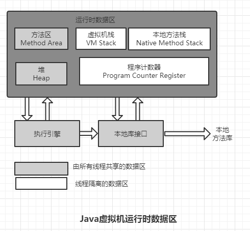

# 内存管理

> 对于C,C++程序员既拥有每一个对象的所有权，又担负着每一个对象声明从开始到终结的维护。
>
> 对于Java程序员在虚拟机自动内存管理的帮助下，不需要为每个new操作去写配对的delete/free代码，不容易出现内存泄漏和内存溢出问题，这样也带来了一个新的问题，一旦出现，不好排查。

## 运行时数据区域

根据java虚拟机规范，java虚拟机锁管理的内存将会包含如下几个运行时数据区

- 方法区
- 虚拟机栈
- 本地方法栈
- 堆
- 程序计数器

### 程序计数器

> 计算机组成原理中的PC

一块小的内存空间，可以看作是当前线程所执行的字节码的行号指示器。

字节码解释器工作时就是通过改变这个

计数器值来选取下一条需要执行的字节码指令，它是程序控制流的指示器，分支、循环、跳转、异常处理、线程恢复等基础功能都需要依赖这个计数器来完成。

由于Java虚拟机的多线程是通过线程轮流切换、分配处理器执行时间的方式来实现的，在任何一个时刻对于单核处理器来说是一个处理器，对于多核处理器来说是一个内核都只会有一条执行中的指令。所以，为了线程切换后恢复到正确的位置，每条线程都有自己**独立**的程序计数器，各个之间互不影响，独立存储，我们也把这类内存区域称为“线程私有”的内存。

如果执行的是java方法，这个计数器记录的是正在执行的虚拟机字节码指令的地址；如果是在执行本地方法，这个计数器则应为空（Undefined）.

**唯一**一个在java虚拟卡规范中没有任何规定`OutOfMemoryError`情况的区域。

### java虚拟机栈

和程序计数器一样，java虚拟机栈也是线程私有的，生命周期与线程相同。