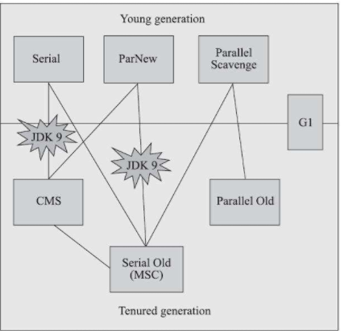
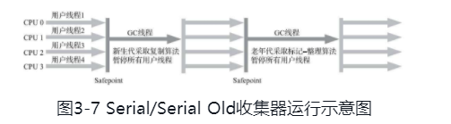
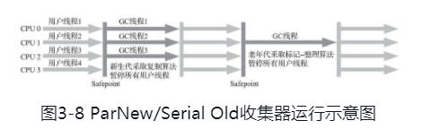
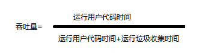
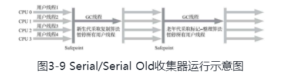
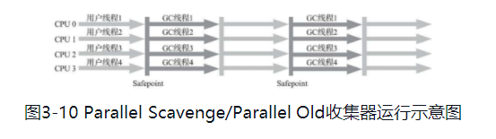
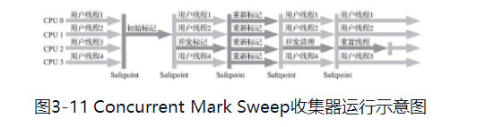
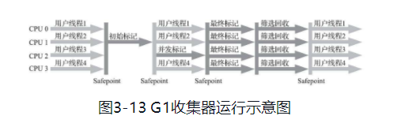

# 垃圾收集器

> 衡量垃圾收集器的三项最重要的指标：内存占用（Footprint）、吞吐量（Throughput）和延迟（Latency）。

## 经典垃圾收集器

HotSpot虚拟机的垃圾收集器：

上图展示了七种作用于不同分代的收集器，如果两个收集器之间存在连线，就说明它们可以搭配使用[插图]，图中收集器所处的区域，则表示它是属于新生代收集器抑或是老年代收集器。                                      

###  Serial收集器

Serial收集器是最基础、历史最悠久的收集器，曾经（在JDK 1.3.1之前）是HotSpot虚拟机新生代收集器的唯一选择。它是一个单线程工作的收集器，但它的“单线程”的意义并不仅仅是说明它只会使用一个处理器或一条收集线程去完成垃圾收集工作，更重要的是强调在它进行垃圾收集时，必须暂停其他所有工作线程，直到它收集结束。“Stop The World”这个词语也许听起来很酷，但这项工作是由虚拟机在后台自动发起和自动完成的，在用户不可知、不可控的情况下把用户的正常工作的线程全部停掉，这对很多应用来说都是不能接受的。

优点：简单而高效，对于单核处理器或处理器核心数较少的环境来说，Serial收集器由于没有线程交互的开销，专心做垃圾收集自然可以获得最高的单线程收集效率。对于运行在客户端模式下的虚拟机来说是一个很好的选择。

### ParNew收集器

ParNew收集器实质上是Serial收集器的多线程并行版本，除了同时使用多条线程进行垃圾收集之外，其余的行为包括Serial收集器可用的所有控制参数（例如：-XX：SurvivorRatio、-XX：PretenureSizeThreshold、-XX：HandlePromotionFailure等）、收集算法、Stop The World、对象分配规则、回收策略等都与Serial收集器完全一致。

ParNew收集器除了支持多线程并行收集之外，其他与Serial收集器相比并没有太多创新之处，但它却是不少运行在**服务端模式下**的HotSpot虚拟机，尤其是JDK 7之前的遗留系统中首选的新生代收集器，其中有一个与功能、性能无关但其实很重要的原因是：除了Serial收集器外，目前只有它能与CMS收集器配合工作。

### Parallel Scavenge收集器（吞吐量优先收集器）

基于标记-复制算法,能够并行收集的多线程收集器.

关注重点：达到一个可控制的吞吐量（Throughput）。

精确控制吞吐量参数：

- 控制最大垃圾收集停顿时间：-XX：MaxGCPauseMillis

  允许的值是一个大于0的毫秒数，收集器将尽力保证内存回收花费的时间不超过用户设定值。

- 直接设置吞吐量大小：-XX：GCTimeRatio

  应当是一个大于0小于100的整数，也就是垃圾收集时间占总时间的比率，相当于吞吐量的倒数。

> -XX：+UseAdaptiveSizePolicy:这是一个开关参数，当这个参数被激活之后，就不需要人工指定新生代的大小（-Xmn）、Eden与Survivor区的比例（-XX：SurvivorRatio）、晋升老年代对象大小（-XX：PretenureSizeThreshold）等细节参数了，虚拟机会根据当前系统的运行情况收集性能监控信息，动态调整这些参数以提供最合适的停顿时间或者最大的吞吐量。这种调节方式称为垃圾收集的自适应的调节策略（GC Ergonomics）

### Serial Old收集器

单线程收集器,使用标记-整理算法.客户端模式下使用。

服务端模式下用途：

1. 在JDK 5以及之前的版本中与Parallel Scavenge收集器搭配使用
2. 作为CMS收集器发生失败时的后备预案，在并发收集发生Concurrent Mode Failure时使用。

### Parallel Old收集器

Parallel Old是Parallel Scavenge收集器的老年代版本,基于标记-整理算法,支持多线程并发收集.

### CMS收集器

CMS（Concurrent Mark Sweep）收集器是一种以获取最短回收停顿时间为目标的收集器。

基于标记-清除算法.

运作过程：

1. 初始标记（CMS initial mark）

2. 并发标记（CMS concurrent mark）

3. 重新标记（CMS remark）

4. 并发清除（CMS concurrent sweep）

   其中初始标记、重新标记这两个步骤仍然需要“Stop The World”。初始标记仅仅只是标记一下GC Roots能直接关联到的对象，速度很快；并发标记阶段就是从GC Roots的直接关联对象开始遍历整个对象图的过程，这个过程耗时较长但是不需要停顿用户线程，可以与垃圾收集线程一起并发运行；而重新标记阶段则是为了修正并发标记期间，因用户程序继续运作而导致标记产生变动的那一部分对象的标记记录，这个阶段的停顿时间通常会比初始标记阶段稍长一些，但也远比并发标记阶段的时间短；最后是并发清除阶段，清理删除掉标记阶段判断的已经死亡的对象，由于不需要移动存活对象，所以这个阶段也是可以与用户线程同时并发的。

   由于在整个过程中耗时最长的并发标记和并发清除阶段中，垃圾收集器线程都可以与用户线程一起工作，所以从总体上来说，CMS收集器的内存回收过程是与用户线程一起并发执行的。

优点：并发收集、低停顿

缺点：

- CMS收集器对处理器资源非常敏感。
- 由于CMS收集器无法处理“浮动垃圾”（Floating Garbage），有可能出现“Con-current Mode Failure”失败进而导致另一次完全“Stop The World”的Full GC的产生。
- 会有大量空间碎片产生。

### Garbage First收集器（G1）

面向服务端应用的垃圾收集器。

可以面向堆内存任何部分来组成回收集（Collection Set，一般简称CSet）进行回收，衡量标准不再是它属于哪个分代，而是哪块内存中存放的垃圾数量最多，回收收益最大，这就是G1收集器的Mixed GC模式。

虽然G1仍然保留新生代和老年代的概念，但新生代和老年代不再是固定的了，它们都是一系列区域（不需要连续）的动态集合。G1收集器之所以能建立可预测的停顿时间模型，是因为它将Region作为单次回收的最小单元，即每次收集到的内存空间都是Region大小的整数倍，这样可以有计划地避免在整个Java堆中进行全区域的垃圾收集。更具体的处理思路是让G1收集器去跟踪各个Region里面的垃圾堆积的“价值”大小，价值即回收所获得的空间大小以及回收所需时间的经验值，然后在后台维护一个优先级列表，每次根据用户设定允许的收集停顿时间（使用参数-XX：MaxGCPauseMillis指定，默认值是200毫秒），优先处理回收价值收益最大的那些Region，这也就是“Garbage First”名字的由来。这种使用Region划分内存空间，以及具有优先级的区域回收方式，保证了G1收集器在有限的时间内获取尽可能高的收集效率。

缺点：

- 将Java堆分成多个独立Region后，Region里面存在的跨Region引用对象如何解决？

- 在并发标记阶段如何保证收集线程与用户线程互不干扰地运行？

  CMS收集器采用增量更新算法实现，而G1收集器则是通过原始快照（SATB）算法来实现的。

- 怎样建立起可靠的停顿预测模型？

运行过程：

1. 初始标记（Initial Marking）：

   仅仅只是标记一下GC Roots能直接关联到的对象，并且修改TAMS指针的值，让下一阶段用户线程并发运行时，能正确地在可用的Region中分配新对象。这个阶段需要停顿线程，但耗时很短，而且是借用进行Minor GC的时候同步完成的，所以G1收集器在这个阶段实际并没有额外的停顿。

2. 并发标记（Concurrent Marking）：

   从GC Root开始对堆中对象进行可达性分析，递归扫描整个堆里的对象图，找出要回收的对象，这阶段耗时较长，但可与用户程序并发执行。当对象图扫描完成以后，还要重新处理SATB记录下的在并发时有引用变动的对象。

3. 最终标记（Final Marking）：

   对用户线程做另一个短暂的暂停，用于处理并发阶段结束后仍遗留下来的最后那少量的SATB记录。

4. 筛选回收（Live Data Counting and Evacuation）：

   负责更新Region的统计数据，对各个Region的回收价值和成本进行排序，根据用户所期望的停顿时间来制定回收计划，可以自由选择任意多个Region构成回收集，然后把决定回收的那一部分Region的存活对象复制到空的Region中，再清理掉整个旧Region的全部空间。

   

优点：与CMS的“标记-清除”算法不同，G1从整体来看是基于“标记-整理”算法实现的收集器，但从局部（两个Region之间）上看又是基于“标记-复制”算法实现，无论如何，这两种算法都意味着G1运作期间不会产生内存空间碎片，垃圾收集完成之后能提供规整的可用内存。这种特性有利于程序长时间运行，在程序为大对象分配内存时不容易因无法找到连续内存空间而提前触发下一次收集。

缺点：在用户程序运行过程中，G1无论是为了垃圾收集产生的内存占用（Footprint）还是程序运行时的额外执行负载（Overload）都要比CMS要高。

## 低延迟垃圾收集器

### Shenandoah收集器

相对于G1的改进：

1. 虽然Shenandoah也是使用基于Region的堆内存布局，同样有着用于存放大对象的HumongousRegion，默认的回收策略也同样是优先处理回收价值最大的Region……但在管理堆内存方面，它与G1至少有三个明显的不同之处，最重要的当然是支持并发的整理算法，G1的回收阶段是可以多线程并行的，但却不能与用户线程并发
2. Shenandoah（目前）是默认不使用分代收集的
3. Shenandoah摒弃了在G1中耗费大量内存和计算资源去维护的记忆集，改用名为“连接矩阵”（Connection Matrix）的全局数据结构来记录跨Region的引用关系，降低了处理跨代指针时的记忆集维护消耗，也降低了伪共享问题（见3.4.4节）的发生概率。

工作流程：

1. 初始标记（Initial Marking）：

   与G1一样，首先标记与GC Roots直接关联的对象，这个阶段仍是“Stop The World”的，但停顿时间与堆大小无关，只与GC Roots的数量相关。

2. 并发标记（Concurrent Marking）：

   与G1一样，遍历对象图，标记出全部可达的对象，这个阶段是与用户线程一起并发的，时间长短取决于堆中存活对象的数量以及对象图的结构复杂程度。

3. 最终标记（Final Marking）：

   与G1一样，处理剩余的SATB扫描，并在这个阶段统计出回收价值最高的Region，将这些Region构成一组回收集（Collection Set）。最终标记阶段也会有一小段短暂的停顿。

4. 并发回收（Concurrent Evacuation）：

   并发回收阶段是Shenandoah与之前HotSpot中其他收集器的核心差异。在这个阶段，Shenandoah要把回收集里面的存活对象先复制一份到其他未被使用的Region之中。复制对象这件事情如果将用户线程冻结起来再做那是相当简单的，但如果两者必须要同时并发进行的话，就变得复杂起来了。其困难点是在移动对象的同时，用户线程仍然可能不停对被移动的对象进行读写访问，移动对象是一次性的行为，但移动之后整个内存中所有指向该对象的引用都还是旧对象的地址，这是很难一瞬间全部改变过来的。对于并发回收阶段遇到的这些困难，Shenandoah将会通过读屏障和被称为“Brooks Pointers”的转发指针来解决（讲解完Shenandoah整个工作过程之后笔者还要再回头介绍它）。并发回收阶段运行的时间长短取决于回收集的大小。

5. 初始引用更新（Initial Update Reference）

   并发回收阶段复制对象结束后，还需要把堆中所有指向旧对象的引用修正到复制后的新地址，这个操作称为引用更新。引用更新的初始化阶段实际上并未做什么具体的处理，设立这个阶段只是为了建立一个线程集合点，确保所有并发回收阶段中进行的收集器线程都已完成分配给它们的对象移动任务而已。初始引用更新时间很短，会产生一个非常短暂的停顿。

6. 并发引用更新（Concurrent Update Reference）：

   真正开始进行引用更新操作，这个阶段是与用户线程一起并发的，时间长短取决于内存中涉及的引用数量的多少。并发引用更新与并发标记不同，它不再需要沿着对象图来搜索，只需要按照内存物理地址的顺序，线性地搜索出引用类型，把旧值改为新值即可。

7. 最终引用更新（Final Update Reference）

   解决了堆中的引用更新后，还要修正存在于GC Roots中的引用。这个阶段是Shenandoah的最后一次停顿，停顿时间只与GC Roots的数量相关。

8. 并发清理（Concurrent Cleanup）：

   经过并发回收和引用更新之后，整个回收集中所有的Region已再无存活对象，这些Region都变成Immediate Garbage Regions了，最后再调用一次并发清理过程来回收这些Region的内存空间，供以后新对象分配使用。

### ZGC收集器(jdk11)

希望在尽可能对吞吐量影响不太大的前提下[插图]，实现在任意堆内存大小下都可以把垃圾收集的停顿时间限制在十毫秒以内的低延迟。

希望在尽可能对吞吐量影响不太大的前提下[插图]，实现在任意堆内存大小下都可以把垃圾收集的停顿时间限制在十毫秒以内的低延迟。

ZGC收集器有一个标志性的设计是它采用的染色指针技术（ColoredPointer，其他类似的技术中可能将它称为Tag Pointer或者VersionPointer）。

运作过程：

1. 并发标记（Concurrent Mark）：
2. 并发预备重分配（Concurrent Prepare for Relocate）
3. 并发重分配（Concurrent Relocate）
4. 并发重映射（Concurrent Remap）