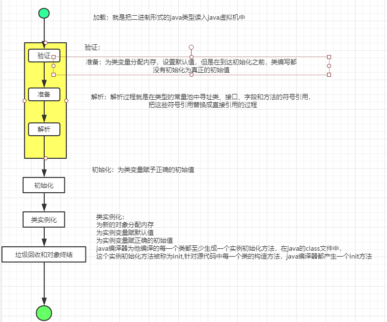

# 类加载

> 在Java中,类型的加载、连接与初始化过程是在程序**运行期间**完成的.
>
> 提供了更大的灵活性，增加了更多的可能性.

[^运行期间]: Runtime的概念。


- 加载：查找并加载类的**二进制数据**，常见的有将已经存在的字节码文件加载到内存。

- 连接：
  - 验证：确保被加载的类的正确性
  - 准备：为类的静态变量分配内存，并将其初始化为默认值
  - 解析：把类中的符号引用转换为直接引用

- 初始化：为类的**静态变量**赋予正确的**初始值**

- 使用

- 卸载

  

## 类加载器深入剖析

### Java虚拟机与程序的生命周期

- 在如下几种情况，Java虚拟机将结束生命周期
  - 执行了`System.exit()`方法
  - 程序正常执行结束
  - 程序在执行过程中遇到了异常或错误而异常终止
  - 由于操作系统出现错误而导致Java虚拟机进程终止。

- Java程序对类的使用方式可分为两种：

  - 主动使用（7种）
    - 创建类的实例
    
    - 访问某个类或接口的静态变量（`getstatic`），或者对该静态变量赋值(`putstatic`)
    
    - 调用类的静态方法(`invokestatic`)
    
    - 反射（eg:`Class.forName("")`）;
    
      ```java
    package com.zixin.classloader;
      
      /**
       * @ClassName Test12
       * @Description 调用classloader类的loadclass方法加载一个类，并不是对类的主动使用，不会导致类的初始化
       * @Author zixin
       * @Date 2020/1/11 18:02
       * @Version 1.0
       **/
      public class Test12 {
          /**
           * class com.zixin.classloader.CL
           * --
           * Class CL
           * class com.zixin.classloader.CL
           * @param args
           * @throws ClassNotFoundException
           */
          public static void main(String[] args) throws ClassNotFoundException {
              ClassLoader classLoader=ClassLoader.getSystemClassLoader();
              Class<?> clazz =classLoader.loadClass("com.zixin.classloader.CL");
              System.out.println(clazz);
              System.out.println("--");
              clazz=Class.forName("com.zixin.classloader.CL");
              System.out.println(clazz);
          }
      }
      
      class CL{
          static {
              System.out.println("Class CL");
      
          }
      }
      ```
    
      
    
    - 初始化一个类的的子类
    
    - Java虚拟机启动时被标明为启动类的类
    
  - `JDK1.7`开始提供的动态语言支持`java.lang.invoke.MethodHandle`实例的解析结果`REF_getStatic`,`REF_putStatic`,`REF_invokeStatic`句柄对应的类没有初始化，则初始化.
  - 被动使用
    
    - 除上述几种情况以外
  
  ```java
  package com.zixin.classloader;
  
  /**
   * 对于静态字段来说，只有直接定义了该字段的类才会被加载。
   * 当一个类在初始化时，要求其父类全部都已经初始化完毕。
   */
  public class Test {
      public static void main(String[] args) {
          /**
           * Parent static block
           * Hello world
           */
          System.out.println(Son.str);
          /**
           * Parent static block
           * son static block
           * Welcome
           *
           * 子类初始化的时候要保证父类也都初始化完成
           */
          System.out.println(Son.str2);
      }
  }
  
  class Parent{
      public static String str="Hello world";
      static {
          System.out.println("Parent static block");
      }
  }
  
  class Son extends Parent{
      public static String str2="Welcome";
      static{
          System.out.println("son static block");
      }
  
  }
  
  ```
  
  

​    所有的java虚拟机实现必须在每个类或接口被Java程序**首次主动使用**时才初始化他们

### 类的加载

类的加载指的是将类的.class文件中的二进制数据读入导内存中，将其放在运行时数据区的方法区中，然后在内存中创建一个`java.lang.Class`对象(规范中未说明Class对象位于哪里，`HotSpot`虚拟机将其放在了方法区中)用来封装类在方法区内的数据结构。

类的加载的最终产品是位于内存中的Class对象。

Class对象封装类类在方法区内的数据结构，并且向Java程序员提供了访问方法区内的数据结构的接口。

#### 加载.class文件的方式

- 从本地系统中直接加载
- 通过网络下载.class文件
- 从zip,jar等归档文件中加载.class文件
- 从专有数据库中提取.class文件
- 将Java源文件动态编译为.class文件

#### 使用`-XX:+TraceClassLoading`查看类加载顺序

```java
-XX:+TraceClassLoading：用于追踪类的加载信息并打印出来

 -XX:+<option>:表示开启option选项
 -XX:-<option>:表示关闭option选项
 -XX：<option>=<value>:表示将option选项的值设置为value
```


#### 常量的本质含义及反编译助记符

```java
package com.zixin.classloader;

/**
 * 常量在编译阶段会存入到调用这个常量的方法所在的类的常量池中
 * 本质上，调用类并没有直接引用到这个定义常量的类，因此不会触发定义常量的类的初始化
 * 注意：这里指的是将常量存放到了Test2的常量池中，之后Test2与Parent1就没有任何关系了，甚至，我们可以将Parent1的class文件删除
 *
 * 助记符：
 * ldc表示将int  float或是String类型的常量值从常量池中推送到栈顶
 * bipush表示将单字节的常量值-128~127推送至栈顶
 * sipush表示将一个短征信常量值（-322768~32767）推送至栈顶
 * iconst_1表示将int类型的1推送至栈顶(iconst_m1~iconst_5)
 */
public class Test2 {
    public static void main(String[] args) {
        /**
         * s加final修饰  hello world
         * s不加final修饰：parent1 static block
         *                hello world
         */
        System.out.println(Parent1.s);
    }

}
class Parent1{
    public static final String s = "hello world";
    public static final int i = 1;
    public static final Short sh = 127;
    static {
        System.out.println("parent1 static block");
    }
}
```


#### 编译器常量和运行期常量

```
package com.zixin.classloader;

import java.util.UUID;

/**
 * 当一个常量的值并非编译器间可以确定的，那么其值就不会被放到调用类的常量池中，
 * 这是在程序运行时，会导致主动使用这个常量所在的类，显然会导致这个类被初始化
 */
public class Test3 {
    public static void main(String[] args) {
        /**
         * Parent3 static code
         * 41724e87-f67c-4e0d-8604-ccbf7d57cb56
         */
        System.out.println(Parent3.s);
    }
}

class Parent3{
    public static  final String s=UUID.randomUUID().toString();
    static {
        System.out.println("Parent3 static code");
    }

}
```

#### 数组创建本质分析

```java
package com.zixin.classloader;

/**
 *对于数组实例来说，其类型是由JVM在运行期动态生成的，表示为[Lcom.zixin.classloader.Parent4
 * 这种形式，动态生成的类型，父类型都是object
 *
 * 对于数组来说，JavaDoc经常讲构成数组的元素称为Component,实际上就是将数组将第一个维度后的类型
 *
 * 助记符：
 * anewarray:表示创建一个引用类型的数组，并将其引用值压入栈顶
 * newarray:表示创建一个袁术类型的数组，并将其引用值压入栈顶
 */
public class Test4 {
    public static void main(String[] args) {
        /**
         * 主动使用第一种情况：创建类的实例：
         *     Parent4 static block
         */
        //Parent4 parent4 = new Parent4();
        /**
         * 不会输出
         */
        Parent4[] parent4s= new Parent4[1];
        //class [Lcom.zixin.classloader.Parent4; 由java虚拟机在运行过程中创建的
        System.out.println(parent4s.getClass());
        //class java.lang.Object
        System.out.println(parent4s.getClass().getSuperclass());
        Parent4[][] parent4s1= new Parent4[1][1];
        //class [[Lcom.zixin.classloader.Parent4;
        System.out.println(parent4s1.getClass());
        //class java.lang.Object
        System.out.println(parent4s1.getClass().getSuperclass());

        System.out.println("-----");
        int[] ints = new int[1];
        //class [I
        System.out.println(ints.getClass());
        //class java.lang.Object
        System.out.println(ints.getClass().getSuperclass());
    }
}

class Parent4{
    static {
        System.out.println("Parent4 static block" );
    }
}

```

####  接口初始化规则

```java
package com.zixin.classloader;

import java.util.Random;

/**
 * @ClassName Test5
 * @Description 当一个接口在初始化时，并不要求其父接口都完成了初始化
 *              只有在真正使用到父接口的时候（如引用接口中定义的常量时），才会初始化
 *              注意与类的区别
 * @Author zixin
 * @Date 2020/1/11 14:38
 * @Version 1.0
 **/
public class Test5 {

    public static void main(String[] args) {
        System.out.println(Child.b);
    }

}

interface Parent5{
    //public static final int a=5;
    public static final int a= new Random().nextInt(3);
}
interface Child  extends Parent5{
    public static int b=6;
    //public static final int b= new Random().nextInt(2);
}
```

#### 类加载器准备阶段

```java
package com.zixin.classloader;

/**
 * @ClassName Test6
 * @Description TODO
 * @Author zixin
 * @Date 2020/1/11 14:58
 * @Version 1.0
 **/
public class Test6 {
    public static void main(String[] args) {
        Singleton singleton=Singleton.getInstance();
        //1、counter1:1  counter2:1
        //2、counter1:1  counter2:0
        System.out.println("counter1:"+Singleton.counter1);
        System.out.println("counter2:"+Singleton.counter2);
    }
}

class Singleton{

    public static int counter1;
    //1
    //public static int counter2=0;
    private static Singleton singleton = new Singleton();
    private Singleton(){
        counter1++;
        counter2++;//准备阶段的重要意义
        System.out.println(counter1);
        System.out.println(counter2);
    }
    //2
    public static int counter2=0;
    public static Singleton getInstance(){
        return singleton;
    }

}
```


#### 类加载器

类加载器用了把类加载到java虚拟机中，从JDK1.2版本开始，类的加载过程采用父亲委托机制，这种机制能更好的包装java平台的安全。在此委托机制中，除了java虚拟机知道的根类加载器以外，其余的类加载器都有且只有一个父加载器。当java程序请求加载器loader1加载sample类时，loader1首先委托自己额父加载器去加载Sample类，若父加载器能加载，则由父加载器完成加载任务否则才由加载器loader1本身加载Sample类。

##### 类加载器的类型

1. Java虚拟机自带的加载器

   - 根类加载器（Bootstrap）：没有父加载器。负责加载虚拟机的核心类库。从系统属性sun.boot.class.path所指定的目录中加载类库。实现依赖于底层操作。

   - 扩展类加载器（Extension）：父加载器为根类加载器，从java.ext.dirs系统属性所指定的目录中加载类库，或者是从JDK的安装目录的jre\lib\ext子目录下加载类库。是java.lang.ClassLoader类的子类

   - 系统（应用）类加载器（System）：父加载器为扩展类加载器。从环境变量classpath或者系统属性java.class.path所指定的目录中加载类。java.lang.ClassLoader类的子类

     ```java
     package com.zixin.classloader;
     
     /**
      * @ClassName Test13
      * @Description 类加载动作
      * @Author zixin
      * @Date 2020/1/11 18:09
      * @Version 1.0
      **/
     public class Test13 {
     
         /**
          * @param args
          * sun.misc.Launcher$AppClassLoader@18b4aac2
          * sun.misc.Launcher$ExtClassLoader@1540e19d
          * null
          */
         public static void main(String[] args) {
             //Returns the system class loader for delegation.  This is the default delegation parent for new <tt>ClassLoader</tt> instances, and is typically the class loader used to start the application.
             ClassLoader classLoader=ClassLoader.getSystemClassLoader();
             System.out.println(classLoader);
             while (null != classLoader){
                 classLoader=classLoader.getParent();
                 System.out.println(classLoader);
             }
         }
     }
     
     ```

     

2. 用户自定义的类加载器

   - `java.lang.ClassLoader`的子类

     ```java
     package com.zixin.classloader;
     
     import java.io.*;
     
     /**
      * @ClassName MyClassLoader
      * @Description 自定义类加载器
      * @Author zixin
      * @Date 2020/1/11 19:00
      * @Version 1.0
      **/
     public class MyClassLoader extends ClassLoader {
         private String classLoaderName ;
         private final String fileExtension=".class";
         public MyClassLoader(String classLoaderName){
             super();//将系统类加载器当做该类加载器的父加载器
             this.classLoaderName=classLoaderName;
         }
     
         public MyClassLoader(ClassLoader parent,String classLoaderName){
             super(parent);//显示指定改类加载器的父加载器
             this.classLoaderName=classLoaderName;
         }
     
         @Override
         public String toString() {
             return "MyClassLoader{" +
                     "classLoaderName='" + classLoaderName + '\'' +
                     '}';
         }
     
         private byte[] loadClassData(String name){
     
             InputStream is = null;
             byte[] data=null;
             ByteArrayOutputStream baos = null;
             try {
     
                 this.classLoaderName=this.classLoaderName.replace(".","/");
                 is = new FileInputStream(new File(name+this.fileExtension));
                 int ch=0;
                 while(-1!=(ch=is.read())){
                     baos.write(ch);
                 }
                 data=baos.toByteArray();
             }catch (Exception e){
                 e.printStackTrace();
             }finally {
     
                 try {
                     is.close();
                     baos.close();
                 } catch (IOException e) {
                     e.printStackTrace();
                 }
             }
             return data;
         }
     
         @Override
         protected Class<?> findClass(String className) throws ClassNotFoundException {
             byte[] data = this.loadClassData(className);
             return this.defineClass(className,data,0,data.length);
         }
     
         public static void test(ClassLoader classLoader) throws Exception{
             Class<?> clazz = classLoader.loadClass("com.zixin.classloader.Test");
             Object object=clazz.newInstance();
             System.out.println(object);//com.zixin.classloader.Test@1540e19d
     
     
         }
     
         public static void main(String[] args) throws Exception {
             MyClassLoader myClassLoader = new MyClassLoader("loader1");
             test(myClassLoader);
         }
     
     }
     
     ```

     

   - 用户可以定制类的加载方式

   

3. 用户自定义的类加载器


##### 类加载器并不需要等到某个类被首次主动使用时才加载它。

- JVM规范允许类加载器在预料某个类将要被使用时就预先加载它，如果在预先加载的过程中遇到了.class文件缺失或存在错误，类加载器必须在程序首次主动使用该类时才报告错误（LinkageError错误）
- 如果这个类一直没有被程序主动使用，那么类加载器就不会报告错误。

##### 类加载器的双亲委托机制

在双亲委托机制中，各个加载器安装父子关系形成了**树形结构**，除了根类加载器值为其余的类加载器都有且只有一个父加载器。

##### 获得`ClassLoader`的途径

- 获得当前类的`ClassLoader`:`clazz.getClassLoader`
- 获得当前线程上下文的`ClassLoader`:`Thread.currentThread().getContextClassLoader()`
- 获得系统的`ClassLoader`:`ClassLoader.getSystemClassLoader();`
- 获得调用者的`ClassLoader`:`DriverManager.getCallerClassLoader()`

##### ClassLoader源码分析

```java
package java.lang;

import java.io.InputStream;
import java.io.IOException;
import java.io.File;
import java.lang.reflect.Constructor;
import java.lang.reflect.InvocationTargetException;
import java.net.MalformedURLException;
import java.net.URL;
import java.security.AccessController;
import java.security.AccessControlContext;
import java.security.CodeSource;
import java.security.Policy;
import java.security.PrivilegedAction;
import java.security.PrivilegedActionException;
import java.security.PrivilegedExceptionAction;
import java.security.ProtectionDomain;
import java.security.cert.Certificate;
import java.util.Collections;
import java.util.Enumeration;
import java.util.HashMap;
import java.util.HashSet;
import java.util.Set;
import java.util.Stack;
import java.util.Map;
import java.util.Vector;
import java.util.Hashtable;
import java.util.WeakHashMap;
import java.util.concurrent.ConcurrentHashMap;
import sun.misc.CompoundEnumeration;
import sun.misc.Resource;
import sun.misc.URLClassPath;
import sun.misc.VM;
import sun.reflect.CallerSensitive;
import sun.reflect.Reflection;
import sun.reflect.misc.ReflectUtil;
import sun.security.util.SecurityConstants;

/**
 * A class loader is an object that is responsible for loading classes. The
 * class <tt>ClassLoader</tt> is an abstract class.  Given the <a
 * href="#name">binary name(二进制名字)</a> of a class, a class loader should attempt to
 * locate or generate data（定位或生成数据） that constitutes a definition for the class.  A
 * typical strategy is to transform the name into a file name and then read a
 * "class file" of that name from a file system.
 *
 * <p> Every {@link Class <tt>Class</tt>} object contains a {@link
 * Class#getClassLoader() reference} to the <tt>ClassLoader</tt> that defined
 * it.每个class包含一个classLoader的引用  class类中的私有ClassLoader
 *
 *对于数组来说不是类加载器来创建的，由java虚拟机根据需要自动创建的
 * public static void main(String[] args) {
 *      String[] strings=new String[2];
 *       //null
 *       System.out.println(strings.getClass().getClassLoader());
 *   }
 * <p> <tt>Class</tt> objects for array classes are not created by class
 * loaders, but are created automatically as required by the Java runtime.
 * The class loader for an array class, as returned by {@link
 * Class#getClassLoader()} is the same as the class loader for its element
 * type; if the element type is a primitive type, then the array class has no
 * class loader（原生类型没有类加载器）.
 *
 * <p> Applications implement subclasses of <tt>ClassLoader</tt> in order to
 * extend the manner in which the Java virtual machine dynamically loads
 * classes.
 *
 * <p> Class loaders may typically be used by security managers to indicate
 * security domains.
 *
 * <p> The <tt>ClassLoader</tt> class uses a delegation model to search for
 * classes and resources.  Each instance of <tt>ClassLoader</tt> has an
 * associated parent class loader.  When requested to find a class or
 * resource, a <tt>ClassLoader</tt> instance will delegate the search for the
 * class or resource to its parent class loader before attempting to find the
 * class or resource itself.  The virtual machine's built-in class loader,
 * called the "bootstrap class loader", does not itself have a parent but may
 * serve as the parent of a <tt>ClassLoader</tt> instance.
 *
 * 并行类加载器
 * <p> Class loaders that support concurrent loading of classes are known as
 * <em>parallel capable</em> class loaders and are required to register
 * themselves at their class initialization time by invoking the
 * {@link
 * #registerAsParallelCapable <tt>ClassLoader.registerAsParallelCapable</tt>}
 * method. Note that the <tt>ClassLoader</tt> class is registered as parallel
 * capable by default. However, its subclasses still need to register themselves
 * if they are parallel capable. <br>
 * In environments in which the delegation model is not strictly
 * hierarchical, class loaders need to be parallel capable, otherwise class
 * loading can lead to deadlocks because the loader lock is held for the
 * duration of the class loading process (see {@link #loadClass
 * <tt>loadClass</tt>} methods).
 *
 * <p> Normally, the Java virtual machine loads classes from the local file
 * system in a platform-dependent manner.  For example, on UNIX systems, the
 * virtual machine loads classes from the directory defined by the
 * <tt>CLASSPATH</tt> environment variable.
 *
 * <p> However, some classes may not originate from a file; they may originate
 * from other sources, such as the network, or they could be constructed by an
 * application.  The method {@link #defineClass(String, byte[], int, int)
 * <tt>defineClass</tt>} converts an array of bytes into an instance of class
 * <tt>Class</tt>. Instances of this newly defined class can be created using
 * {@link Class#newInstance <tt>Class.newInstance</tt>}.自己数组转换为class  
 * 使用new instanc  创建类
 *
 * <p> The methods and constructors of objects created by a class loader may
 * reference other classes.  To determine the class(es) referred to, the Java
 * virtual machine invokes the {@link #loadClass <tt>loadClass</tt>} method of
 * the class loader that originally created the class.
 *
 * <p> For example, an application could create a network class loader to
 * download class files from a server.  Sample code might look like:
 *
 * <blockquote><pre>
 *   ClassLoader loader&nbsp;= new NetworkClassLoader(host,&nbsp;port);
 *   Object main&nbsp;= loader.loadClass("Main", true).newInstance();
 *       &nbsp;.&nbsp;.&nbsp;.
 * </pre></blockquote>
 *
 * <p> The network class loader subclass must define the methods {@link
 * #findClass <tt>findClass</tt>} and <tt>loadClassData</tt> to load a class
 * from the network.  Once it has downloaded the bytes that make up the class,
 * it should use the method {@link #defineClass <tt>defineClass</tt>} to
 * create a class instance.  A sample implementation is:
 *
 * <blockquote><pre>
 *     class NetworkClassLoader extends ClassLoader {
 *         String host;
 *         int port;
 *
 *         public Class findClass(String name) {
 *             byte[] b = loadClassData(name);
 *             return defineClass(name, b, 0, b.length);
 *         }
 *
 *         private byte[] loadClassData(String name) {
 *             // load the class data from the connection
 *             &nbsp;.&nbsp;.&nbsp;.
 *         }
 *     }
 * </pre></blockquote>
 *
 * <h3> <a name="name">Binary names</a> </h3>
 *
 * <p> Any class name provided as a {@link String} parameter to methods in
 * <tt>ClassLoader</tt> must be a binary name as defined by
 * <cite>The Java&trade; Language Specification</cite>.
 *
 * <p> Examples of valid class names include:
 * <blockquote><pre>
 *   "java.lang.String"
 *   "javax.swing.JSpinner$DefaultEditor"
 *   "java.security.KeyStore$Builder$FileBuilder$1"
 *   "java.net.URLClassLoader$3$1"
 * </pre></blockquote>
 *
 * @see      #resolveClass(Class)
 * @since 1.0
 */
public abstract class ClassLoader {

    private static native void registerNatives();
    static {
        registerNatives();
    }

    // The parent class loader for delegation
    // Note: VM hardcoded the offset of this field, thus all new fields
    // must be added *after* it.
    private final ClassLoader parent;

    /**
     * Encapsulates the set of parallel capable loader types.
     */
    private static class ParallelLoaders {
        private ParallelLoaders() {}

        // the set of parallel capable loader types
        private static final Set<Class<? extends ClassLoader>> loaderTypes =
            Collections.newSetFromMap(
                new WeakHashMap<Class<? extends ClassLoader>, Boolean>());
        static {
            synchronized (loaderTypes) { loaderTypes.add(ClassLoader.class); }
        }

        /**
         * Registers the given class loader type as parallel capabale.
         * Returns {@code true} is successfully registered; {@code false} if
         * loader's super class is not registered.
         */
        static boolean register(Class<? extends ClassLoader> c) {
            synchronized (loaderTypes) {
                if (loaderTypes.contains(c.getSuperclass())) {
                    // register the class loader as parallel capable
                    // if and only if all of its super classes are.
                    // Note: given current classloading sequence, if
                    // the immediate super class is parallel capable,
                    // all the super classes higher up must be too.
                    loaderTypes.add(c);
                    return true;
                } else {
                    return false;
                }
            }
        }

        /**
         * Returns {@code true} if the given class loader type is
         * registered as parallel capable.
         */
        static boolean isRegistered(Class<? extends ClassLoader> c) {
            synchronized (loaderTypes) {
                return loaderTypes.contains(c);
            }
        }
    }

    // Maps class name to the corresponding lock object when the current
    // class loader is parallel capable.
    // Note: VM also uses this field to decide if the current class loader
    // is parallel capable and the appropriate lock object for class loading.
    private final ConcurrentHashMap<String, Object> parallelLockMap;

    // Hashtable that maps packages to certs
    private final Map <String, Certificate[]> package2certs;

    // Shared among all packages with unsigned classes
    private static final Certificate[] nocerts = new Certificate[0];

    // The classes loaded by this class loader. The only purpose of this table
    // is to keep the classes from being GC'ed until the loader is GC'ed.
    private final Vector<Class<?>> classes = new Vector<>();

    // The "default" domain. Set as the default ProtectionDomain on newly
    // created classes.
    private final ProtectionDomain defaultDomain =
        new ProtectionDomain(new CodeSource(null, (Certificate[]) null),
                             null, this, null);

    // The initiating protection domains for all classes loaded by this loader
    private final Set<ProtectionDomain> domains;

    // Invoked by the VM to record every loaded class with this loader.
    void addClass(Class<?> c) {
        classes.addElement(c);
    }

    // The packages defined in this class loader.  Each package name is mapped
    // to its corresponding Package object.
    // @GuardedBy("itself")
    private final HashMap<String, Package> packages = new HashMap<>();

    private static Void checkCreateClassLoader() {
        SecurityManager security = System.getSecurityManager();
        if (security != null) {
            security.checkCreateClassLoader();
        }
        return null;
    }

    private ClassLoader(Void unused, ClassLoader parent) {
        this.parent = parent;
        if (ParallelLoaders.isRegistered(this.getClass())) {
            parallelLockMap = new ConcurrentHashMap<>();
            package2certs = new ConcurrentHashMap<>();
            domains =
                Collections.synchronizedSet(new HashSet<ProtectionDomain>());
            assertionLock = new Object();
        } else {
            // no finer-grained lock; lock on the classloader instance
            parallelLockMap = null;
            package2certs = new Hashtable<>();
            domains = new HashSet<>();
            assertionLock = this;
        }
    }

    /**
     * Creates a new class loader using the specified parent class loader for
     * delegation.
     *
     * <p> If there is a security manager, its {@link
     * SecurityManager#checkCreateClassLoader()
     * <tt>checkCreateClassLoader</tt>} method is invoked.  This may result in
     * a security exception.  </p>
     *
     * @param  parent
     *         The parent class loader
     *
     * @throws  SecurityException
     *          If a security manager exists and its
     *          <tt>checkCreateClassLoader</tt> method doesn't allow creation
     *          of a new class loader.
     *
     * @since  1.2
     */
    protected ClassLoader(ClassLoader parent) {
        this(checkCreateClassLoader(), parent);
    }

    /**
     * Creates a new class loader using the <tt>ClassLoader</tt> returned by
     * the method {@link #getSystemClassLoader()
     * <tt>getSystemClassLoader()</tt>} as the parent class loader.
     *
     * <p> If there is a security manager, its {@link
     * SecurityManager#checkCreateClassLoader()
     * <tt>checkCreateClassLoader</tt>} method is invoked.  This may result in
     * a security exception.  </p>
     *
     * @throws  SecurityException
     *          If a security manager exists and its
     *          <tt>checkCreateClassLoader</tt> method doesn't allow creation
     *          of a new class loader.
     */
    protected ClassLoader() {
        this(checkCreateClassLoader(), getSystemClassLoader());
    }

    // -- Class --

    /**
     * Loads the class with the specified <a href="#name">binary name</a>.
     * This method searches for classes in the same manner as the {@link
     * #loadClass(String, boolean)} method.  It is invoked by the Java virtual
     * machine to resolve class references.  Invoking this method is equivalent
     * to invoking {@link #loadClass(String, boolean) <tt>loadClass(name,
     * false)</tt>}.
     *
     * @param  name
     *         The <a href="#name">binary name</a> of the class
     *
     * @return  The resulting <tt>Class</tt> object
     *
     * @throws  ClassNotFoundException
     *          If the class was not found
     */
    public Class<?> loadClass(String name) throws ClassNotFoundException {
        return loadClass(name, false);
    }

    /**
     * Loads the class with the specified <a href="#name">binary name</a>.  The
     * default implementation of this method searches for classes in the
     * following order:
     *
     * <ol>
     *
     *   <li><p> Invoke {@link #findLoadedClass(String)} to check if the class
     *   has already been loaded.  </p></li>
     *
     *   <li><p> Invoke the {@link #loadClass(String) <tt>loadClass</tt>} method
     *   on the parent class loader.  If the parent is <tt>null</tt> the class
     *   loader built-in to the virtual machine is used, instead.  </p></li>
     *
     *   <li><p> Invoke the {@link #findClass(String)} method to find the
     *   class.  </p></li>
     *
     * </ol>
     *
     * <p> If the class was found using the above steps, and the
     * <tt>resolve</tt> flag is true, this method will then invoke the {@link
     * #resolveClass(Class)} method on the resulting <tt>Class</tt> object.
     *
     * <p> Subclasses of <tt>ClassLoader</tt> are encouraged to override {@link
     * #findClass(String)}, rather than this method.  </p>
     *
     * <p> Unless overridden, this method synchronizes on the result of
     * {@link #getClassLoadingLock <tt>getClassLoadingLock</tt>} method
     * during the entire class loading process.
     *
     * @param  name
     *         The <a href="#name">binary name</a> of the class
     *
     * @param  resolve
     *         If <tt>true</tt> then resolve the class
     *
     * @return  The resulting <tt>Class</tt> object
     *
     * @throws  ClassNotFoundException
     *          If the class could not be found
     */
    protected Class<?> loadClass(String name, boolean resolve)
        throws ClassNotFoundException
    {
        synchronized (getClassLoadingLock(name)) {
            // First, check if the class has already been loaded
            Class<?> c = findLoadedClass(name);
            if (c == null) {
                long t0 = System.nanoTime();
                try {
                    if (parent != null) {
                        c = parent.loadClass(name, false);
                    } else {
                        c = findBootstrapClassOrNull(name);
                    }
                } catch (ClassNotFoundException e) {
                    // ClassNotFoundException thrown if class not found
                    // from the non-null parent class loader
                }

                if (c == null) {
                    // If still not found, then invoke findClass in order
                    // to find the class.
                    long t1 = System.nanoTime();
                    c = findClass(name);

                    // this is the defining class loader; record the stats
                    sun.misc.PerfCounter.getParentDelegationTime().addTime(t1 - t0);
                    sun.misc.PerfCounter.getFindClassTime().addElapsedTimeFrom(t1);
                    sun.misc.PerfCounter.getFindClasses().increment();
                }
            }
            if (resolve) {
                resolveClass(c);
            }
            return c;
        }
    }

    /**
     * Returns the lock object for class loading operations.
     * For backward compatibility, the default implementation of this method
     * behaves as follows. If this ClassLoader object is registered as
     * parallel capable, the method returns a dedicated object associated
     * with the specified class name. Otherwise, the method returns this
     * ClassLoader object.
     *
     * @param  className
     *         The name of the to-be-loaded class
     *
     * @return the lock for class loading operations
     *
     * @throws NullPointerException
     *         If registered as parallel capable and <tt>className</tt> is null
     *
     * @see #loadClass(String, boolean)
     *
     * @since  1.7
     */
    protected Object getClassLoadingLock(String className) {
        Object lock = this;
        if (parallelLockMap != null) {
            Object newLock = new Object();
            lock = parallelLockMap.putIfAbsent(className, newLock);
            if (lock == null) {
                lock = newLock;
            }
        }
        return lock;
    }

    // This method is invoked by the virtual machine to load a class.
    private Class<?> loadClassInternal(String name)
        throws ClassNotFoundException
    {
        // For backward compatibility, explicitly lock on 'this' when
        // the current class loader is not parallel capable.
        if (parallelLockMap == null) {
            synchronized (this) {
                 return loadClass(name);
            }
        } else {
            return loadClass(name);
        }
    }

    // Invoked by the VM after loading class with this loader.
    private void checkPackageAccess(Class<?> cls, ProtectionDomain pd) {
        final SecurityManager sm = System.getSecurityManager();
        if (sm != null) {
            if (ReflectUtil.isNonPublicProxyClass(cls)) {
                for (Class<?> intf: cls.getInterfaces()) {
                    checkPackageAccess(intf, pd);
                }
                return;
            }

            final String name = cls.getName();
            final int i = name.lastIndexOf('.');
            if (i != -1) {
                AccessController.doPrivileged(new PrivilegedAction<Void>() {
                    public Void run() {
                        sm.checkPackageAccess(name.substring(0, i));
                        return null;
                    }
                }, new AccessControlContext(new ProtectionDomain[] {pd}));
            }
        }
        domains.add(pd);
    }

    /**
     * Finds the class with the specified <a href="#name">binary name</a>.
     * This method should be overridden by class loader implementations that
     * follow the delegation model for loading classes, and will be invoked by
     * the {@link #loadClass <tt>loadClass</tt>} method after checking the
     * parent class loader for the requested class.  The default implementation
     * throws a <tt>ClassNotFoundException</tt>.
     *
     * @param  name
     *         The <a href="#name">binary name</a> of the class
     *
     * @return  The resulting <tt>Class</tt> object
     *
     * @throws  ClassNotFoundException
     *          If the class could not be found
     *
     * @since  1.2
     */
    protected Class<?> findClass(String name) throws ClassNotFoundException {
        throw new ClassNotFoundException(name);
    }

    /**
     * Converts an array of bytes into an instance of class <tt>Class</tt>.
     * Before the <tt>Class</tt> can be used it must be resolved.  This method
     * is deprecated in favor of the version that takes a <a
     * href="#name">binary name</a> as its first argument, and is more secure.
     *
     * @param  b
     *         The bytes that make up the class data.  The bytes in positions
     *         <tt>off</tt> through <tt>off+len-1</tt> should have the format
     *         of a valid class file as defined by
     *         <cite>The Java&trade; Virtual Machine Specification</cite>.
     *
     * @param  off
     *         The start offset in <tt>b</tt> of the class data
     *
     * @param  len
     *         The length of the class data
     *
     * @return  The <tt>Class</tt> object that was created from the specified
     *          class data
     *
     * @throws  ClassFormatError
     *          If the data did not contain a valid class
     *
     * @throws  IndexOutOfBoundsException
     *          If either <tt>off</tt> or <tt>len</tt> is negative, or if
     *          <tt>off+len</tt> is greater than <tt>b.length</tt>.
     *
     * @throws  SecurityException
     *          If an attempt is made to add this class to a package that
     *          contains classes that were signed by a different set of
     *          certificates than this class, or if an attempt is made
     *          to define a class in a package with a fully-qualified name
     *          that starts with "{@code java.}".
     *
     * @see  #loadClass(String, boolean)
     * @see  #resolveClass(Class)
     *
     * @deprecated  Replaced by {@link #defineClass(String, byte[], int, int)
     * defineClass(String, byte[], int, int)}
     */
    @Deprecated
    protected final Class<?> defineClass(byte[] b, int off, int len)
        throws ClassFormatError
    {
        return defineClass(null, b, off, len, null);
    }

    /**
     * Converts an array of bytes into an instance of class <tt>Class</tt>.
     * Before the <tt>Class</tt> can be used it must be resolved.
     *
     * <p> This method assigns a default {@link java.security.ProtectionDomain
     * <tt>ProtectionDomain</tt>} to the newly defined class.  The
     * <tt>ProtectionDomain</tt> is effectively granted the same set of
     * permissions returned when {@link
     * java.security.Policy#getPermissions(java.security.CodeSource)
     * <tt>Policy.getPolicy().getPermissions(new CodeSource(null, null))</tt>}
     * is invoked.  The default domain is created on the first invocation of
     * {@link #defineClass(String, byte[], int, int) <tt>defineClass</tt>},
     * and re-used on subsequent invocations.
     *
     * <p> To assign a specific <tt>ProtectionDomain</tt> to the class, use
     * the {@link #defineClass(String, byte[], int, int,
     * java.security.ProtectionDomain) <tt>defineClass</tt>} method that takes a
     * <tt>ProtectionDomain</tt> as one of its arguments.  </p>
     *
     * @param  name
     *         The expected <a href="#name">binary name</a> of the class, or
     *         <tt>null</tt> if not known
     *
     * @param  b
     *         The bytes that make up the class data.  The bytes in positions
     *         <tt>off</tt> through <tt>off+len-1</tt> should have the format
     *         of a valid class file as defined by
     *         <cite>The Java&trade; Virtual Machine Specification</cite>.
     *
     * @param  off
     *         The start offset in <tt>b</tt> of the class data
     *
     * @param  len
     *         The length of the class data
     *
     * @return  The <tt>Class</tt> object that was created from the specified
     *          class data.
     *
     * @throws  ClassFormatError
     *          If the data did not contain a valid class
     *
     * @throws  IndexOutOfBoundsException
     *          If either <tt>off</tt> or <tt>len</tt> is negative, or if
     *          <tt>off+len</tt> is greater than <tt>b.length</tt>.
     *
     * @throws  SecurityException
     *          If an attempt is made to add this class to a package that
     *          contains classes that were signed by a different set of
     *          certificates than this class (which is unsigned), or if
     *          <tt>name</tt> begins with "<tt>java.</tt>".
     *
     * @see  #loadClass(String, boolean)
     * @see  #resolveClass(Class)
     * @see  java.security.CodeSource
     * @see  java.security.SecureClassLoader
     *
     * @since  1.1
     */
    protected final Class<?> defineClass(String name, byte[] b, int off, int len)
        throws ClassFormatError
    {
        return defineClass(name, b, off, len, null);
    }

    /* Determine protection domain, and check that:
        - not define java.* class,
        - signer of this class matches signers for the rest of the classes in
          package.
    */
    private ProtectionDomain preDefineClass(String name,
                                            ProtectionDomain pd)
    {
        if (!checkName(name))
            throw new NoClassDefFoundError("IllegalName: " + name);

        // Note:  Checking logic in java.lang.invoke.MemberName.checkForTypeAlias
        // relies on the fact that spoofing is impossible if a class has a name
        // of the form "java.*"
        if ((name != null) && name.startsWith("java.")) {
            throw new SecurityException
                ("Prohibited package name: " +
                 name.substring(0, name.lastIndexOf('.')));
        }
        if (pd == null) {
            pd = defaultDomain;
        }

        if (name != null) checkCerts(name, pd.getCodeSource());

        return pd;
    }

    private String defineClassSourceLocation(ProtectionDomain pd)
    {
        CodeSource cs = pd.getCodeSource();
        String source = null;
        if (cs != null && cs.getLocation() != null) {
            source = cs.getLocation().toString();
        }
        return source;
    }

    private void postDefineClass(Class<?> c, ProtectionDomain pd)
    {
        if (pd.getCodeSource() != null) {
            Certificate certs[] = pd.getCodeSource().getCertificates();
            if (certs != null)
                setSigners(c, certs);
        }
    }

    /**
     * Converts an array of bytes into an instance of class <tt>Class</tt>,
     * with an optional <tt>ProtectionDomain</tt>.  If the domain is
     * <tt>null</tt>, then a default domain will be assigned to the class as
     * specified in the documentation for {@link #defineClass(String, byte[],
     * int, int)}.  Before the class can be used it must be resolved.
     *
     * <p> The first class defined in a package determines the exact set of
     * certificates that all subsequent classes defined in that package must
     * contain.  The set of certificates for a class is obtained from the
     * {@link java.security.CodeSource <tt>CodeSource</tt>} within the
     * <tt>ProtectionDomain</tt> of the class.  Any classes added to that
     * package must contain the same set of certificates or a
     * <tt>SecurityException</tt> will be thrown.  Note that if
     * <tt>name</tt> is <tt>null</tt>, this check is not performed.
     * You should always pass in the <a href="#name">binary name</a> of the
     * class you are defining as well as the bytes.  This ensures that the
     * class you are defining is indeed the class you think it is.
     *
     * <p> The specified <tt>name</tt> cannot begin with "<tt>java.</tt>", since
     * all classes in the "<tt>java.*</tt> packages can only be defined by the
     * bootstrap class loader.  If <tt>name</tt> is not <tt>null</tt>, it
     * must be equal to the <a href="#name">binary name</a> of the class
     * specified by the byte array "<tt>b</tt>", otherwise a {@link
     * NoClassDefFoundError <tt>NoClassDefFoundError</tt>} will be thrown. </p>
     *
     * @param  name
     *         The expected <a href="#name">binary name</a> of the class, or
     *         <tt>null</tt> if not known
     *
     * @param  b
     *         The bytes that make up the class data. The bytes in positions
     *         <tt>off</tt> through <tt>off+len-1</tt> should have the format
     *         of a valid class file as defined by
     *         <cite>The Java&trade; Virtual Machine Specification</cite>.
     *
     * @param  off
     *         The start offset in <tt>b</tt> of the class data
     *
     * @param  len
     *         The length of the class data
     *
     * @param  protectionDomain
     *         The ProtectionDomain of the class
     *
     * @return  The <tt>Class</tt> object created from the data,
     *          and optional <tt>ProtectionDomain</tt>.
     *
     * @throws  ClassFormatError
     *          If the data did not contain a valid class
     *
     * @throws  NoClassDefFoundError
     *          If <tt>name</tt> is not equal to the <a href="#name">binary
     *          name</a> of the class specified by <tt>b</tt>
     *
     * @throws  IndexOutOfBoundsException
     *          If either <tt>off</tt> or <tt>len</tt> is negative, or if
     *          <tt>off+len</tt> is greater than <tt>b.length</tt>.
     *
     * @throws  SecurityException
     *          If an attempt is made to add this class to a package that
     *          contains classes that were signed by a different set of
     *          certificates than this class, or if <tt>name</tt> begins with
     *          "<tt>java.</tt>".
     */
    protected final Class<?> defineClass(String name, byte[] b, int off, int len,
                                         ProtectionDomain protectionDomain)
        throws ClassFormatError
    {
        protectionDomain = preDefineClass(name, protectionDomain);
        String source = defineClassSourceLocation(protectionDomain);
        Class<?> c = defineClass1(name, b, off, len, protectionDomain, source);
        postDefineClass(c, protectionDomain);
        return c;
    }

    /**
     * Converts a {@link java.nio.ByteBuffer <tt>ByteBuffer</tt>}
     * into an instance of class <tt>Class</tt>,
     * with an optional <tt>ProtectionDomain</tt>.  If the domain is
     * <tt>null</tt>, then a default domain will be assigned to the class as
     * specified in the documentation for {@link #defineClass(String, byte[],
     * int, int)}.  Before the class can be used it must be resolved.
     *
     * <p>The rules about the first class defined in a package determining the
     * set of certificates for the package, and the restrictions on class names
     * are identical to those specified in the documentation for {@link
     * #defineClass(String, byte[], int, int, ProtectionDomain)}.
     *
     * <p> An invocation of this method of the form
     * <i>cl</i><tt>.defineClass(</tt><i>name</i><tt>,</tt>
     * <i>bBuffer</i><tt>,</tt> <i>pd</i><tt>)</tt> yields exactly the same
     * result as the statements
     *
     *<p> <tt>
     * ...<br>
     * byte[] temp = new byte[bBuffer.{@link
     * java.nio.ByteBuffer#remaining remaining}()];<br>
     *     bBuffer.{@link java.nio.ByteBuffer#get(byte[])
     * get}(temp);<br>
     *     return {@link #defineClass(String, byte[], int, int, ProtectionDomain)
     * cl.defineClass}(name, temp, 0,
     * temp.length, pd);<br>
     * </tt></p>
     *
     * @param  name
     *         The expected <a href="#name">binary name</a>. of the class, or
     *         <tt>null</tt> if not known
     *
     * @param  b
     *         The bytes that make up the class data. The bytes from positions
     *         <tt>b.position()</tt> through <tt>b.position() + b.limit() -1
     *         </tt> should have the format of a valid class file as defined by
     *         <cite>The Java&trade; Virtual Machine Specification</cite>.
     *
     * @param  protectionDomain
     *         The ProtectionDomain of the class, or <tt>null</tt>.
     *
     * @return  The <tt>Class</tt> object created from the data,
     *          and optional <tt>ProtectionDomain</tt>.
     *
     * @throws  ClassFormatError
     *          If the data did not contain a valid class.
     *
     * @throws  NoClassDefFoundError
     *          If <tt>name</tt> is not equal to the <a href="#name">binary
     *          name</a> of the class specified by <tt>b</tt>
     *
     * @throws  SecurityException
     *          If an attempt is made to add this class to a package that
     *          contains classes that were signed by a different set of
     *          certificates than this class, or if <tt>name</tt> begins with
     *          "<tt>java.</tt>".
     *
     * @see      #defineClass(String, byte[], int, int, ProtectionDomain)
     *
     * @since  1.5
     */
    protected final Class<?> defineClass(String name, java.nio.ByteBuffer b,
                                         ProtectionDomain protectionDomain)
        throws ClassFormatError
    {
        int len = b.remaining();

        // Use byte[] if not a direct ByteBufer:
        if (!b.isDirect()) {
            if (b.hasArray()) {
                return defineClass(name, b.array(),
                                   b.position() + b.arrayOffset(), len,
                                   protectionDomain);
            } else {
                // no array, or read-only array
                byte[] tb = new byte[len];
                b.get(tb);  // get bytes out of byte buffer.
                return defineClass(name, tb, 0, len, protectionDomain);
            }
        }

        protectionDomain = preDefineClass(name, protectionDomain);
        String source = defineClassSourceLocation(protectionDomain);
        Class<?> c = defineClass2(name, b, b.position(), len, protectionDomain, source);
        postDefineClass(c, protectionDomain);
        return c;
    }

    private native Class<?> defineClass0(String name, byte[] b, int off, int len,
                                         ProtectionDomain pd);

    private native Class<?> defineClass1(String name, byte[] b, int off, int len,
                                         ProtectionDomain pd, String source);

    private native Class<?> defineClass2(String name, java.nio.ByteBuffer b,
                                         int off, int len, ProtectionDomain pd,
                                         String source);

    // true if the name is null or has the potential to be a valid binary name
    private boolean checkName(String name) {
        if ((name == null) || (name.length() == 0))
            return true;
        if ((name.indexOf('/') != -1)
            || (!VM.allowArraySyntax() && (name.charAt(0) == '[')))
            return false;
        return true;
    }

    private void checkCerts(String name, CodeSource cs) {
        int i = name.lastIndexOf('.');
        String pname = (i == -1) ? "" : name.substring(0, i);

        Certificate[] certs = null;
        if (cs != null) {
            certs = cs.getCertificates();
        }
        Certificate[] pcerts = null;
        if (parallelLockMap == null) {
            synchronized (this) {
                pcerts = package2certs.get(pname);
                if (pcerts == null) {
                    package2certs.put(pname, (certs == null? nocerts:certs));
                }
            }
        } else {
            pcerts = ((ConcurrentHashMap<String, Certificate[]>)package2certs).
                putIfAbsent(pname, (certs == null? nocerts:certs));
        }
        if (pcerts != null && !compareCerts(pcerts, certs)) {
            throw new SecurityException("class \""+ name +
                 "\"'s signer information does not match signer information of other classes in the same package");
        }
    }

    /**
     * check to make sure the certs for the new class (certs) are the same as
     * the certs for the first class inserted in the package (pcerts)
     */
    private boolean compareCerts(Certificate[] pcerts,
                                 Certificate[] certs)
    {
        // certs can be null, indicating no certs.
        if ((certs == null) || (certs.length == 0)) {
            return pcerts.length == 0;
        }

        // the length must be the same at this point
        if (certs.length != pcerts.length)
            return false;

        // go through and make sure all the certs in one array
        // are in the other and vice-versa.
        boolean match;
        for (int i = 0; i < certs.length; i++) {
            match = false;
            for (int j = 0; j < pcerts.length; j++) {
                if (certs[i].equals(pcerts[j])) {
                    match = true;
                    break;
                }
            }
            if (!match) return false;
        }

        // now do the same for pcerts
        for (int i = 0; i < pcerts.length; i++) {
            match = false;
            for (int j = 0; j < certs.length; j++) {
                if (pcerts[i].equals(certs[j])) {
                    match = true;
                    break;
                }
            }
            if (!match) return false;
        }

        return true;
    }

    /**
     * Links the specified class.  This (misleadingly named) method may be
     * used by a class loader to link a class.  If the class <tt>c</tt> has
     * already been linked, then this method simply returns. Otherwise, the
     * class is linked as described in the "Execution" chapter of
     * <cite>The Java&trade; Language Specification</cite>.
     *
     * @param  c
     *         The class to link
     *
     * @throws  NullPointerException
     *          If <tt>c</tt> is <tt>null</tt>.
     *
     * @see  #defineClass(String, byte[], int, int)
     */
    protected final void resolveClass(Class<?> c) {
        resolveClass0(c);
    }

    private native void resolveClass0(Class<?> c);

    /**
     * Finds a class with the specified <a href="#name">binary name</a>,
     * loading it if necessary.
     *
     * <p> This method loads the class through the system class loader (see
     * {@link #getSystemClassLoader()}).  The <tt>Class</tt> object returned
     * might have more than one <tt>ClassLoader</tt> associated with it.
     * Subclasses of <tt>ClassLoader</tt> need not usually invoke this method,
     * because most class loaders need to override just {@link
     * #findClass(String)}.  </p>
     *
     * @param  name
     *         The <a href="#name">binary name</a> of the class
     *
     * @return  The <tt>Class</tt> object for the specified <tt>name</tt>
     *
     * @throws  ClassNotFoundException
     *          If the class could not be found
     *
     * @see  #ClassLoader(ClassLoader)
     * @see  #getParent()
     */
    protected final Class<?> findSystemClass(String name)
        throws ClassNotFoundException
    {
        ClassLoader system = getSystemClassLoader();
        if (system == null) {
            if (!checkName(name))
                throw new ClassNotFoundException(name);
            Class<?> cls = findBootstrapClass(name);
            if (cls == null) {
                throw new ClassNotFoundException(name);
            }
            return cls;
        }
        return system.loadClass(name);
    }

    /**
     * Returns a class loaded by the bootstrap class loader;
     * or return null if not found.
     */
    private Class<?> findBootstrapClassOrNull(String name)
    {
        if (!checkName(name)) return null;

        return findBootstrapClass(name);
    }

    // return null if not found
    private native Class<?> findBootstrapClass(String name);

    /**
     * Returns the class with the given <a href="#name">binary name</a> if this
     * loader has been recorded by the Java virtual machine as an initiating
     * loader of a class with that <a href="#name">binary name</a>.  Otherwise
     * <tt>null</tt> is returned.
     *
     * @param  name
     *         The <a href="#name">binary name</a> of the class
     *
     * @return  The <tt>Class</tt> object, or <tt>null</tt> if the class has
     *          not been loaded
     *
     * @since  1.1
     */
    protected final Class<?> findLoadedClass(String name) {
        if (!checkName(name))
            return null;
        return findLoadedClass0(name);
    }

    private native final Class<?> findLoadedClass0(String name);

    /**
     * Sets the signers of a class.  This should be invoked after defining a
     * class.
     *
     * @param  c
     *         The <tt>Class</tt> object
     *
     * @param  signers
     *         The signers for the class
     *
     * @since  1.1
     */
    protected final void setSigners(Class<?> c, Object[] signers) {
        c.setSigners(signers);
    }


    // -- Resource --

    /**
     * Finds the resource with the given name.  A resource is some data
     * (images, audio, text, etc) that can be accessed by class code in a way
     * that is independent of the location of the code.
     *
     * <p> The name of a resource is a '<tt>/</tt>'-separated path name that
     * identifies the resource.
     *
     * <p> This method will first search the parent class loader for the
     * resource; if the parent is <tt>null</tt> the path of the class loader
     * built-in to the virtual machine is searched.  That failing, this method
     * will invoke {@link #findResource(String)} to find the resource.  </p>
     *
     * @apiNote When overriding this method it is recommended that an
     * implementation ensures that any delegation is consistent with the {@link
     * #getResources(java.lang.String) getResources(String)} method.
     *
     * @param  name
     *         The resource name
     *
     * @return  A <tt>URL</tt> object for reading the resource, or
     *          <tt>null</tt> if the resource could not be found or the invoker
     *          doesn't have adequate  privileges to get the resource.
     *
     * @since  1.1
     */
    public URL getResource(String name) {
        URL url;
        if (parent != null) {
            url = parent.getResource(name);
        } else {
            url = getBootstrapResource(name);
        }
        if (url == null) {
            url = findResource(name);
        }
        return url;
    }

    /**
     * Finds all the resources with the given name. A resource is some data
     * (images, audio, text, etc) that can be accessed by class code in a way
     * that is independent of the location of the code.
     *
     * <p>The name of a resource is a <tt>/</tt>-separated path name that
     * identifies the resource.
     *
     * <p> The search order is described in the documentation for {@link
     * #getResource(String)}.  </p>
     *
     * @apiNote When overriding this method it is recommended that an
     * implementation ensures that any delegation is consistent with the {@link
     * #getResource(java.lang.String) getResource(String)} method. This should
     * ensure that the first element returned by the Enumeration's
     * {@code nextElement} method is the same resource that the
     * {@code getResource(String)} method would return.
     *
     * @param  name
     *         The resource name
     *
     * @return  An enumeration of {@link java.net.URL <tt>URL</tt>} objects for
     *          the resource.  If no resources could  be found, the enumeration
     *          will be empty.  Resources that the class loader doesn't have
     *          access to will not be in the enumeration.
     *
     * @throws  IOException
     *          If I/O errors occur
     *
     * @see  #findResources(String)
     *
     * @since  1.2
     */
    public Enumeration<URL> getResources(String name) throws IOException {
        @SuppressWarnings("unchecked")
        Enumeration<URL>[] tmp = (Enumeration<URL>[]) new Enumeration<?>[2];
        if (parent != null) {
            tmp[0] = parent.getResources(name);
        } else {
            tmp[0] = getBootstrapResources(name);
        }
        tmp[1] = findResources(name);

        return new CompoundEnumeration<>(tmp);
    }

    /**
     * Finds the resource with the given name. Class loader implementations
     * should override this method to specify where to find resources.
     *
     * @param  name
     *         The resource name
     *
     * @return  A <tt>URL</tt> object for reading the resource, or
     *          <tt>null</tt> if the resource could not be found
     *
     * @since  1.2
     */
    protected URL findResource(String name) {
        return null;
    }

    /**
     * Returns an enumeration of {@link java.net.URL <tt>URL</tt>} objects
     * representing all the resources with the given name. Class loader
     * implementations should override this method to specify where to load
     * resources from.
     *
     * @param  name
     *         The resource name
     *
     * @return  An enumeration of {@link java.net.URL <tt>URL</tt>} objects for
     *          the resources
     *
     * @throws  IOException
     *          If I/O errors occur
     *
     * @since  1.2
     */
    protected Enumeration<URL> findResources(String name) throws IOException {
        return java.util.Collections.emptyEnumeration();
    }

    /**
     * Registers the caller as parallel capable.
     * The registration succeeds if and only if all of the following
     * conditions are met:
     * <ol>
     * <li> no instance of the caller has been created</li>
     * <li> all of the super classes (except class Object) of the caller are
     * registered as parallel capable</li>
     * </ol>
     * <p>Note that once a class loader is registered as parallel capable, there
     * is no way to change it back.</p>
     *
     * @return  true if the caller is successfully registered as
     *          parallel capable and false if otherwise.
     *
     * @since   1.7
     */
    @CallerSensitive
    protected static boolean registerAsParallelCapable() {
        Class<? extends ClassLoader> callerClass =
            Reflection.getCallerClass().asSubclass(ClassLoader.class);
        return ParallelLoaders.register(callerClass);
    }

    /**
     * Find a resource of the specified name from the search path used to load
     * classes.  This method locates the resource through the system class
     * loader (see {@link #getSystemClassLoader()}).
     *
     * @param  name
     *         The resource name
     *
     * @return  A {@link java.net.URL <tt>URL</tt>} object for reading the
     *          resource, or <tt>null</tt> if the resource could not be found
     *
     * @since  1.1
     */
    public static URL getSystemResource(String name) {
        ClassLoader system = getSystemClassLoader();
        if (system == null) {
            return getBootstrapResource(name);
        }
        return system.getResource(name);
    }

    /**
     * Finds all resources of the specified name from the search path used to
     * load classes.  The resources thus found are returned as an
     * {@link java.util.Enumeration <tt>Enumeration</tt>} of {@link
     * java.net.URL <tt>URL</tt>} objects.
     *
     * <p> The search order is described in the documentation for {@link
     * #getSystemResource(String)}.  </p>
     *
     * @param  name
     *         The resource name
     *
     * @return  An enumeration of resource {@link java.net.URL <tt>URL</tt>}
     *          objects
     *
     * @throws  IOException
     *          If I/O errors occur

     * @since  1.2
     */
    public static Enumeration<URL> getSystemResources(String name)
        throws IOException
    {
        ClassLoader system = getSystemClassLoader();
        if (system == null) {
            return getBootstrapResources(name);
        }
        return system.getResources(name);
    }

    /**
     * Find resources from the VM's built-in classloader.
     */
    private static URL getBootstrapResource(String name) {
        URLClassPath ucp = getBootstrapClassPath();
        Resource res = ucp.getResource(name);
        return res != null ? res.getURL() : null;
    }

    /**
     * Find resources from the VM's built-in classloader.
     */
    private static Enumeration<URL> getBootstrapResources(String name)
        throws IOException
    {
        final Enumeration<Resource> e =
            getBootstrapClassPath().getResources(name);
        return new Enumeration<URL> () {
            public URL nextElement() {
                return e.nextElement().getURL();
            }
            public boolean hasMoreElements() {
                return e.hasMoreElements();
            }
        };
    }

    // Returns the URLClassPath that is used for finding system resources.
    static URLClassPath getBootstrapClassPath() {
        return sun.misc.Launcher.getBootstrapClassPath();
    }


    /**
     * Returns an input stream for reading the specified resource.
     *
     * <p> The search order is described in the documentation for {@link
     * #getResource(String)}.  </p>
     *
     * @param  name
     *         The resource name
     *
     * @return  An input stream for reading the resource, or <tt>null</tt>
     *          if the resource could not be found
     *
     * @since  1.1
     */
    public InputStream getResourceAsStream(String name) {
        URL url = getResource(name);
        try {
            return url != null ? url.openStream() : null;
        } catch (IOException e) {
            return null;
        }
    }

    /**
     * Open for reading, a resource of the specified name from the search path
     * used to load classes.  This method locates the resource through the
     * system class loader (see {@link #getSystemClassLoader()}).
     *
     * @param  name
     *         The resource name
     *
     * @return  An input stream for reading the resource, or <tt>null</tt>
     *          if the resource could not be found
     *
     * @since  1.1
     */
    public static InputStream getSystemResourceAsStream(String name) {
        URL url = getSystemResource(name);
        try {
            return url != null ? url.openStream() : null;
        } catch (IOException e) {
            return null;
        }
    }


    // -- Hierarchy --

    /**
     * Returns the parent class loader for delegation. Some implementations may
     * use <tt>null</tt> to represent the bootstrap class loader. This method
     * will return <tt>null</tt> in such implementations if this class loader's
     * parent is the bootstrap class loader.
     *
     * <p> If a security manager is present, and the invoker's class loader is
     * not <tt>null</tt> and is not an ancestor of this class loader, then this
     * method invokes the security manager's {@link
     * SecurityManager#checkPermission(java.security.Permission)
     * <tt>checkPermission</tt>} method with a {@link
     * RuntimePermission#RuntimePermission(String)
     * <tt>RuntimePermission("getClassLoader")</tt>} permission to verify
     * access to the parent class loader is permitted.  If not, a
     * <tt>SecurityException</tt> will be thrown.  </p>
     *
     * @return  The parent <tt>ClassLoader</tt>
     *
     * @throws  SecurityException
     *          If a security manager exists and its <tt>checkPermission</tt>
     *          method doesn't allow access to this class loader's parent class
     *          loader.
     *
     * @since  1.2
     */
    @CallerSensitive
    public final ClassLoader getParent() {
        if (parent == null)
            return null;
        SecurityManager sm = System.getSecurityManager();
        if (sm != null) {
            // Check access to the parent class loader
            // If the caller's class loader is same as this class loader,
            // permission check is performed.
            checkClassLoaderPermission(parent, Reflection.getCallerClass());
        }
        return parent;
    }

    /**
     * Returns the system class loader for delegation.  This is the default
     * delegation parent for new <tt>ClassLoader</tt> instances, and is
     * typically the class loader used to start the application.
     *
     * <p> This method is first invoked early in the runtime's startup
     * sequence, at which point it creates the system class loader and sets it
     * as the context class loader of the invoking <tt>Thread</tt>.
     *
     * <p> The default system class loader is an implementation-dependent
     * instance of this class.
     *
     * <p> If the system property "<tt>java.system.class.loader</tt>" is defined
     * when this method is first invoked then the value of that property is
     * taken to be the name of a class that will be returned as the system
     * class loader.  The class is loaded using the default system class loader
     * and must define a public constructor that takes a single parameter of
     * type <tt>ClassLoader</tt> which is used as the delegation parent.  An
     * instance is then created using this constructor with the default system
     * class loader as the parameter.  The resulting class loader is defined
     * to be the system class loader.
     *
     * <p> If a security manager is present, and the invoker's class loader is
     * not <tt>null</tt> and the invoker's class loader is not the same as or
     * an ancestor of the system class loader, then this method invokes the
     * security manager's {@link
     * SecurityManager#checkPermission(java.security.Permission)
     * <tt>checkPermission</tt>} method with a {@link
     * RuntimePermission#RuntimePermission(String)
     * <tt>RuntimePermission("getClassLoader")</tt>} permission to verify
     * access to the system class loader.  If not, a
     * <tt>SecurityException</tt> will be thrown.  </p>
     *
     * @return  The system <tt>ClassLoader</tt> for delegation, or
     *          <tt>null</tt> if none
     *
     * @throws  SecurityException
     *          If a security manager exists and its <tt>checkPermission</tt>
     *          method doesn't allow access to the system class loader.
     *
     * @throws  IllegalStateException
     *          If invoked recursively during the construction of the class
     *          loader specified by the "<tt>java.system.class.loader</tt>"
     *          property.
     *
     * @throws  Error
     *          If the system property "<tt>java.system.class.loader</tt>"
     *          is defined but the named class could not be loaded, the
     *          provider class does not define the required constructor, or an
     *          exception is thrown by that constructor when it is invoked. The
     *          underlying cause of the error can be retrieved via the
     *          {@link Throwable#getCause()} method.
     *
     * @revised  1.4
     */
    @CallerSensitive
    public static ClassLoader getSystemClassLoader() {
        initSystemClassLoader();
        if (scl == null) {
            return null;
        }
        SecurityManager sm = System.getSecurityManager();
        if (sm != null) {
            checkClassLoaderPermission(scl, Reflection.getCallerClass());
        }
        return scl;
    }

    private static synchronized void initSystemClassLoader() {
        if (!sclSet) {
            if (scl != null)
                throw new IllegalStateException("recursive invocation");
            sun.misc.Launcher l = sun.misc.Launcher.getLauncher();
            if (l != null) {
                Throwable oops = null;
                scl = l.getClassLoader();
                try {
                    scl = AccessController.doPrivileged(
                        new SystemClassLoaderAction(scl));
                } catch (PrivilegedActionException pae) {
                    oops = pae.getCause();
                    if (oops instanceof InvocationTargetException) {
                        oops = oops.getCause();
                    }
                }
                if (oops != null) {
                    if (oops instanceof Error) {
                        throw (Error) oops;
                    } else {
                        // wrap the exception
                        throw new Error(oops);
                    }
                }
            }
            sclSet = true;
        }
    }

    // Returns true if the specified class loader can be found in this class
    // loader's delegation chain.
    boolean isAncestor(ClassLoader cl) {
        ClassLoader acl = this;
        do {
            acl = acl.parent;
            if (cl == acl) {
                return true;
            }
        } while (acl != null);
        return false;
    }

    // Tests if class loader access requires "getClassLoader" permission
    // check.  A class loader 'from' can access class loader 'to' if
    // class loader 'from' is same as class loader 'to' or an ancestor
    // of 'to'.  The class loader in a system domain can access
    // any class loader.
    private static boolean needsClassLoaderPermissionCheck(ClassLoader from,
                                                           ClassLoader to)
    {
        if (from == to)
            return false;

        if (from == null)
            return false;

        return !to.isAncestor(from);
    }

    // Returns the class's class loader, or null if none.
    static ClassLoader getClassLoader(Class<?> caller) {
        // This can be null if the VM is requesting it
        if (caller == null) {
            return null;
        }
        // Circumvent security check since this is package-private
        return caller.getClassLoader0();
    }

    /*
     * Checks RuntimePermission("getClassLoader") permission
     * if caller's class loader is not null and caller's class loader
     * is not the same as or an ancestor of the given cl argument.
     */
    static void checkClassLoaderPermission(ClassLoader cl, Class<?> caller) {
        SecurityManager sm = System.getSecurityManager();
        if (sm != null) {
            // caller can be null if the VM is requesting it
            ClassLoader ccl = getClassLoader(caller);
            if (needsClassLoaderPermissionCheck(ccl, cl)) {
                sm.checkPermission(SecurityConstants.GET_CLASSLOADER_PERMISSION);
            }
        }
    }

    // The class loader for the system
    // @GuardedBy("ClassLoader.class")
    private static ClassLoader scl;

    // Set to true once the system class loader has been set
    // @GuardedBy("ClassLoader.class")
    private static boolean sclSet;


    // -- Package --

    /**
     * Defines a package by name in this <tt>ClassLoader</tt>.  This allows
     * class loaders to define the packages for their classes. Packages must
     * be created before the class is defined, and package names must be
     * unique within a class loader and cannot be redefined or changed once
     * created.
     *
     * @param  name
     *         The package name
     *
     * @param  specTitle
     *         The specification title
     *
     * @param  specVersion
     *         The specification version
     *
     * @param  specVendor
     *         The specification vendor
     *
     * @param  implTitle
     *         The implementation title
     *
     * @param  implVersion
     *         The implementation version
     *
     * @param  implVendor
     *         The implementation vendor
     *
     * @param  sealBase
     *         If not <tt>null</tt>, then this package is sealed with
     *         respect to the given code source {@link java.net.URL
     *         <tt>URL</tt>}  object.  Otherwise, the package is not sealed.
     *
     * @return  The newly defined <tt>Package</tt> object
     *
     * @throws  IllegalArgumentException
     *          If package name duplicates an existing package either in this
     *          class loader or one of its ancestors
     *
     * @since  1.2
     */
    protected Package definePackage(String name, String specTitle,
                                    String specVersion, String specVendor,
                                    String implTitle, String implVersion,
                                    String implVendor, URL sealBase)
        throws IllegalArgumentException
    {
        synchronized (packages) {
            Package pkg = getPackage(name);
            if (pkg != null) {
                throw new IllegalArgumentException(name);
            }
            pkg = new Package(name, specTitle, specVersion, specVendor,
                              implTitle, implVersion, implVendor,
                              sealBase, this);
            packages.put(name, pkg);
            return pkg;
        }
    }

    /**
     * Returns a <tt>Package</tt> that has been defined by this class loader
     * or any of its ancestors.
     *
     * @param  name
     *         The package name
     *
     * @return  The <tt>Package</tt> corresponding to the given name, or
     *          <tt>null</tt> if not found
     *
     * @since  1.2
     */
    protected Package getPackage(String name) {
        Package pkg;
        synchronized (packages) {
            pkg = packages.get(name);
        }
        if (pkg == null) {
            if (parent != null) {
                pkg = parent.getPackage(name);
            } else {
                pkg = Package.getSystemPackage(name);
            }
            if (pkg != null) {
                synchronized (packages) {
                    Package pkg2 = packages.get(name);
                    if (pkg2 == null) {
                        packages.put(name, pkg);
                    } else {
                        pkg = pkg2;
                    }
                }
            }
        }
        return pkg;
    }

    /**
     * Returns all of the <tt>Packages</tt> defined by this class loader and
     * its ancestors.
     *
     * @return  The array of <tt>Package</tt> objects defined by this
     *          <tt>ClassLoader</tt>
     *
     * @since  1.2
     */
    protected Package[] getPackages() {
        Map<String, Package> map;
        synchronized (packages) {
            map = new HashMap<>(packages);
        }
        Package[] pkgs;
        if (parent != null) {
            pkgs = parent.getPackages();
        } else {
            pkgs = Package.getSystemPackages();
        }
        if (pkgs != null) {
            for (int i = 0; i < pkgs.length; i++) {
                String pkgName = pkgs[i].getName();
                if (map.get(pkgName) == null) {
                    map.put(pkgName, pkgs[i]);
                }
            }
        }
        return map.values().toArray(new Package[map.size()]);
    }


    // -- Native library access --

    /**
     * Returns the absolute path name of a native library.  The VM invokes this
     * method to locate the native libraries that belong to classes loaded with
     * this class loader. If this method returns <tt>null</tt>, the VM
     * searches the library along the path specified as the
     * "<tt>java.library.path</tt>" property.
     *
     * @param  libname
     *         The library name
     *
     * @return  The absolute path of the native library
     *
     * @see  System#loadLibrary(String)
     * @see  System#mapLibraryName(String)
     *
     * @since  1.2
     */
    protected String findLibrary(String libname) {
        return null;
    }

    /**
     * The inner class NativeLibrary denotes a loaded native library instance.
     * Every classloader contains a vector of loaded native libraries in the
     * private field <tt>nativeLibraries</tt>.  The native libraries loaded
     * into the system are entered into the <tt>systemNativeLibraries</tt>
     * vector.
     *
     * <p> Every native library requires a particular version of JNI. This is
     * denoted by the private <tt>jniVersion</tt> field.  This field is set by
     * the VM when it loads the library, and used by the VM to pass the correct
     * version of JNI to the native methods.  </p>
     *
     * @see      ClassLoader
     * @since    1.2
     */
    static class NativeLibrary {
        // opaque handle to native library, used in native code.
        long handle;
        // the version of JNI environment the native library requires.
        private int jniVersion;
        // the class from which the library is loaded, also indicates
        // the loader this native library belongs.
        private final Class<?> fromClass;
        // the canonicalized name of the native library.
        // or static library name
        String name;
        // Indicates if the native library is linked into the VM
        boolean isBuiltin;
        // Indicates if the native library is loaded
        boolean loaded;
        native void load(String name, boolean isBuiltin);

        native long find(String name);
        native void unload(String name, boolean isBuiltin);

        public NativeLibrary(Class<?> fromClass, String name, boolean isBuiltin) {
            this.name = name;
            this.fromClass = fromClass;
            this.isBuiltin = isBuiltin;
        }

        protected void finalize() {
            synchronized (loadedLibraryNames) {
                if (fromClass.getClassLoader() != null && loaded) {
                    /* remove the native library name */
                    int size = loadedLibraryNames.size();
                    for (int i = 0; i < size; i++) {
                        if (name.equals(loadedLibraryNames.elementAt(i))) {
                            loadedLibraryNames.removeElementAt(i);
                            break;
                        }
                    }
                    /* unload the library. */
                    ClassLoader.nativeLibraryContext.push(this);
                    try {
                        unload(name, isBuiltin);
                    } finally {
                        ClassLoader.nativeLibraryContext.pop();
                    }
                }
            }
        }
        // Invoked in the VM to determine the context class in
        // JNI_Load/JNI_Unload
        static Class<?> getFromClass() {
            return ClassLoader.nativeLibraryContext.peek().fromClass;
        }
    }

    // All native library names we've loaded.
    private static Vector<String> loadedLibraryNames = new Vector<>();

    // Native libraries belonging to system classes.
    private static Vector<NativeLibrary> systemNativeLibraries
        = new Vector<>();

    // Native libraries associated with the class loader.
    private Vector<NativeLibrary> nativeLibraries = new Vector<>();

    // native libraries being loaded/unloaded.
    private static Stack<NativeLibrary> nativeLibraryContext = new Stack<>();

    // The paths searched for libraries
    private static String usr_paths[];
    private static String sys_paths[];

    private static String[] initializePath(String propname) {
        String ldpath = System.getProperty(propname, "");
        String ps = File.pathSeparator;
        int ldlen = ldpath.length();
        int i, j, n;
        // Count the separators in the path
        i = ldpath.indexOf(ps);
        n = 0;
        while (i >= 0) {
            n++;
            i = ldpath.indexOf(ps, i + 1);
        }

        // allocate the array of paths - n :'s = n + 1 path elements
        String[] paths = new String[n + 1];

        // Fill the array with paths from the ldpath
        n = i = 0;
        j = ldpath.indexOf(ps);
        while (j >= 0) {
            if (j - i > 0) {
                paths[n++] = ldpath.substring(i, j);
            } else if (j - i == 0) {
                paths[n++] = ".";
            }
            i = j + 1;
            j = ldpath.indexOf(ps, i);
        }
        paths[n] = ldpath.substring(i, ldlen);
        return paths;
    }

    // Invoked in the java.lang.Runtime class to implement load and loadLibrary.
    static void loadLibrary(Class<?> fromClass, String name,
                            boolean isAbsolute) {
        ClassLoader loader =
            (fromClass == null) ? null : fromClass.getClassLoader();
        if (sys_paths == null) {
            usr_paths = initializePath("java.library.path");
            sys_paths = initializePath("sun.boot.library.path");
        }
        if (isAbsolute) {
            if (loadLibrary0(fromClass, new File(name))) {
                return;
            }
            throw new UnsatisfiedLinkError("Can't load library: " + name);
        }
        if (loader != null) {
            String libfilename = loader.findLibrary(name);
            if (libfilename != null) {
                File libfile = new File(libfilename);
                if (!libfile.isAbsolute()) {
                    throw new UnsatisfiedLinkError(
    "ClassLoader.findLibrary failed to return an absolute path: " + libfilename);
                }
                if (loadLibrary0(fromClass, libfile)) {
                    return;
                }
                throw new UnsatisfiedLinkError("Can't load " + libfilename);
            }
        }
        for (int i = 0 ; i < sys_paths.length ; i++) {
            File libfile = new File(sys_paths[i], System.mapLibraryName(name));
            if (loadLibrary0(fromClass, libfile)) {
                return;
            }
            libfile = ClassLoaderHelper.mapAlternativeName(libfile);
            if (libfile != null && loadLibrary0(fromClass, libfile)) {
                return;
            }
        }
        if (loader != null) {
            for (int i = 0 ; i < usr_paths.length ; i++) {
                File libfile = new File(usr_paths[i],
                                        System.mapLibraryName(name));
                if (loadLibrary0(fromClass, libfile)) {
                    return;
                }
                libfile = ClassLoaderHelper.mapAlternativeName(libfile);
                if (libfile != null && loadLibrary0(fromClass, libfile)) {
                    return;
                }
            }
        }
        // Oops, it failed
        throw new UnsatisfiedLinkError("no " + name + " in java.library.path");
    }

    private static native String findBuiltinLib(String name);

    private static boolean loadLibrary0(Class<?> fromClass, final File file) {
        // Check to see if we're attempting to access a static library
        String name = findBuiltinLib(file.getName());
        boolean isBuiltin = (name != null);
        if (!isBuiltin) {
            boolean exists = AccessController.doPrivileged(
                new PrivilegedAction<Object>() {
                    public Object run() {
                        return file.exists() ? Boolean.TRUE : null;
                    }})
                != null;
            if (!exists) {
                return false;
            }
            try {
                name = file.getCanonicalPath();
            } catch (IOException e) {
                return false;
            }
        }
        ClassLoader loader =
            (fromClass == null) ? null : fromClass.getClassLoader();
        Vector<NativeLibrary> libs =
            loader != null ? loader.nativeLibraries : systemNativeLibraries;
        synchronized (libs) {
            int size = libs.size();
            for (int i = 0; i < size; i++) {
                NativeLibrary lib = libs.elementAt(i);
                if (name.equals(lib.name)) {
                    return true;
                }
            }

            synchronized (loadedLibraryNames) {
                if (loadedLibraryNames.contains(name)) {
                    throw new UnsatisfiedLinkError
                        ("Native Library " +
                         name +
                         " already loaded in another classloader");
                }
                /* If the library is being loaded (must be by the same thread,
                 * because Runtime.load and Runtime.loadLibrary are
                 * synchronous). The reason is can occur is that the JNI_OnLoad
                 * function can cause another loadLibrary invocation.
                 *
                 * Thus we can use a static stack to hold the list of libraries
                 * we are loading.
                 *
                 * If there is a pending load operation for the library, we
                 * immediately return success; otherwise, we raise
                 * UnsatisfiedLinkError.
                 */
                int n = nativeLibraryContext.size();
                for (int i = 0; i < n; i++) {
                    NativeLibrary lib = nativeLibraryContext.elementAt(i);
                    if (name.equals(lib.name)) {
                        if (loader == lib.fromClass.getClassLoader()) {
                            return true;
                        } else {
                            throw new UnsatisfiedLinkError
                                ("Native Library " +
                                 name +
                                 " is being loaded in another classloader");
                        }
                    }
                }
                NativeLibrary lib = new NativeLibrary(fromClass, name, isBuiltin);
                nativeLibraryContext.push(lib);
                try {
                    lib.load(name, isBuiltin);
                } finally {
                    nativeLibraryContext.pop();
                }
                if (lib.loaded) {
                    loadedLibraryNames.addElement(name);
                    libs.addElement(lib);
                    return true;
                }
                return false;
            }
        }
    }

    // Invoked in the VM class linking code.
    static long findNative(ClassLoader loader, String name) {
        Vector<NativeLibrary> libs =
            loader != null ? loader.nativeLibraries : systemNativeLibraries;
        synchronized (libs) {
            int size = libs.size();
            for (int i = 0; i < size; i++) {
                NativeLibrary lib = libs.elementAt(i);
                long entry = lib.find(name);
                if (entry != 0)
                    return entry;
            }
        }
        return 0;
    }


    // -- Assertion management --

    final Object assertionLock;

    // The default toggle for assertion checking.
    // @GuardedBy("assertionLock")
    private boolean defaultAssertionStatus = false;

    // Maps String packageName to Boolean package default assertion status Note
    // that the default package is placed under a null map key.  If this field
    // is null then we are delegating assertion status queries to the VM, i.e.,
    // none of this ClassLoader's assertion status modification methods have
    // been invoked.
    // @GuardedBy("assertionLock")
    private Map<String, Boolean> packageAssertionStatus = null;

    // Maps String fullyQualifiedClassName to Boolean assertionStatus If this
    // field is null then we are delegating assertion status queries to the VM,
    // i.e., none of this ClassLoader's assertion status modification methods
    // have been invoked.
    // @GuardedBy("assertionLock")
    Map<String, Boolean> classAssertionStatus = null;

    /**
     * Sets the default assertion status for this class loader.  This setting
     * determines whether classes loaded by this class loader and initialized
     * in the future will have assertions enabled or disabled by default.
     * This setting may be overridden on a per-package or per-class basis by
     * invoking {@link #setPackageAssertionStatus(String, boolean)} or {@link
     * #setClassAssertionStatus(String, boolean)}.
     *
     * @param  enabled
     *         <tt>true</tt> if classes loaded by this class loader will
     *         henceforth have assertions enabled by default, <tt>false</tt>
     *         if they will have assertions disabled by default.
     *
     * @since  1.4
     */
    public void setDefaultAssertionStatus(boolean enabled) {
        synchronized (assertionLock) {
            if (classAssertionStatus == null)
                initializeJavaAssertionMaps();

            defaultAssertionStatus = enabled;
        }
    }

    /**
     * Sets the package default assertion status for the named package.  The
     * package default assertion status determines the assertion status for
     * classes initialized in the future that belong to the named package or
     * any of its "subpackages".
     *
     * <p> A subpackage of a package named p is any package whose name begins
     * with "<tt>p.</tt>".  For example, <tt>javax.swing.text</tt> is a
     * subpackage of <tt>javax.swing</tt>, and both <tt>java.util</tt> and
     * <tt>java.lang.reflect</tt> are subpackages of <tt>java</tt>.
     *
     * <p> In the event that multiple package defaults apply to a given class,
     * the package default pertaining to the most specific package takes
     * precedence over the others.  For example, if <tt>javax.lang</tt> and
     * <tt>javax.lang.reflect</tt> both have package defaults associated with
     * them, the latter package default applies to classes in
     * <tt>javax.lang.reflect</tt>.
     *
     * <p> Package defaults take precedence over the class loader's default
     * assertion status, and may be overridden on a per-class basis by invoking
     * {@link #setClassAssertionStatus(String, boolean)}.  </p>
     *
     * @param  packageName
     *         The name of the package whose package default assertion status
     *         is to be set. A <tt>null</tt> value indicates the unnamed
     *         package that is "current"
     *         (see section 7.4.2 of
     *         <cite>The Java&trade; Language Specification</cite>.)
     *
     * @param  enabled
     *         <tt>true</tt> if classes loaded by this classloader and
     *         belonging to the named package or any of its subpackages will
     *         have assertions enabled by default, <tt>false</tt> if they will
     *         have assertions disabled by default.
     *
     * @since  1.4
     */
    public void setPackageAssertionStatus(String packageName,
                                          boolean enabled) {
        synchronized (assertionLock) {
            if (packageAssertionStatus == null)
                initializeJavaAssertionMaps();

            packageAssertionStatus.put(packageName, enabled);
        }
    }

    /**
     * Sets the desired assertion status for the named top-level class in this
     * class loader and any nested classes contained therein.  This setting
     * takes precedence over the class loader's default assertion status, and
     * over any applicable per-package default.  This method has no effect if
     * the named class has already been initialized.  (Once a class is
     * initialized, its assertion status cannot change.)
     *
     * <p> If the named class is not a top-level class, this invocation will
     * have no effect on the actual assertion status of any class. </p>
     *
     * @param  className
     *         The fully qualified class name of the top-level class whose
     *         assertion status is to be set.
     *
     * @param  enabled
     *         <tt>true</tt> if the named class is to have assertions
     *         enabled when (and if) it is initialized, <tt>false</tt> if the
     *         class is to have assertions disabled.
     *
     * @since  1.4
     */
    public void setClassAssertionStatus(String className, boolean enabled) {
        synchronized (assertionLock) {
            if (classAssertionStatus == null)
                initializeJavaAssertionMaps();

            classAssertionStatus.put(className, enabled);
        }
    }

    /**
     * Sets the default assertion status for this class loader to
     * <tt>false</tt> and discards any package defaults or class assertion
     * status settings associated with the class loader.  This method is
     * provided so that class loaders can be made to ignore any command line or
     * persistent assertion status settings and "start with a clean slate."
     *
     * @since  1.4
     */
    public void clearAssertionStatus() {
        /*
         * Whether or not "Java assertion maps" are initialized, set
         * them to empty maps, effectively ignoring any present settings.
         */
        synchronized (assertionLock) {
            classAssertionStatus = new HashMap<>();
            packageAssertionStatus = new HashMap<>();
            defaultAssertionStatus = false;
        }
    }

    /**
     * Returns the assertion status that would be assigned to the specified
     * class if it were to be initialized at the time this method is invoked.
     * If the named class has had its assertion status set, the most recent
     * setting will be returned; otherwise, if any package default assertion
     * status pertains to this class, the most recent setting for the most
     * specific pertinent package default assertion status is returned;
     * otherwise, this class loader's default assertion status is returned.
     * </p>
     *
     * @param  className
     *         The fully qualified class name of the class whose desired
     *         assertion status is being queried.
     *
     * @return  The desired assertion status of the specified class.
     *
     * @see  #setClassAssertionStatus(String, boolean)
     * @see  #setPackageAssertionStatus(String, boolean)
     * @see  #setDefaultAssertionStatus(boolean)
     *
     * @since  1.4
     */
    boolean desiredAssertionStatus(String className) {
        synchronized (assertionLock) {
            // assert classAssertionStatus   != null;
            // assert packageAssertionStatus != null;

            // Check for a class entry
            Boolean result = classAssertionStatus.get(className);
            if (result != null)
                return result.booleanValue();

            // Check for most specific package entry
            int dotIndex = className.lastIndexOf(".");
            if (dotIndex < 0) { // default package
                result = packageAssertionStatus.get(null);
                if (result != null)
                    return result.booleanValue();
            }
            while(dotIndex > 0) {
                className = className.substring(0, dotIndex);
                result = packageAssertionStatus.get(className);
                if (result != null)
                    return result.booleanValue();
                dotIndex = className.lastIndexOf(".", dotIndex-1);
            }

            // Return the classloader default
            return defaultAssertionStatus;
        }
    }

    // Set up the assertions with information provided by the VM.
    // Note: Should only be called inside a synchronized block
    private void initializeJavaAssertionMaps() {
        // assert Thread.holdsLock(assertionLock);

        classAssertionStatus = new HashMap<>();
        packageAssertionStatus = new HashMap<>();
        AssertionStatusDirectives directives = retrieveDirectives();

        for(int i = 0; i < directives.classes.length; i++)
            classAssertionStatus.put(directives.classes[i],
                                     directives.classEnabled[i]);

        for(int i = 0; i < directives.packages.length; i++)
            packageAssertionStatus.put(directives.packages[i],
                                       directives.packageEnabled[i]);

        defaultAssertionStatus = directives.deflt;
    }

    // Retrieves the assertion directives from the VM.
    private static native AssertionStatusDirectives retrieveDirectives();
}


class SystemClassLoaderAction
    implements PrivilegedExceptionAction<ClassLoader> {
    private ClassLoader parent;

    SystemClassLoaderAction(ClassLoader parent) {
        this.parent = parent;
    }

    public ClassLoader run() throws Exception {
        String cls = System.getProperty("java.system.class.loader");
        if (cls == null) {
            return parent;
        }

        Constructor<?> ctor = Class.forName(cls, true, parent)
            .getDeclaredConstructor(new Class<?>[] { ClassLoader.class });
        ClassLoader sys = (ClassLoader) ctor.newInstance(
            new Object[] { parent });
        Thread.currentThread().setContextClassLoader(sys);
        return sys;
    }
}

```


#### 类的验证

类被加载后，就进入连接阶段。连接就是将依据读入到内存的类的二进制数据合并到虚拟机的运行环境中去。

类的验证的内容：

- 类文件的结构检查
- 语义检查
- 字节码验证
- 二进制兼容性的验证

#### 类的准备

在准备阶段，Java虚拟机为**类的静态变量**分配内存，并设置默认的初始值，例如对于如下的类，在准备阶段，将为int类型的静态变量a分配4个字节的内存空间，并且默认赋予值0，为long类型的静态变量b分配8个字节的内存空间，并且赋予默认值0.

```java
public class Sample{
    private static int a=1;
    public static long b;
    static{
        b=1
    }
}
```

#### 类的初始化

在初始化阶段，java虚拟机执行类的初始化语句，为类的静态变量赋予初始值。在程序中，静态变量的初始化有两种途径：

1. 在静态变量的声明处进行初始化
2. 在静态代码块中进行初始化。

例如下列代码中，静态变量a和b都内显示初始化，而静态变量c没有被显式初始化，它将保存默认值0

```java
public class Sample{
    private static int a=1;   //在静态变量的声明处进行初始化
    public static long b;
    public static long c;
    static{
        b=1   //在静态代码块中进行初始化
    }
}
```

静态变量的声明语句，已经静态代码块都被看做类的初始化语句，java虚拟机会按照初始化语句在类文件中的先后顺序来依次执行。例如下列代码初始化之后a的取值为4.

```java
public class Sample{
    static int a=1;
    static {
        a=2;
    }
    static{
        a=4;
    }
    public tatic void main(String args[]){
        System.out.println("a="+a);
    }
}
```

类的初始化步骤

- 加入这个类还没有被加载和链接，那就先进行加载和链接。
- 加入类存在直接父类。并且这个父类还没有被初始化，那就先初始化直接父类。
- 加入类中存在初始化语句，那就一次执行这些初始化语句。

类的初始化时机：

- 主动使用（7种）
  - 创建类的实例
  - 访问某个类或接口的静态变量（`getstatic`），或者对该静态变量赋值(`putstatic`)
  - 调用类的静态方法(`invokestatic`)
  - 反射（eg:`Class.forName("")`）;
  - 初始化一个类的的子类
  - Java虚拟机启动时被标明为启动类的类
  - `JDK1.7`开始提供的动态语言支持`java.lang.invoke.MethodHandle`实例的解析结果`REF_getStatic`,`REF_putStatic`,`REF_invokeStatic`句柄对应的类没有初始化，则初始化.
- 被动使用
  - 除上述几种情况以外

当java虚拟机初始化一个类时，要求它的所有父类都已经被初始化，但是这条规则并不适用于接口。

- 在初始化一个类时，并不会先初始化他所实现的接口

- 在初始化一个接口时，并不会先初始化他的父接口

  因此，一个父接口并不会因为它的子接口或者实现类的初始化而初始化，只有当程序首次使用特点接口的静态变量时，才会导致该接口的初始化。

  ```java
  package com.zixin.classloader;
  
  import java.util.Random;
  
  /**
   * @ClassName Test5
   * @Description 当一个接口在初始化时，并不要求其父接口都完成了初始化
   *              只有在真正使用到父接口的时候（如引用接口中定义的常量时），才会初始化
   *              注意与类的区别
   * @Author zixin
   * @Date 2020/1/11 14:38
   * @Version 1.0
   **/
  public class Test5 {
  
      public static void main(String[] args) {
          //6
          //System.out.println(Child.b);
          System.out.println(Parent5_1.thread);
  
      }
  
  }
  interface  GrandPa{
      public static Thread thread=new Thread(){
          {//实例化代码块
              System.out.println("GrandParent5 invoked");
          }
      };
  }
  
  interface Parent5 extends GrandPa{
     public static Thread thread=new Thread(){
         {//实例化代码块
             System.out.println("Parent5 invoked");
         }
     };
  }
  class Child  implements Parent5{
      public static int b=6;
      //public static final int b= new Random().nextInt(2);
  }
  
  interface GrandPa_1{
      public static Thread thread=new Thread(){
          {//实例化代码块
              System.out.println("GrandPa_1 invoked");
          }
      };
  }
  
  interface Parent5_1{
      public static Thread thread=new Thread(){
          {//实例化代码块
              System.out.println("Parent5_1 invoked");
          }
      };
  }
  ```

  

只有当程序访问的静态变量或静态方法确实在当前类或当前接口中定义时，才可以认为是对类或接口的主动使用。

调用`ClassLoader`类的`loadClass`方法加载一个类，并不是对类的主动使用，不会导致类的初始化。

