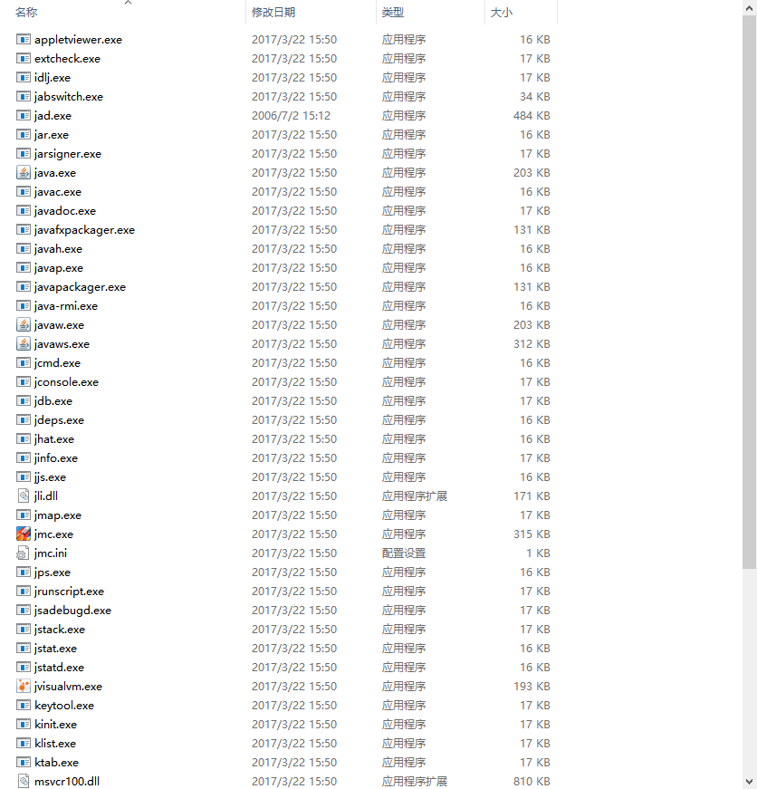
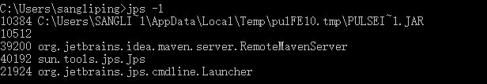
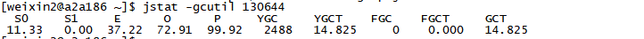
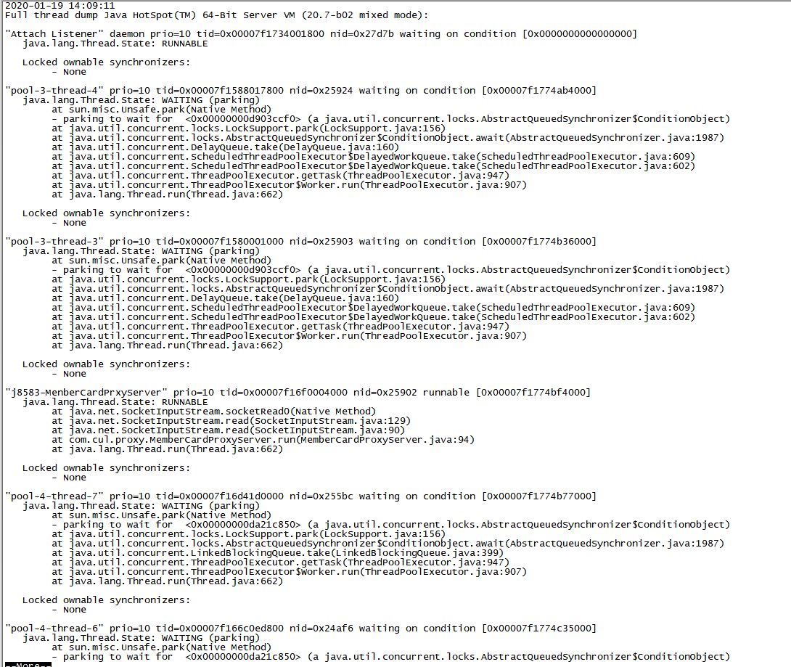
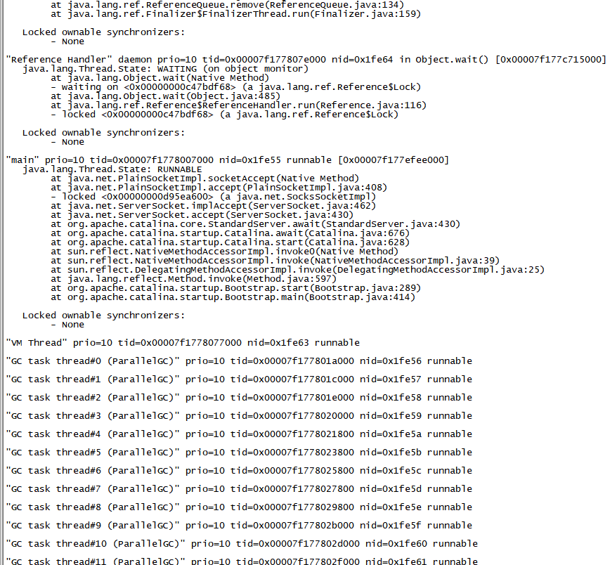

## 基础故障处理工具



分为3类

- 商业授权工具：LMC(Java Mission Control) JFR(JavaFlight Recorder)
- 正式支持工具：长期技术支持
- 实验性工具：无技术支持

[^JDK5]: 如果需要监控JDK5，需要增加参数`-Dcom.sun.management.jmxremote`

1. jps（JVM Process Status Tool）:虚拟机进程状态工具

   列出正在运行的虚拟机进程，并显示虚拟机及这些进程的本地虚拟机唯一ID

   ```shell
   jps [options] [hostip]
   ```

   

   jps还可以通过RMI协议查询开启了RMI服务的远程虚拟机进程状态，参数hostid为RMI注册表中注册的主机名。

   | 选项 | 作用                                                 |
   | ---- | ---------------------------------------------------- |
   | -q   | 只输出LVMID，省略主类的名称                          |
   | -m   | 输出虚拟机进程启动传递给主类main()函数的参数         |
   | -l   | 输出主类的全名，如果进程执行的是JAR包，则输出jar路径 |
   | -v   | 输出虚拟机进程启动时的JVM参数                        |

2. jstat:虚拟机统计信息监视工具

   监控虚拟机各种运行状态信息的命令行工具。可以显示本地或者远程虚拟机进程中的类加载、内存、垃圾收集、即时编译等运行时数据。

   ```shell
   jstat [option vmid [interval[s|ms] [count]]]
   ```

   如果是本地虚拟机进程，VMID和LVMID是一致的，如果是远程虚拟机那VMID的格式为：[protocol:][//]lvmid[@hostname[:port]/servername]

   interval和count代表查询间隔和次数。如果没有测查询一次。

   ```shell
   jstat -gc 2764 250 20
   ```

   | 选项              | 作用                                                         |
   | ----------------- | ------------------------------------------------------------ |
   | -class            | 监视类加载、卸载数量，总空间以及类装载所耗费的时间           |
   | -gc               | 监视java堆状况，包括Eden区、2个Survivor取、老年代、永久代等的容量，已用空间，垃圾收集时间合计等信息。 |
   | -gccapacity       | 监视内容与-gc基本相同，但输出主要关注java堆各个区域使用到的最大、最小空间。 |
   | -gcutil           | 监视内容与-gc基本相同，但输出主要关注已使用空间占总空间的百分比 |
   | -gccause          | 与-gcutil功能一样，但是会额外出导致上一次垃圾收集产生的原因  |
   | -gcnew            | 监视新生代垃圾收集状况                                       |
   | -gcnewcapacity    | 监视内容与-gcnew基本相同，输出主要关注使用到的最大、最小空间 |
   | -gcold            | 监视老年代垃圾收集状况                                       |
   | -gcoldcapacity    | 监视内容与-gcold基本相同，输出主要关注使用到的最大、最小空间 |
   | -gcpermcapacity   | 输出永久代使用到的最大、最小空间                             |
   | -compiler         | 输出即使编译器编译过的方法、耗时等信息                       |
   | -printcompilation | 输出已经被即时编译的方法                                     |

   

   这台服务器的新生代Eden区（E，表示Eden）使用了37.22%的空间，2个Survivor区（S0、S1，表示Survivor0、Survivor1）里面都是空的，老年代（O，表示Old）和永久代（P，表示Permanent）则分别使用了72.91%和99.92%的空间。程序运行以来共发生MinorGC（YGC，表示Young GC）2488次，总耗时14.8255秒；发生FullGC（FGC，表示Full GC）0次，总耗时（FGCT，表示Full GC Time）为0秒；所有GC总耗时（GCT，表示GC Time）为14.825秒。

3. jinfo:java配置信息工具

   jinfo（Configuration Info for Java）的作用是实时查看和调整虚拟机各项参数。使用jps命令的-v参数可以查看虚拟机启动时显式指定的参数列表，但如果想知道未被显式指定的参数的系统默认值，除了去找资料外，就只能使用jinfo的-flag选项进行查询了（如果只限于JDK 6或以上版本的话，使用java-XX：+PrintFlagsFinal查看参数默认值也是一个很好的选择）。jinfo还可以使用-sysprops选项把虚拟机进程的System.getProperties()的内容打印出来。

   ```shell
   jinfo [option]  pid
   ```

   ```shell
   [weixin2@a2a186 ~]$ jinfo -flag CMSInitiatingOccupancyFraction 130644
   -XX:CMSInitiatingOccupancyFraction=-1
   ```

   

4. jmap:java内存映像工具

   jmap（Memory Map for Java）命令用于生成堆转储快照（一般称为heapdump或dump文件）。还可以查询finalize执行队列、Java堆和方法区的详细信息，如空间使用率、当前用的是哪种收集器等。

   ```shell
   jmap [option]  vmid
   ```

   | 选项           | 作用                                                         |
   | -------------- | ------------------------------------------------------------ |
   | -dump          | 生成java堆转储快照，格式为-dump:[live.]format=b.file=<filename>，其中live子参数说明是否只dump出存活的对象 |
   | -finalizerinfo | 显示在F-Queue中等着Finalize线程执行finalize方法的对象，只在linux\Solaris平台有效 |
   | -heap          | 显示堆中详细信息，如使用哪种回收器，参数配置、分代情况等，只在linux\Solaris平台有效 |
   | -histo         | 显示堆中对象统计信息。包括类、实例数量、合计容量             |
   | -permstat      | 以ClassLoader为统计口径显示永久代内存状态，只在linux\Solaris平台有效 |
   | -F             | 当虚拟机进程对-dump选项没有响应时，可使用这个选项强制生成dump快照，只在linux\Solaris平台有效 |

5. jhat:虚拟机堆转储快照分析工具

   JDK提供jhat（JVM Heap Analysis Tool）命令与jmap搭配使用，来分析jmap生成的堆转储快照。

6. jstack：Java堆栈跟踪工具

   jstack（Stack Trace for Java）命令用于生成虚拟机当前时刻的线程快照（一般称为threaddump或者javacore文件）。线程快照就是当前虚拟机内每一条线程正在执行的方法堆栈的集合，生成线程快照的目的通常是定位线程出现长时间停顿的原因，如线程间死锁、死循环、请求外部资源导致的长时间挂起等，都是导致线程长时间停顿的常见原因。线程出现停顿时通过jstack来查看各个线程的调用堆栈，就可以获知没有响应的线程到底在后台做些什么事情，或者等待着什么资源。

   ```shell
   jstack [option]  vmid
   ```

   | 选项 | 作用                                         |
   | ---- | -------------------------------------------- |
   | -F   | 当正常输出的请求不被响应时，强制输出线程堆栈 |
   | -l   | 除堆栈外，显示关于锁的附加信息               |
   | -m   | 如果调用到本地方法的话，可以显示C/C++的堆栈  |

   

   

   

7. 


