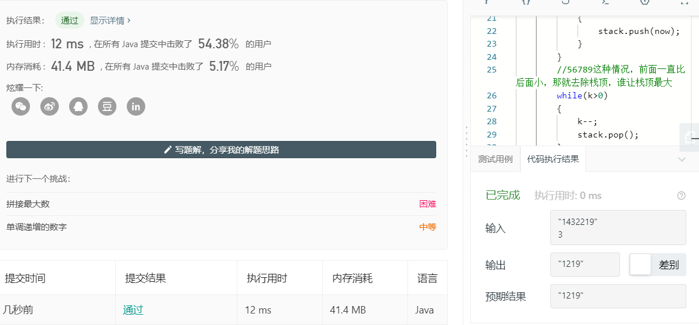

## [402. 移掉K位数字](https://leetcode-cn.com/problems/remove-k-digits/)

给定一个以字符串表示的非负整数 *num*，移除这个数中的 *k* 位数字，使得剩下的数字最小。

**注意:**

- *num* 的长度小于 10002 且 ≥ *k。*
- *num* 不会包含任何前导零。

**示例 1 :**

```
输入: num = "1432219", k = 3
输出: "1219"
解释: 移除掉三个数字 4, 3, 和 2 形成一个新的最小的数字 1219。
```

**示例 2 :**

```
输入: num = "10200", k = 1
输出: "200"
解释: 移掉首位的 1 剩下的数字为 200. 注意输出不能有任何前导零。
```

示例 **3 :**

```
输入: num = "10", k = 2
输出: "0"
解释: 从原数字移除所有的数字，剩余为空就是0。
```

### 代码

```java
package com.zixin.algorithm;

import java.util.Stack;

public class LC402 {
	/**
	 * 
	 * @Title: removeKdigits
	 * @Description: 原数据长度固定 删除长度固定 则剩下的位数也就固定
	 * 删除的时候保证前面的数据尽量小 
	 * 前面单调递增不需要删   如果后面单调递增个从后往前删
	 * 
	 * @author Administrator
	 * @date 2020-03-21 10:50:03
	 * @param @param num
	 * @param @param k
	 * @param @return 参数
	 * @return String 返回类型
	 * @throws
	 */
	public String removeKdigits(String num, int k) {
		 //贪心算法+栈
        if(k>=num.length()||num.length()==0) {
            return "0";
        }
        //栈顶始终是最大值
        Stack<Integer>stack=new Stack<>();
        stack.push(num.charAt(0)-'0');
        for(int i=1;i<num.length();i++)
        {
            int now=num.charAt(i)-'0';
            //可能好几个值都比当前值大，那么我们就在k允许的情况下，去去除它。
            while(!stack.isEmpty()&&k>0&&now<stack.peek()){
                stack.pop();
                k--;
            }
            //不等于0可以添加进去,
            //等于0，栈不为空可以填进去，
            if(now!=0||!stack.isEmpty())
            {
                stack.push(now);
            }
        }
        //56789这种情况，前面一直比后面小，那就去除栈顶，谁让栈顶最大
        while(k>0)
        {
            k--;
            stack.pop();
        }
        //10，1(当now=0时，满足条件，去掉1，但now为0，且为空。)
        if(stack.isEmpty())
            return "0";
        StringBuilder sb=new StringBuilder();
        while(!stack.isEmpty())
            sb.append(stack.pop());
        //从后往前添加所以我们要逆序
        return sb.reverse().toString();
	}
}

```

### 提交

