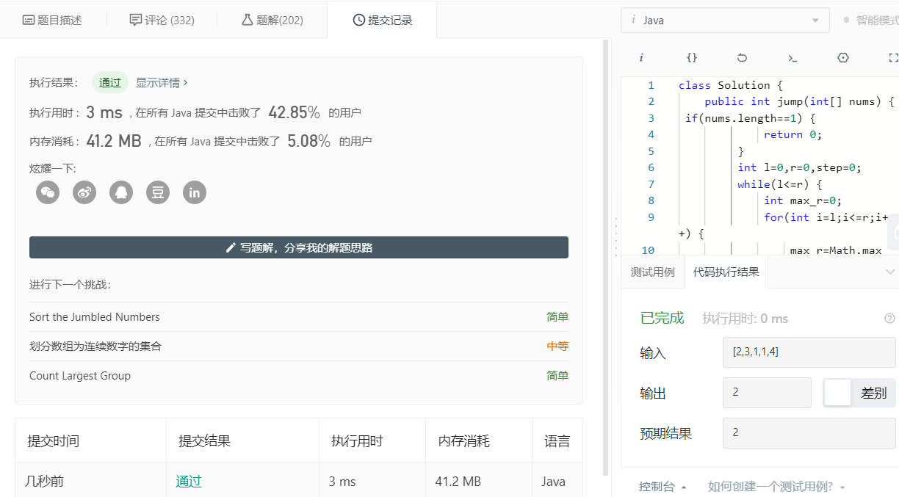

## [45. 跳跃游戏 II](https://leetcode-cn.com/problems/jump-game-ii/)

给定一个非负整数数组，你最初位于数组的第一个位置。

数组中的每个元素代表你在该位置可以跳跃的最大长度。

你的目标是使用最少的跳跃次数到达数组的最后一个位置。

### **示例:**

```
输入: [2,3,1,1,4]
输出: 2
解释: 跳到最后一个位置的最小跳跃数是 2。
     从下标为 0 跳到下标为 1 的位置，跳 1 步，然后跳 3 步到达数组的最后一个位置。
```

### **说明:**

假设你总是可以到达数组的最后一个位置。

### 代码

```java
package com.zixin.algorithm;

public class LC45 {
	
	/**
	 * 
	 * @Title: jump
	 * @Description:思路：贪心法来做，时间复杂度O(n).

我们如何选这一步的落脚点？前一步的落脚点用l表示，前一步可以达到的最远位置用r表示，在（l, r]区间内的所有的数nums[i]再走一步，可以达到的最远的位置是max(nums[i]+i)，谁能达到这个最远位置，
谁就是这一步的落脚点，此最远位置就是这一步的最远位置。
	 * @author Administrator
	 * @date 2020-03-20 23:09:53
	 * @param @param nums
	 * @param @return 参数
	 * @return int 返回类型
	 * @throws
	 */
	 public int jump(int[] nums) {

		 if(nums.length==1) {
			 return 0;
		 }
		 int l=0,r=0,step=0;
		 while(l<=r) {
			 int max_r=0;
			 for(int i=l;i<=r;i++) {
				 max_r=Math.max(max_r, i+nums[i]);
			 }
			 l=r+1;r=max_r;
			 step++;
			 if(r>=nums.length-1) {
				 break;
			 }
		 }
		 return step;
	 }
}

```

### 提交

