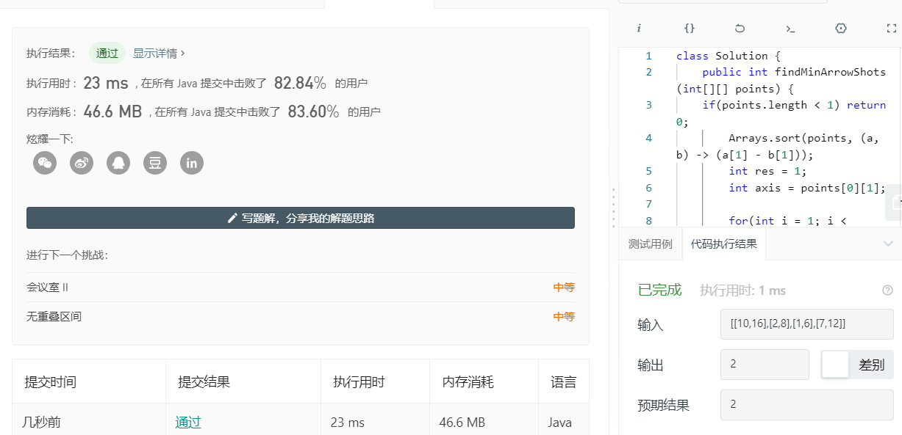

## [452. 用最少数量的箭引爆气球](https://leetcode-cn.com/problems/minimum-number-of-arrows-to-burst-balloons/)

在二维空间中有许多球形的气球。对于每个气球，提供的输入是水平方向上，气球直径的开始和结束坐标。由于它是水平的，所以y坐标并不重要，因此只要知道开始和结束的x坐标就足够了。开始坐标总是小于结束坐标。平面内最多存在104个气球。

一支弓箭可以沿着x轴从不同点完全垂直地射出。在坐标x处射出一支箭，若有一个气球的直径的开始和结束坐标为 xstart，xend， 且满足  xstart ≤ x ≤ xend，则该气球会被引爆。可以射出的弓箭的数量没有限制。 弓箭一旦被射出之后，可以无限地前进。我们想找到使得所有气球全部被引爆，所需的弓箭的最小数量。

**Example:**

```
输入:
[[10,16], [2,8], [1,6], [7,12]]

输出:
2

解释:
对于该样例，我们可以在x = 6（射爆[2,8],[1,6]两个气球）和 x = 11（射爆另外两个气球）。
```

### 思路

### 代码

```java
package com.zixin.algorithm;

import java.util.Arrays;


public class LC452 {
	// 这里使用的是贪心算法，每次都是打最右边的点 ，当新的点的左边大于之前打掉的断点的右边 则就需要再加一
	public int findMinArrowShots(int[][] points) {

		if(points.length < 1) return 0;
        Arrays.sort(points, (a, b) -> (a[1] - b[1]));
        int res = 1;
        int axis = points[0][1];
        
        for(int i = 1; i < points.length; ++i) {
            if(axis < points[i][0]) {
            	res++;
                axis = points[i][1];
            }
        }
		return res;
	}
}

```

## 提交

