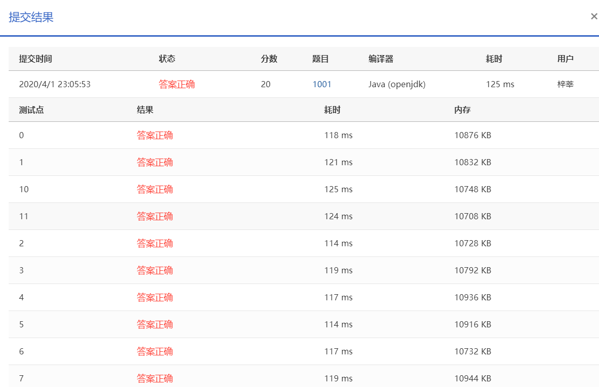

Calculate *a*+*b* and output the sum in standard format -- that is, the digits must be separated into groups of three by commas (unless there are less than four digits).

### Input Specification:

Each input file contains one test case. Each case contains a pair of integers *a* and *b* where −106≤*a*,*b*≤106. The numbers are separated by a space.

### Output Specification:

For each test case, you should output the sum of *a* and *b* in one line. The sum must be written in the standard format.

### Sample Input:

```in
-1000000 9

      
    
```

### Sample Output:

```out
-999,991

      
    
```

作者: CHEN, Yue

单位: 浙江大学

时间限制: 400 ms

内存限制: 64 MB

### 代码

```java
package com.zixin.algorithm;

import java.util.Scanner;

public class PATA1001 {

	public static void main(String[] args) {
		Scanner sc = new Scanner(System.in);
		int a = sc.nextInt();
		int b =sc.nextInt();
		sc.close();
		int c = a+b;
		if(c<0) {
			System.out.print("-");
			c=-c;
		}
		int length=0;
		int num[] = new int[10];
		if(c==0) {
			num[length++]=0;
		}
		while(c!=0) {
			num[length++]=c%10;
			c=c/10;
		}
		for(int k=length-1;k>=0;k--) {//高位开始输出
			System.out.printf("%d",num[k]);
			if(k>0&&k%3==0) {
				System.out.print(",");//三位1个逗号
			}
		}

	}

}

```

### 提交



