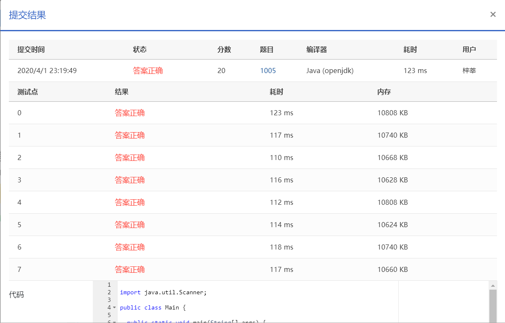

Given a non-negative integer *N*, your task is to compute the sum of all the digits of *N*, and output every digit of the sum in English.

### Input Specification:

Each input file contains one test case. Each case occupies one line which contains an *N* (≤10100).

### Output Specification:

For each test case, output in one line the digits of the sum in English words. There must be one space between two consecutive words, but no extra space at the end of a line.

### Sample Input:

```in
12345

      
    
```

### Sample Output:

```out
one five
```

### 代码

```java
package com.zixin.algorithm;

import java.util.Scanner;

public class PATA005 {

	public static void main(String[] args) {
		Scanner sc = new Scanner(System.in);
		char[] arr = sc.next().toCharArray();
		int sum = 0;
		String [] num = {"zero","one","two","three","four","five","six","seven","eight","nine"};
		for(int i=0;i<arr.length;i++) {
		sum+=arr[i]-'0';	
		}
		sc.close();
		int digit[]=new int[102];
		int numlen=0;
		if(sum==0) {
			System.out.println(num[0]);
		}else {
			while (sum!=0) {
				digit[numlen++]=sum%10;
				sum=sum/10;
			}
			
			for(int i=numlen-1;i>=0;i--) {
				System.out.printf("%s",num[digit[i]]);
				if(i!=0) {
					System.out.print(" ");
				}
			}
		}
		
		

	}

}

```

### 提交

