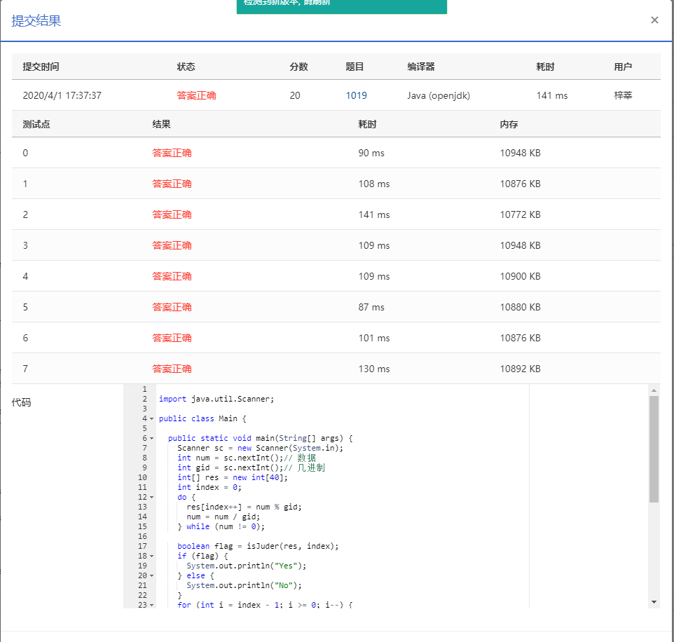

A number that will be the same when it is written forwards or backwards is known as a **Palindromic Number**. For example, 1234321 is a palindromic number. All single digit numbers are palindromic numbers.

Although palindromic numbers are most often considered in the decimal system, the concept of palindromicity can be applied to the natural numbers in any numeral system. Consider a number *N*>0 in base *b*≥2, where it is written in standard notation with *k*+1 digits *a**i* as ∑*i*=0*k*(*a**i**b**i*). Here, as usual, 0≤*a**i*<*b* for all *i* and *a**k* is non-zero. Then *N* is palindromic if and only if *a**i*=*a**k*−*i* for all *i*. Zero is written 0 in any base and is also palindromic by definition.

Given any positive decimal integer *N* and a base *b*, you are supposed to tell if *N* is a palindromic number in base *b*.

### Input Specification:

Each input file contains one test case. Each case consists of two positive numbers *N* and *b*, where 0<*N*≤109 is the decimal number and 2≤*b*≤109 is the base. The numbers are separated by a space.

### Output Specification:

For each test case, first print in one line `Yes` if *N* is a palindromic number in base *b*, or `No` if not. Then in the next line, print *N* as the number in base *b* in the form "*a**k* *a**k*−1 ... *a*0". Notice that there must be no extra space at the end of output.

### Sample Input 1:

```in
27 2

      
    
```

### Sample Output 1:

```out
Yes
1 1 0 1 1

      
    
```

### Sample Input 2:

```in
121 5

      
    
```

### Sample Output 2:

```out
No
4 4 1
```


### 代码

```java
package com.zixin.algorithm;

import java.util.Scanner;

public class PATA1019 {

	public static void main(String[] args) {
		Scanner sc = new Scanner(System.in);
		int num = sc.nextInt();// 数据
		int gid = sc.nextInt();// 几进制
		int[] res = new int[40];
		int index = 0;
		do {
			res[index++] = num % gid;
			num = num / gid;
		} while (num != 0);

		boolean flag = isJuder(res, index);
		if (flag) {
			System.out.println("Yes");
		} else {
			System.out.println("No");
		}
		for (int i = index - 1; i >= 0; i--) {
			if (i == index - 1) {
				System.out.printf("%d", res[i]);
			} else {
				System.out.printf(" %d", res[i]);
			}
		}

	}

	static boolean isJuder(int[] arr, int num) {
		for (int i = 0; i < num / 2; i++) {
			if (arr[i] != arr[num - 1 - i]) {
				return false;
			}
		}
		return true;
	}

}

```

### 提交

