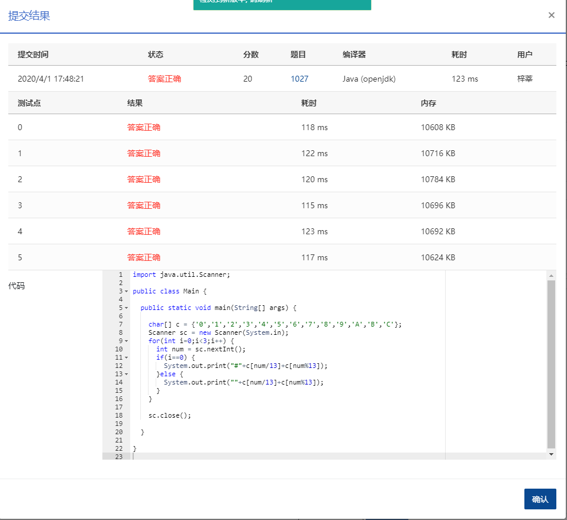

People in Mars represent the colors in their computers in a similar way as the Earth people. That is, a color is represented by a 6-digit number, where the first 2 digits are for `Red`, the middle 2 digits for `Green`, and the last 2 digits for `Blue`. The only difference is that they use radix 13 (0-9 and A-C) instead of 16. Now given a color in three decimal numbers (each between 0 and 168), you are supposed to output their Mars RGB values.

### Input Specification:

Each input file contains one test case which occupies a line containing the three decimal color values.

### Output Specification:

For each test case you should output the Mars RGB value in the following format: first output `#`, then followed by a 6-digit number where all the English characters must be upper-cased. If a single color is only 1-digit long, you must print a `0` to its left.

### Sample Input:

```in
15 43 71

      
    
```

### Sample Output:

```out
#123456
```


### 代码

```java
package com.zixin.algorithm;

import java.util.Scanner;

public class PATA1027 {

	public static void main(String[] args) {
		
		char[] c = {'0','1','2','3','4','5','6','7','8','9','A','B','C'};
		Scanner sc = new Scanner(System.in);
		for(int i=0;i<3;i++) {
			int num = sc.nextInt();
			if(i==0) {
				System.out.print("#"+c[num/13]+c[num%13]);
			}else {
				System.out.print(""+c[num/13]+c[num%13]);
			}
		}
		
		sc.close();

	}

}

```

### 提交

