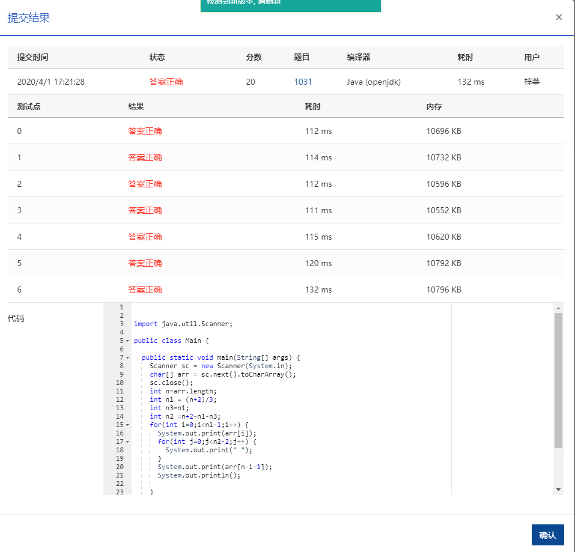

Given any string of *N* (≥5) characters, you are asked to form the characters into the shape of `U`. For example, `helloworld` can be printed as:

```
h  d
e  l
l  r
lowo

      
    
```

That is, the characters must be printed in the original order, starting top-down from the left vertical line with *n*1 characters, then left to right along the bottom line with *n*2 characters, and finally bottom-up along the vertical line with *n*3 characters. And more, we would like `U` to be as squared as possible -- that is, it must be satisfied that *n*1=*n*3=*m**a**x* { *k* | *k*≤*n*2 for all 3≤*n*2≤*N* } with *n*1+*n*2+*n*3−2=*N*.

### Input Specification:

Each input file contains one test case. Each case contains one string with no less than 5 and no more than 80 characters in a line. The string contains no white space.

### Output Specification:

For each test case, print the input string in the shape of U as specified in the description.

### Sample Input:

```in
helloworld!

      
    
```

### Sample Output:

```out
h   !
e   d
l   l
lowor
```

### 代码

```java
package com.zixin.algorithm;

import java.util.Scanner;

public class PATA1031 {

	public static void main(String[] args) {
		Scanner sc = new Scanner(System.in);
		char[] arr = sc.next().toCharArray();
		sc.close();
		int n=arr.length;
		int n1 = (n+2)/3;//关键是如何求出n1  也可以从小到大枚举 找到第一个符合条件的值
		int n3=n1;
		int n2 =n+2-n1-n3;
		for(int i=0;i<n1-1;i++) {
			System.out.print(arr[i]);
			for(int j=0;j<n2-2;j++) {
				System.out.print(" ");
			}
			System.out.print(arr[n-i-1]);
			System.out.println();
			
		}
		for(int i=0;i<n2;i++) {
			System.out.print(arr[n1+i-1]);
		}
	}
}

```

### 提交

