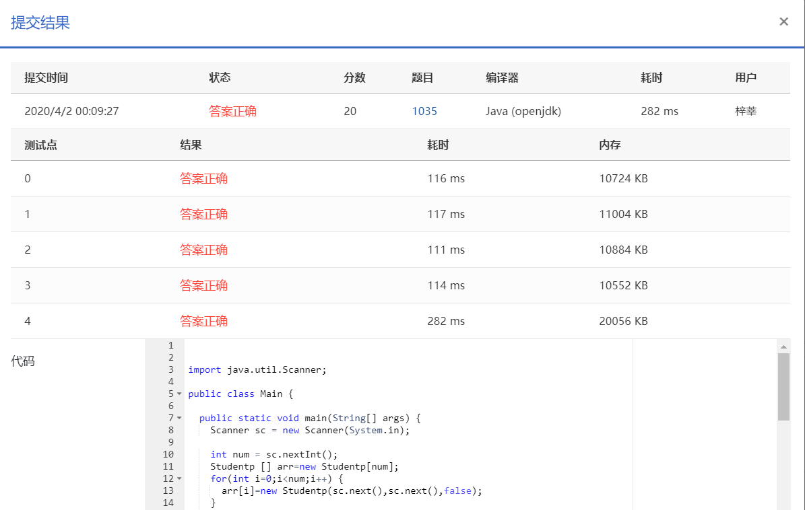

To prepare for PAT, the judge sometimes has to generate random passwords for the users. The problem is that there are always some confusing passwords since it is hard to distinguish `1` (one) from `l` (`L` in lowercase), or `0` (zero) from `O` (`o` in uppercase). One solution is to replace `1` (one) by `@`, `0` (zero) by `%`, `l` by `L`, and `O` by `o`. Now it is your job to write a program to check the accounts generated by the judge, and to help the juge modify the confusing passwords.

### Input Specification:

Each input file contains one test case. Each case contains a positive integer *N* (≤1000), followed by *N* lines of accounts. Each account consists of a user name and a password, both are strings of no more than 10 characters with no space.

### Output Specification:

For each test case, first print the number *M* of accounts that have been modified, then print in the following *M* lines the modified accounts info, that is, the user names and the corresponding modified passwords. The accounts must be printed in the same order as they are read in. If no account is modified, print in one line `There are N accounts and no account is modified` where `N` is the total number of accounts. However, if `N` is one, you must print `There is 1 account and no account is modified` instead.

### Sample Input 1:

```in
3
Team000002 Rlsp0dfa
Team000003 perfectpwd
Team000001 R1spOdfa

      
    
```

### Sample Output 1:

```out
2
Team000002 RLsp%dfa
Team000001 R@spodfa

      
    
```

### Sample Input 2:

```in
1
team110 abcdefg332

      
    
```

### Sample Output 2:

```out
There is 1 account and no account is modified

      
    
```

### Sample Input 3:

```in
2
team110 abcdefg222
team220 abcdefg333

      
    
```

### Sample Output 3:

```out
There are 2 accounts and no account is modified
```

### 代码

```java
package com.zixin.algorithm;

import java.util.Scanner;

public class PATA1035 {

	public static void main(String[] args) {
		Scanner sc = new Scanner(System.in);

		int num = sc.nextInt();
		Studentp [] arr=new Studentp[num];
		for(int i=0;i<num;i++) {
			arr[i]=new Studentp(sc.next(),sc.next(),false);
		}
		sc.close();
		int changeNum=0;
		for(int i=0;i<num;i++) {
			String password = arr[i].getPassword();
			if(password.contains("1")||password.contains("0")||password.contains("l")||password.contains("O")) {
				arr[i].isChange=true;
				arr[i].setPassword(password.replaceAll("1", "@").replaceAll("0", "%").replaceAll("l", "L").replaceAll("O", "o"));
				changeNum++;
			}
		}
		if(changeNum==0&&num==1) {
			System.out.println("There is "+num+" account and no account is modified");
		}else if(changeNum==0&&num>1) {
			System.out.println("There are "+num+" accounts and no account is modified");
		}else {
			System.out.println(changeNum);
			for(int i=0;i<num;i++) {
				if(arr[i].isChange) {
					System.out.println(arr[i].getName()+" "+arr[i].getPassword());
				}
			}
		}
	}

}


class Studentp{
	private String name;
	private String password;
	boolean isChange;
	public String getName() {
		return name;
	}
	public void setName(String name) {
		this.name = name;
	}
	public String getPassword() {
		return password;
	}
	public void setPassword(String password) {
		this.password = password;
	}
	public boolean isChange() {
		return isChange;
	}
	public void setChange(boolean isChange) {
		this.isChange = isChange;
	}
	public Studentp(String name, String password, boolean isChange) {
		super();
		this.name = name;
		this.password = password;
		this.isChange = isChange;
	}
	
}
```

### 提交

