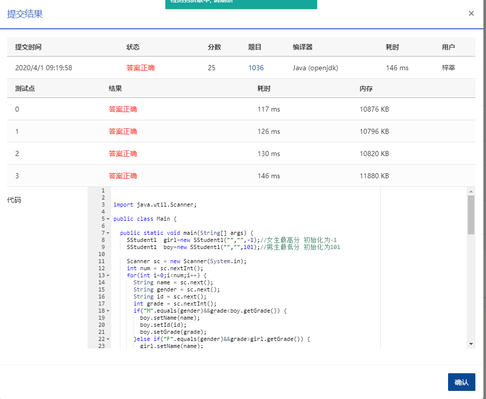

This time you are asked to tell the difference between the lowest grade of all the male students and the highest grade of all the female students.

### Input Specification:

Each input file contains one test case. Each case contains a positive integer *N*, followed by *N* lines of student information. Each line contains a student's `name`, `gender`, `ID` and `grade`, separated by a space, where `name` and `ID` are strings of no more than 10 characters with no space, `gender` is either `F` (female) or `M` (male), and `grade` is an integer between 0 and 100. It is guaranteed that all the grades are distinct.

### Output Specification:

For each test case, output in 3 lines. The first line gives the name and ID of the female student with the highest grade, and the second line gives that of the male student with the lowest grade. The third line gives the difference *g**r**a**d**e**F*−*g**r**a**d**e**M*. If one such kind of student is missing, output `Absent` in the corresponding line, and output `NA` in the third line instead.

### Sample Input 1:

```in
3
Joe M Math990112 89
Mike M CS991301 100
Mary F EE990830 95

      
    
```

### Sample Output 1:

```out
Mary EE990830
Joe Math990112
6

      
    
```

### Sample Input 2:

```in
1
Jean M AA980920 60

      
    
```

### Sample Output 2:

```out
Absent
Jean AA980920
NA

      
    
```

作者: CHEN, Yue

单位: 浙江大学

时间限制: 400 ms

内存限制: 64 MB


### 代码

```java
package com.zixin.algorithm;

import java.util.Scanner;

public class PATA1036 {

	public static void main(String[] args) {
		SStudent1  girl=new SStudent1("","",-1);//女生最高分 初始化为-1
		SStudent1  boy=new SStudent1("","",101);//男生最低分 初始化为101

		Scanner sc = new Scanner(System.in);
		int num = sc.nextInt();
		for(int i=0;i<num;i++) {
			String name = sc.next();
			String gender = sc.next();
			String id = sc.next();
			int grade = sc.nextInt();
			if("M".equals(gender)&&grade<boy.getGrade()) {
				boy.setName(name);
				boy.setId(id);
				boy.setGrade(grade);
			}else if("F".equals(gender)&&grade>girl.getGrade()) {
				girl.setName(name);
				girl.setId(id);
				girl.setGrade(grade);
			}
		}

		sc.close();
		boolean flag = true;
		if(girl.getGrade()==-1) {
			System.out.println("Absent");
			flag =false;
		}else {
			System.out.println(girl.getName()+" "+girl.getId());
		}
		if(boy.getGrade()==101) {
			System.out.println("Absent");
			flag =false;
		}else {
			System.out.println(boy.getName()+" "+boy.getId());
		}
		if(!flag) {
			System.out.println("NA");
		}else {
			System.out.println(girl.getGrade()-boy.getGrade());
		}
	}

}

class  SStudent1{
	private String name;
	private String id;
	private int grade;
	public String getName() {
		return name;
	}
	public void setName(String name) {
		this.name = name;
	}
	public String getId() {
		return id;
	}
	public void setId(String id) {
		this.id = id;
	}
	public int getGrade() {
		return grade;
	}
	public void setGrade(int grade) {
		this.grade = grade;
	}
	public SStudent1(String name, String id, int grade) {
		super();
		this.name = name;
		this.id = id;
		this.grade = grade;
	}
	public SStudent1() {
		super();
	}
	
}

```

### 提交

