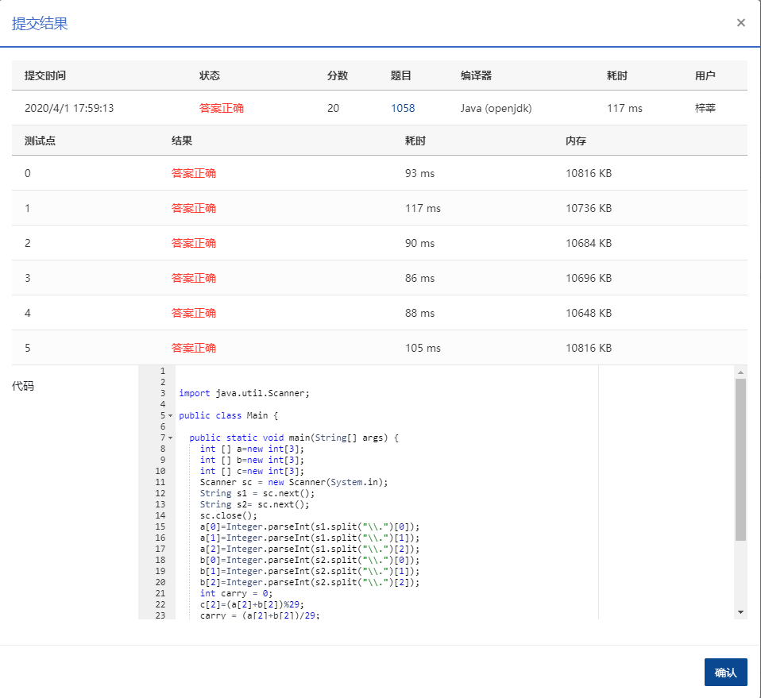

If you are a fan of Harry Potter, you would know the world of magic has its own currency system -- as Hagrid explained it to Harry, "Seventeen silver Sickles to a Galleon and twenty-nine Knuts to a Sickle, it's easy enough." Your job is to write a program to compute *A*+*B* where *A* and *B* are given in the standard form of `Galleon.Sickle.Knut` (`Galleon` is an integer in [0,107], `Sickle` is an integer in [0, 17), and `Knut` is an integer in [0, 29)).

### Input Specification:

Each input file contains one test case which occupies a line with *A* and *B* in the standard form, separated by one space.

### Output Specification:

For each test case you should output the sum of *A* and *B* in one line, with the same format as the input.

### Sample Input:

```in
3.2.1 10.16.27

      
    
```

### Sample Output:

```out
14.1.28
```

### 代码

```java
package com.zixin.algorithm;

import java.util.Scanner;

public class PATA1058 {

	public static void main(String[] args) {
		int [] a=new int[3];
		int [] b=new int[3];
		int [] c=new int[3];
		Scanner sc = new Scanner(System.in);
		String s1 = sc.next();
		String s2= sc.next();
		sc.close();
		a[0]=Integer.parseInt(s1.split("\\.")[0]);
		a[1]=Integer.parseInt(s1.split("\\.")[1]);
		a[2]=Integer.parseInt(s1.split("\\.")[2]);
		b[0]=Integer.parseInt(s2.split("\\.")[0]);
		b[1]=Integer.parseInt(s2.split("\\.")[1]);
		b[2]=Integer.parseInt(s2.split("\\.")[2]);
		int carry = 0;
		c[2]=(a[2]+b[2])%29;
		carry = (a[2]+b[2])/29;
		c[1]=(a[1]+b[1]+carry)%17;
		carry =(a[1]+b[1]+carry)/17;
		c[0]=a[0]+b[0]+carry;
		System.out.println(c[0]+"."+c[1]+"."+c[2]);

	}

}

```

### 提交

