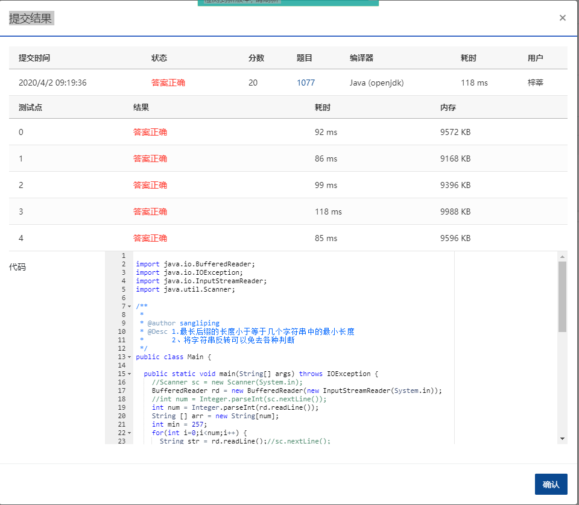

The Japanese language is notorious for its sentence ending particles. Personal preference of such particles can be considered as a reflection of the speaker's personality. Such a preference is called "Kuchiguse" and is often exaggerated artistically in Anime and Manga. For example, the artificial sentence ending particle "nyan~" is often used as a stereotype for characters with a cat-like personality:

- Itai nyan~ (It hurts, nyan~)
- Ninjin wa iyada nyan~ (I hate carrots, nyan~)

Now given a few lines spoken by the same character, can you find her Kuchiguse?

### Input Specification:

Each input file contains one test case. For each case, the first line is an integer *N* (2≤*N*≤100). Following are *N* file lines of 0~256 (inclusive) characters in length, each representing a character's spoken line. The spoken lines are case sensitive.

### Output Specification:

For each test case, print in one line the kuchiguse of the character, i.e., the longest common suffix of all *N* lines. If there is no such suffix, write `nai`.

### Sample Input 1:

```in
3
Itai nyan~
Ninjin wa iyadanyan~
uhhh nyan~

      
    
```

### Sample Output 1:

```out
nyan~

      
    
```

### Sample Input 2:

```in
3
Itai!
Ninjinnwaiyada T_T
T_T

      
    
```

### Sample Output 2:

```out
nai
```

### 代码

```java
package com.zixin.algorithm;

import java.io.BufferedReader;
import java.io.IOException;
import java.io.InputStreamReader;
import java.util.Scanner;

/**
 * 
 * @author sangliping
 * @Desc 1.最长后缀的长度小于等于几个字符串中的最小长度
 *       2、将字符串反转可以免去各种判断
 *       3、使用Scanner会有一个超时 17分  ，换成BufferedReader可以AC
 */
public class PATA1077 {

	public static void main(String[] args) throws IOException {
		//Scanner sc = new Scanner(System.in);
		BufferedReader rd = new BufferedReader(new InputStreamReader(System.in));
		//int num = Integer.parseInt(sc.nextLine());
		int num = Integer.parseInt(rd.readLine());
		String [] arr = new String[num];
		int min = 257;
		for(int i=0;i<num;i++) {
			String str = rd.readLine();//sc.nextLine();
			if(str.length()<min) {
				min=str.length();
			}
			arr[i]=new StringBuilder(str).reverse().toString();
		}
		//sc.close();
		rd.close();
		boolean same = true;
		int sameIndex = 0;
		for(int i=0;i<min;i++) {
			char c = arr[0].charAt(i);
			for(int j=1;j<num;j++) {
				if(arr[j].charAt(i)!=c) {
					same=false;
					break;
				}
			}
			if(same) {
				sameIndex++;
			}
			
		}
		if(sameIndex>0) {
			for(int i=sameIndex-1;i>=0;i--) {
				System.out.printf("%c",arr[0].charAt(i));
			}
		}else {
			System.out.println("nai");//不存在公共前缀
		}
	}

}

```

### 提交

