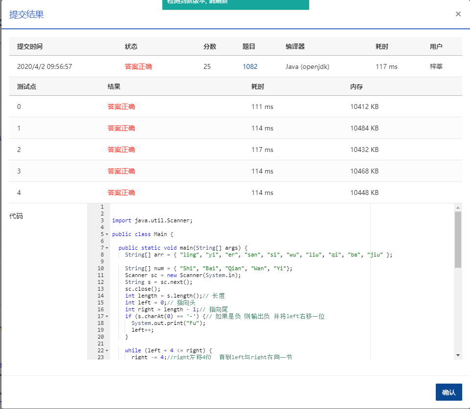

Given an integer with no more than 9 digits, you are supposed to read it in the traditional Chinese way. Output `Fu` first if it is negative. For example, -123456789 is read as `Fu yi Yi er Qian san Bai si Shi wu Wan liu Qian qi Bai ba Shi jiu`. Note: zero (`ling`) must be handled correctly according to the Chinese tradition. For example, 100800 is `yi Shi Wan ling ba Bai`.

### Input Specification:

Each input file contains one test case, which gives an integer with no more than 9 digits.

### Output Specification:

For each test case, print in a line the Chinese way of reading the number. The characters are separated by a space and there must be no extra space at the end of the line.

### Sample Input 1:

```in
-123456789

      
    
```

### Sample Output 1:

```out
Fu yi Yi er Qian san Bai si Shi wu Wan liu Qian qi Bai ba Shi jiu

      
    
```

### Sample Input 2:

```in
100800

      
    
```

### Sample Output 2:

```out
yi Shi Wan ling ba Bai
```

### 代码

```java
package com.zixin.algorithm;

import java.util.Scanner;

public class PATA1082 {

	public static void main(String[] args) {
		String[] arr = { "ling", "yi", "er", "san", "si", "wu", "liu", "qi", "ba", "jiu" };

		String[] num = { "Shi", "Bai", "Qian", "Wan", "Yi"};
		Scanner sc = new Scanner(System.in);
		String s = sc.next();
		sc.close();
		int length = s.length();// 长度
		int left = 0;// 指向头
		int right = length - 1;// 指向尾
		if (s.charAt(0) == '-') {// 如果是负 则输出负 并将left右移一位
			System.out.print("Fu");
			left++;
		}

		while (left + 4 <= right) {
			right -= 4;//right左移4位  直到left与right在同一节
		}
		while (left < length) {
			boolean flag = false;// flag表示是否有积累的0
			boolean isPrint = false;// 表示该节中没有输出过其中的位
			while (left <= right) {// 从左到右处理每一位
				if (left > 0 && s.charAt(left) == '0') {// 如果当前为0
					flag = true;// 则令标记为true
				} else {// 当前位不为0
					if (flag == true) {// 存在积累的0
						System.out.print(" ling");
						flag = false;
					}
					if (left > 0) {
						System.out.print(" ");
					}
					System.out.print(arr[s.charAt(left) - '0']);
					isPrint = true;// 至少有一位被输出
					if (left != right) {
						System.out.print(" " + num[right - left - 1]);
					}

				}
				left++;
			}
			if (isPrint && right != length - 1) {
				System.out.print(" " + num[(length - 1 - right) / 4 + 2]);
			}
			right += 4;
		}

	}

}

```

### 提交

