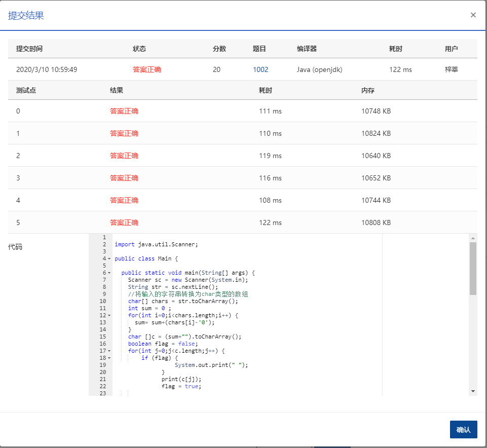

## 写出这个数

### 题目描述

```
读入一个正整数 n，计算其各位数字之和，用汉语拼音写出和的每一位数字。
```

### **输入描述:**

```
每个测试输入包含 1 个测试用例，即给出自然数 n 的值。这里保证 n 小于 10^100
```

### 输出描述:

```
在一行内输出 n 的各位数字之和的每一位，拼音数字间有 1 空格，但一行中最后一个拼音数字后没有空格。
```

### 输入例子:

```
1234567890987654321123456789
```

### 输出例子

```
yi san wu
```

### 代码

##### 代码1：结果正确

```java

package com.zixin.algorithm;

import java.util.Scanner;

public class PATB1002 {

	public static void main(String[] args) {
		Scanner sc = new Scanner(System.in);
		String str = sc.nextLine();
		//将输入的字符串转换为char类型的数组
		char[] chars = str.toCharArray();
		int sum = 0 ;
		for(int i=0;i<chars.length;i++) {
			sum= sum+(chars[i]-'0');
		}
		char []c = (sum+"").toCharArray();
		boolean flag = false;
		for(int j=0;j<c.length;j++) {
			if(j!=c.length-1) {
				print(c[j]);
				System.out.print(" ");
				
			}else {
				print(c[j]);
			}
			
		}
				
	}
	private static void print(char c) {
        switch (c) {
            case '1':
                System.out.print("yi");
                break;
            case '2':
                System.out.print("er");
                break;
            case '3':
                System.out.print("san");
                break;
            case '4':
                System.out.print("si");
                break;
            case '5':
                System.out.print("wu");
                break;
            case '6':
                System.out.print("liu");
                break;
            case '7':
                System.out.print("qi");
                break;
            case '8':
                System.out.print("ba");
                break;
            case '9':
                System.out.print("jiu");
                break;
            case '0':
                System.out.print("ling");
                break;

        }
    }
}

```

#### 代码二

```java
import java.util.Scanner;

public class Main {
	static String[] pinyin = { "ling", "yi", "er", "san", "si", "wu", "liu", "qi", "ba", "jiu" };

	public static void main(String args[]) throws Exception {
		Scanner s = new Scanner(System.in);
		String str = s.next();
		int sum = 0;
		for (int i = 0; i < str.length(); i++) {
			sum += str.charAt(i) - '0';
		}
		str = sum + "";
		for (int i = 0; i < str.length(); i++) {
			System.out.print(pinyin[str.charAt(i) - '0']);
			if (i < str.length() - 1) {
				System.out.print(" ");
			}
		}

	}
}

```


### 输入VS输出

```java
1231321
yi san
```

### 提交




第二个应该更好一些，因为用时短，且代码少。