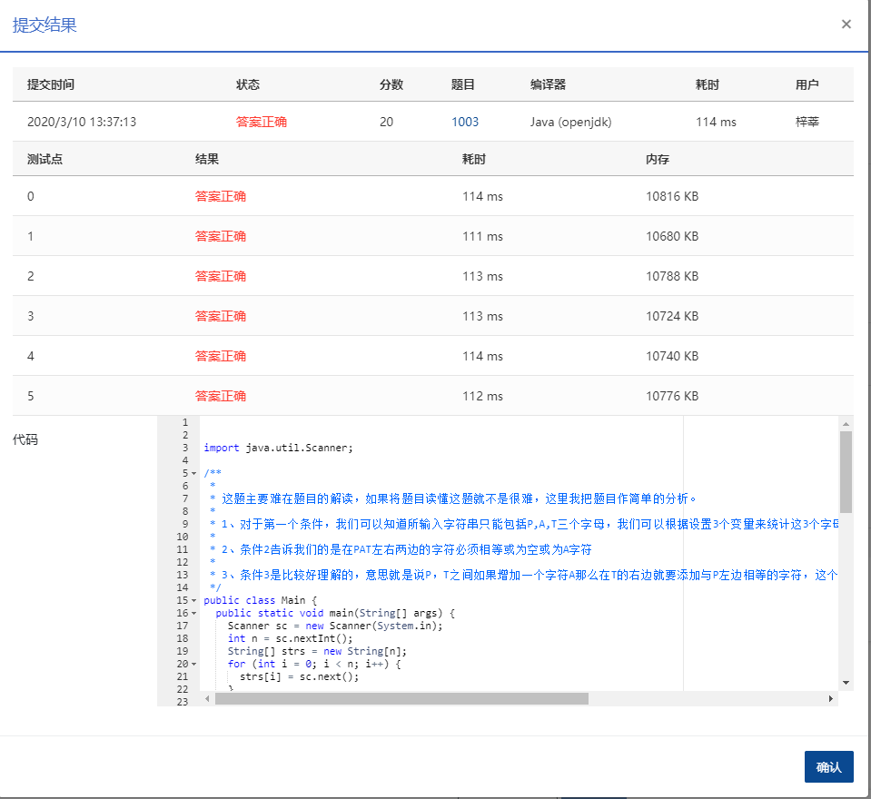

## 我要通过

### 题目描述

```
“答案正确”是自动判题系统给出的最令人欢喜的回复。本题属于 PAT 的“答案正确”大派送 —— 只要读入的字符串满足下列条件，系统就输出“答案正确”，否则输出“答案错误”。

得到“答案正确”的条件是：

字符串中必须仅有 P、 A、 T这三种字符，不可以包含其它字符；
任意形如 xPATx 的字符串都可以获得“答案正确”，其中 x 或者是空字符串，或者是仅由字母 A 组成的字符串；
如果 aPbTc 是正确的，那么 aPbATca 也是正确的，其中 a、 b、 c 均或者是空字符串，或者是仅由字母 A 组成的字符串。
现在就请你为 PAT 写一个自动裁判程序，判定哪些字符串是可以获得“答案正确”的。
```

### **输入描述:**

```
每个测试输入包含 1 个测试用例。第 1 行给出一个正整数 n (<10)，是需要检测的字符串个数。接下来每个字符串占一行，字符串长度不超过 100，且不包含空格。
```

### 输出描述:

```
每个字符串的检测结果占一行，如果该字符串可以获得“答案正确”，则输出 YES，否则输出 NO。
```

### 输入例子:

```
8
PAT
PAAT
AAPATAA
AAPAATAAAA
xPATx
PT
Whatever
APAAATAA
```

### 输出例子

```
YES
YES
YES
YES
NO
NO
NO
NO
```

### 代码

##### 代码1：结果正确

```java
package com.zixin.algorithm;

import java.util.Scanner;

/**
 * 
 * 这题主要难在题目的解读，如果将题目读懂这题就不是很难，这里我把题目作简单的分析。
 * 
 * 1、对于第一个条件，我们可以知道所输入字符串只能包括P,A,T三个字母，我们可以根据设置3个变量来统计这3个字母的数量如果3个字母数量之和不等于字符串长度那就有可能包含其它字母。
 * 
 * 2、条件2告诉我们的是在PAT左右两边的字符必须相等或为空或为A字符
 * 
 * 3、条件3是比较好理解的，意思就是说P，T之间如果增加一个字符A那么在T的右边就要添加与P左边相等的字符，这个字符的数量要根据P左边的字符来定。
 */
public class PATB1003 {
	public static void main(String[] args) {
		Scanner sc = new Scanner(System.in);
		int n = sc.nextInt();
		String[] strs = new String[n];
		for (int i = 0; i < n; i++) {
			strs[i] = sc.next();
		}
        sc.close();
		for (int i = 0; i < n; i++) {
			System.out.println(StrTrueOrFalse(strs[i]));
		}
	}

	public static String StrTrueOrFalse(String s) {
		//  A的数量     P的数量    T的数量     
		int NumA = 0, NumP = 0, NumT = 0;
		//P的位置     T的位置
		int PosP = 0, PosT = 0;
		for (int i = 0; i < s.length(); i++) {
			//如果是A则A的数量加1
			if (s.charAt(i) == 'A') {
				NumA++;
			}
			//如果是P 则P的数量加1
			if (s.charAt(i) == 'P') {
				NumP++;
				PosP = i;
			}
			//如果是T则T的数量加1
			if (s.charAt(i) == 'T') {
				NumT++;
				PosT = i;
			}
		}
		//NumA + NumP + NumT == s.length() 说明只有这3种字符
		//A不可能为0
		//P只能是1个 T只能是1个
		//PosT - PosP > 1  T必须在P右边
		if (NumA + NumP + NumT == s.length() && NumA != 0 && NumP == 1 && NumT == 1 && PosT - PosP > 1
				&& PosP * (PosT - PosP - 1) == s.length() - PosT - 1) {
			return "YES";
		} else {
			return "NO";
		}
	}
	
	
	
}

```

#### 代码二

```java
package com.zixin.algorithm;

import java.util.Scanner;

/**
 * 
 * 这题主要难在题目的解读，如果将题目读懂这题就不是很难，这里我把题目作简单的分析。
 * 
 * 1、对于第一个条件，我们可以知道所输入字符串只能包括P,A,T三个字母，我们可以根据设置3个变量来统计这3个字母的数量如果3个字母数量之和不等于字符串长度那就有可能包含其它字母。
 * 
 * 2、条件2告诉我们的是在PAT左右两边的字符必须相等或为空或为A字符
 * 
 * 3、条件3是比较好理解的，意思就是说P，T之间如果增加一个字符A那么在T的右边就要添加与P左边相等的字符，这个字符的数量要根据P左边的字符来定。
 */
public class PATB1003 {
	public static void main(String[] args) {
        int number;
        String string = new String();
        Scanner sc = new Scanner(System.in);
        number = Integer.parseInt(sc.nextLine());
        for(int i=0;i<number;i++)
        {
            string = sc.nextLine();
            String pattern = "A*PA+TA*";//匹配3个条件
            String pattern1 = "PA+T";//a,c均为空字符串
            if(string.matches(pattern)){
                if(string.matches(pattern1)){
                    System.out.println("YES");
                    continue;
                }
                else{
                    String temp[] = string.split("P|T");
                    int a = temp[0].length();//P之前A的数量
                    int b = temp[1].length();//P之后T之前A的数量
                    int c = temp[2].length();//T之后A的数量
                    if((c-a)/a==b-1){
                        System.out.println("YES");
                    }
                    else{
                        System.out.println("NO");
                    }
                    }
            }
            else
                System.out.println("NO");
        }

    }
}

```


### 输入VS输出

```java
8
PAT
PAAT
AAPATAA
AAPAATAAAA
xPATx
PT
Whatever
APAAATAA
YES
YES
YES
YES
NO
NO
NO

```

### 提交




第二个应该更好一些，因为用时短，且代码少。