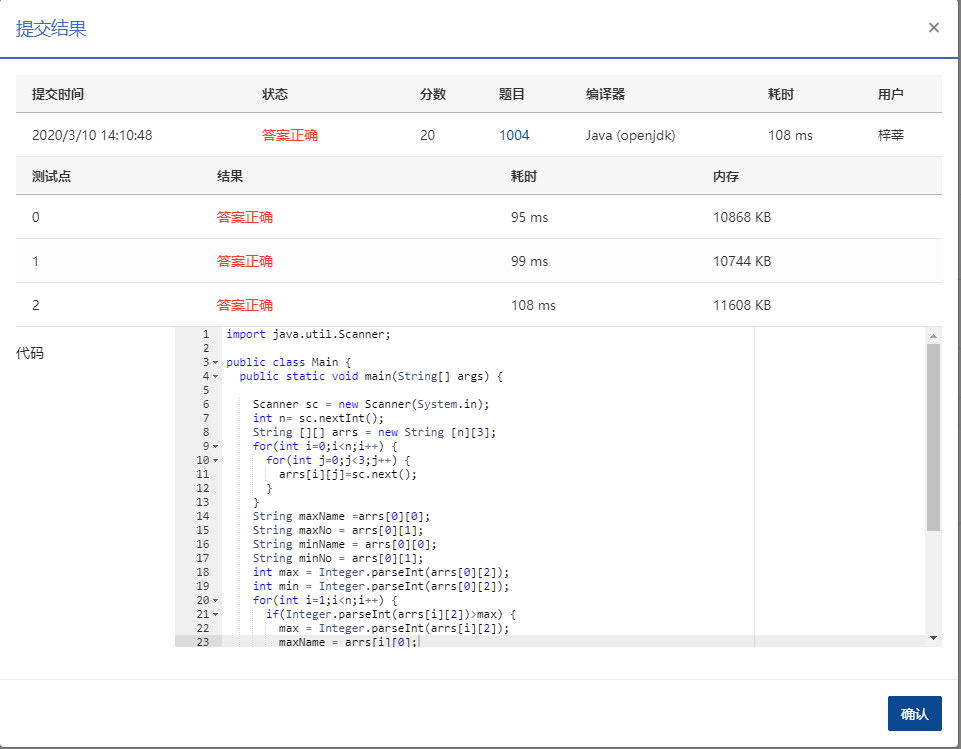

## **成绩排名** (20分)

### 题目描述

```
读入 n（>0）名学生的姓名、学号、成绩，分别输出成绩最高和成绩最低学生的姓名和学号。
```

### **输入描述:**

每个测试输入包含 1 个测试用例，格式为：

```
第 1 行：正整数 n
第 2 行：第 1 个学生的姓名 学号 成绩
第 3 行：第 2 个学生的姓名 学号 成绩
  ... ... ...
第 n+1 行：第 n 个学生的姓名 学号 成绩
```

其中`姓名`和`学号`均为不超过 10 个字符的字符串，成绩为 0 到 100 之间的一个整数，这里保证在一组测试用例中没有两个学生的成绩是相同的。

### 输出描述:

```
对每个测试用例输出 2 行，第 1 行是成绩最高学生的姓名和学号，第 2 行是成绩最低学生的姓名和学号，字符串间有 1 空格。
```

### 输入例子:

```
3
Joe Math990112 89
Mike CS991301 100
Mary EE990830 95
```

### 输出例子

```
Mike CS991301
Joe Math990112
```

### 代码

```java
package com.zixin.algorithm;

import java.util.Scanner;

public class PATB1004 {
	public static void main(String[] args) {

		Scanner sc = new Scanner(System.in);
		int n= sc.nextInt();
		String [][] arrs = new String [n][3];
		for(int i=0;i<n;i++) {
			for(int j=0;j<3;j++) {
				arrs[i][j]=sc.next();
			}
		}
		String maxName =arrs[0][0];
		String maxNo = arrs[0][1];
		String minName = arrs[0][0];
		String minNo = arrs[0][1];
		int max = Integer.parseInt(arrs[0][2]);
		int min = Integer.parseInt(arrs[0][2]);
		for(int i=1;i<n;i++) {
			if(Integer.parseInt(arrs[i][2])>max) {
				max = Integer.parseInt(arrs[i][2]);
				maxName = arrs[i][0];
				maxNo = arrs[i][1];
			}else if(Integer.parseInt(arrs[i][2])<min){
				min = Integer.parseInt(arrs[i][2]);
				minName=  arrs[i][0];
				minNo = arrs[i][1];
			}
		}
		System.out.println(maxName + " " +maxNo);
		System.out.println(minName + " " +minNo);
	}
}

```


### 输入VS输出

```java
3
Joe Math990112 89
Mike CS991301 100
Mary EE990830 95
Mike CS991301
Joe Math990112


```

### 提交


