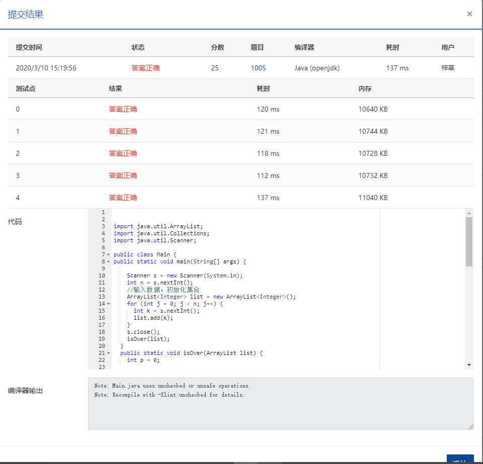

## 继续（3n+1）猜想

### 题目描述

```
卡拉兹(Callatz)猜想（对任何一个正整数 n，如果它是偶数，那么把它砍掉一半；如果它是奇数，那么把 (3n+1) 砍掉一半。）。在这个题目里，情况稍微有些复杂。

当我们验证卡拉兹猜想的时候，为了避免重复计算，可以记录下递推过程中遇到的每一个数。例如对 n=3 进行验证的时候，我们需要计算 3、5、8、4、2、1，则当我们对 n=5、8、4、2 进行验证的时候，就可以直接判定卡拉兹猜想的真伪，而不需要重复计算，因为这 4 个数已经在验证3的时候遇到过了，我们称 5、8、4、2 是被 3“覆盖”的数。我们称一个数列中的某个数 n 为“关键数”，如果 n 不能被数列中的其他数字所覆盖。

现在给定一系列待验证的数字，我们只需要验证其中的几个关键数，就可以不必再重复验证余下的数字。你的任务就是找出这些关键数字，并按从大到小的顺序输出它们。
```

### **输入描述:**

```
每个测试输入包含 1 个测试用例，第 1 行给出一个正整数 K (<100)，第 2 行给出 K 个互不相同的待验证的正整数 n (1<n≤100)的值，数字间用空格隔开。

```


### 输出描述:

```
每个测试用例的输出占一行，按从大到小的顺序输出关键数字。数字间用 1 个空格隔开，但一行中最后一个数字后没有空格。
```

### 输入例子:

```
6
3 5 6 7 8 11
```

### 输出例子

```
7 6
```

### 代码

```java
package com.zixin.algorithm;

import java.util.ArrayList;
import java.util.Collections;
import java.util.Scanner;

public class PATB1005 {
public static void main(String[] args) {
		
		Scanner s = new Scanner(System.in);
		int n = s.nextInt();
		//输入数据，初始化集合
		ArrayList<Integer> list = new ArrayList<Integer>();
		for (int j = 0; j < n; j++) {
			int k = s.nextInt();
			list.add(k);
		}
		s.close();
		isOver(list);
	}
	public static void isOver(ArrayList list) {
		int p = 0;

		//k是集合的长度
		int k = list.size();
		//循环
		while (p != list.size()) {
			k = list.size();
			int m = (int) list.get(p);//当前处理的数
			while (m != 1) {//不等于的时候
				if (m % 2 == 0) {//被2整除 
					m = m / 2;
					for (int i1 = 0; i1 < list.size(); i1++) {
						if ((int) list.get(i1) == m) {//如果有原集合中有当前的数，则移除
							list.remove(i1);
						}
					}
				} else {//不能被2整除
					m = (3 * m + 1) / 2;
					for (int i2 = 0; i2 < list.size(); i2++) {
						if ((int) list.get(i2) == m) {//如果有原集合当中的数，则移除
							list.remove(i2);
						}
					}
				}
			}

			if (k == list.size()) {
				p++;
			}

		}
		Collections.sort(list);
		//逆序输出
		for (int i3 = list.size() - 1; i3 >= 0; i3--) {
			System.out.print((int) list.get(i3));
			if(i3!=0) {
				System.out.print(" ");
			}

		}
		
	}

	
}

```


### 输入VS输出

```java
6
3 5 6 7 8 11
7 6
```

### 提交

