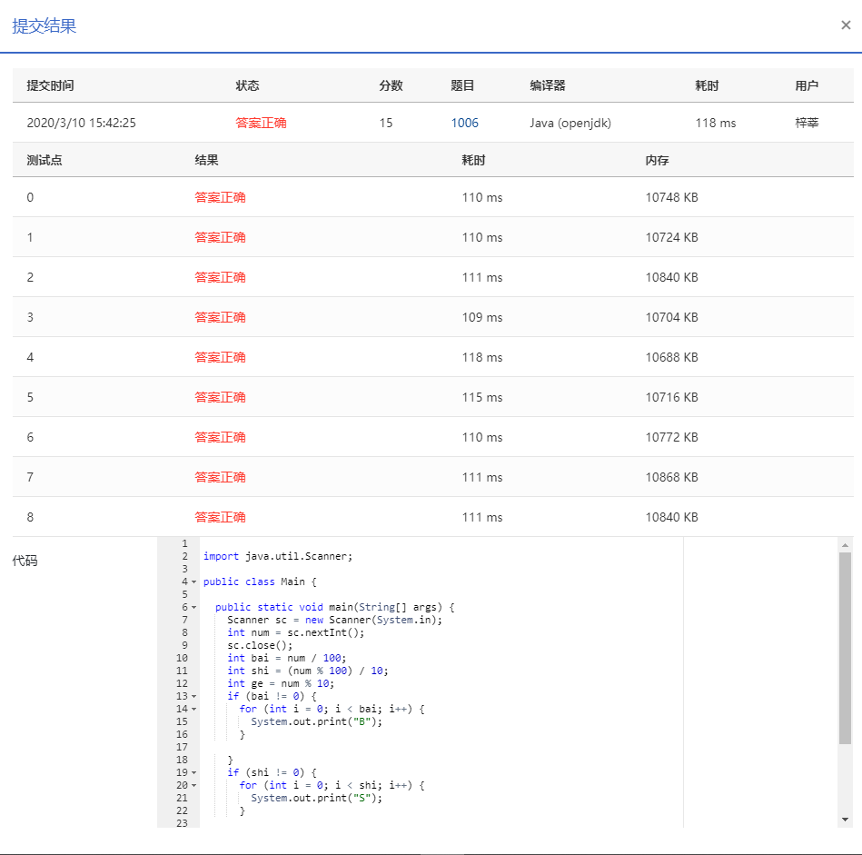

## 1006 换个格式输出整数 (15分)

### 题目描述

```
让我们用字母 B 来表示“百”、字母 S 表示“十”，用 12...n 来表示不为零的个位数字 n（<10），换个格式来输出任一个不超过 3 位的正整数。例如 234 应该被输出为 BBSSS1234，因为它有 2 个“百”、3 个“十”、以及个位的 4。
```

### **输入描述:**

```
每个测试输入包含 1 个测试用例，给出正整数 n（<1000）。
```


### 输出描述:

```
每个测试用例的输出占一行，用规定的格式输出 n。
```

### 输入例子:

```
234
```

### 输出例子

```
BBSSS1234
```

### 代码

```java
package com.zixin.algorithm;

import java.util.Scanner;

public class PATB1006 {

	public static void main(String[] args) {
		Scanner sc = new Scanner(System.in);
		int num = sc.nextInt();
		sc.close();
		int bai = num / 100;
		int shi = (num % 100) / 10;
		int ge = num % 10;
		if (bai != 0) {
			for (int i = 0; i < bai; i++) {
				System.out.print("B");
			}

		}
		if (shi != 0) {
			for (int i = 0; i < shi; i++) {
				System.out.print("S");
			}

		}
		for (int i = 1; i <= ge; i++) {
			System.out.print(i);
		}
	}

}

```


### 输入VS输出

```java
234
BBSSS1234
```

### 提交

