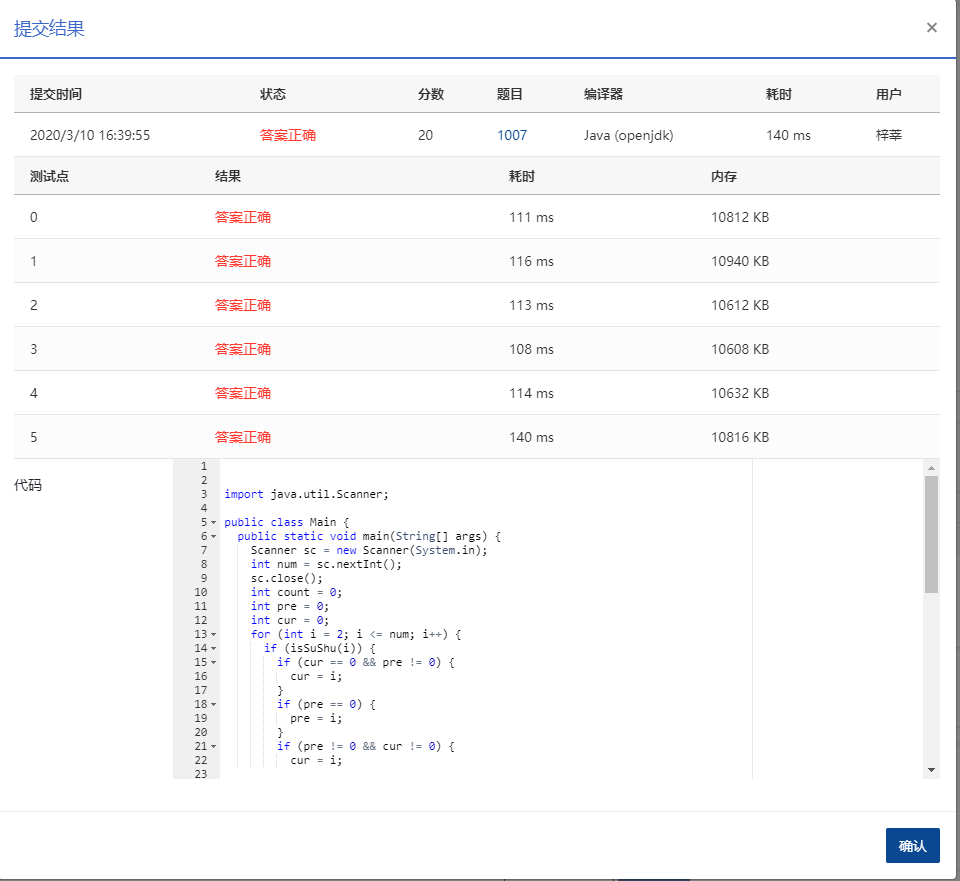

## 1007 素数对猜想 (20分)

### 题目描述

让我们定义d<sub>n</sub>=p<sub>n+1</sub>-p<sub>n</sub>.显然有d<sub>1</sub>=1,且对于n>1有d<sub>n</sub>是偶数，“素数对猜想”认为“存在无穷多对相邻且差为2的素数”，现给定任意正整数N（<10<pub>5</pub>）,计算不超过N的满足猜想的素数对的个数


### **输入描述:**

```
输入在一行给出正整数N。
```


### 输出描述:

```
在一行中输出不超过N的满足猜想的素数对的个数。
```

### 输入例子:

```
20
```

### 输出例子

```
4
```

### 代码

```java
package com.zixin.algorithm;

import java.util.Scanner;

public class PATB1007 {
	public static void main(String[] args) {
		Scanner sc = new Scanner(System.in);
		int num = sc.nextInt();
		sc.close();
		int count = 0;
		int pre = 0;
		int cur = 0;
		//<=   =号不能少
		for (int i = 2; i <= num; i++) {
			if (isSuShu(i)) {
				if (cur == 0 && pre != 0) {
					cur = i;
				}
				if (pre == 0) {
					pre = i;
				}
				if (pre != 0 && cur != 0) {
					cur = i;

					if (cur - pre == 2) {
						// System.out.println(pre+" "+cur);
						count = count + 1;
					}
					pre = cur;
				}
			}
		}
		System.out.print(count);
	}

	private static boolean isSuShu(int i) {
		if (i == 1) {
			return true;
		}
		if (i == 2) {
			return false;
		}
		//注意这里使用sqrt 不然容易超时
		int temp = (int) Math.sqrt(i);
		int t = 2;
		for (int j = t; j <= temp; j++) {
			if (i % j == 0) {
				return false;
			}
		}
		return true;
	}

	public static void main1(String[] args) {
		isSuShu(9);
	}
}

```


### 输入VS输出

```java
32
5
```

### 提交

