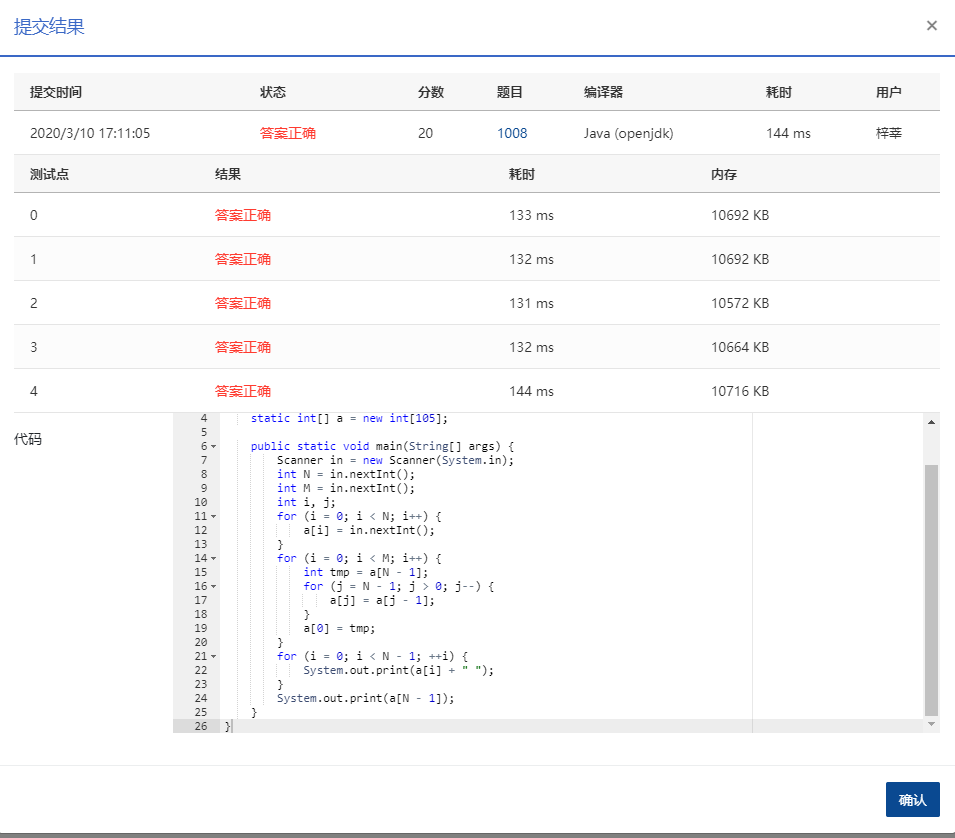

## **1008** **数组元素循环右移问题** (20分)

### 题目描述

一个数组*A*中存有*N*（>0）个整数，在不允许使用另外数组的前提下，将每个整数循环向右移*M*（≥0）个位置，即将*A*中的数据由（A<sub>0</sub>A<sub>1</sub>...A<sub>N-1</sub>）变换为（A<sub>N-M</sub>...A<sub>N-1</sub>A<sub>0</sub>A<sub>1</sub>...A<sub>N-M-1</sub>）（最后*M*个数循环移至最前面的*M*个位置）。如果需要考虑程序移动数据的次数尽量少，要如何设计移动的方法？


### **输入描述:**

```
每个输入包含一个测试用例，第1行输入N（1≤N≤100）和M（≥0）；第2行输入N个整数，之间用空格分隔。
```


### 输出描述:

```
在一行中输出循环右移M位以后的整数序列，之间用空格分隔，序列结尾不能有多余空格。
```

### 输入例子:

```
6 2
1 2 3 4 5 6
```

### 输出例子

```
5 6 1 2 3 4
```

### 代码

```java
package com.zixin.algorithm;

import java.util.Scanner;

public class PATB1008 {

	//不知道这个为啥不对
	public static void main1(String[] args) {
		Scanner sc = new Scanner(System.in);
        int n = sc.nextInt();//数组元素个数
        int index = sc.nextInt();//需要逆转的位置
        int [] arr = new int[n];
        for(int i=0;i<n;i++) {
        	arr[i]=sc.nextInt();
        }
        sc.close();
        reverse(arr,0,arr.length-index-1);
        reverse(arr,arr.length-index,arr.length-1);
        reverse(arr,0,arr.length-1);
        print(arr);
	}

	private static void reverse(int [] arr,int from ,int to) {
		while(from <to) {
			int temp = arr[from];
			arr[from] = arr[to];
			arr[to]=temp;
			from++;
			to--;
		}
		
		//print(arr);
	}
	
	private static void print(int [] arr) {
		for(int i=0;i<arr.length;i++) {
			if(i!=arr.length-1) {
				System.out.print(arr[i]+" ");
			}else {
				System.out.print(arr[i]);
			}
			
		}
	}
	
	public static void main(String[] args) {
        Scanner in = new Scanner(System.in);
        int N = in.nextInt();
        int M = in.nextInt();
        int a[] = new int[N];
        int i, j;
        for (i = 0; i < N; i++) {
            a[i] = in.nextInt();
        }
        in.close();
        for (i = 0; i < M; i++) {
            int tmp = a[N - 1];
            for (j = N - 1; j > 0; j--) {
                a[j] = a[j - 1];
            }
            a[0] = tmp;
        }
        for (i = 0; i < N - 1; ++i) {
            System.out.print(a[i] + " ");
        }
        System.out.print(a[N - 1]);
    }
}

```


### 输入VS输出

```java
7 3
1 2 3 4 5 6 7
5 6 7 1 2 3 4
```

### 提交



