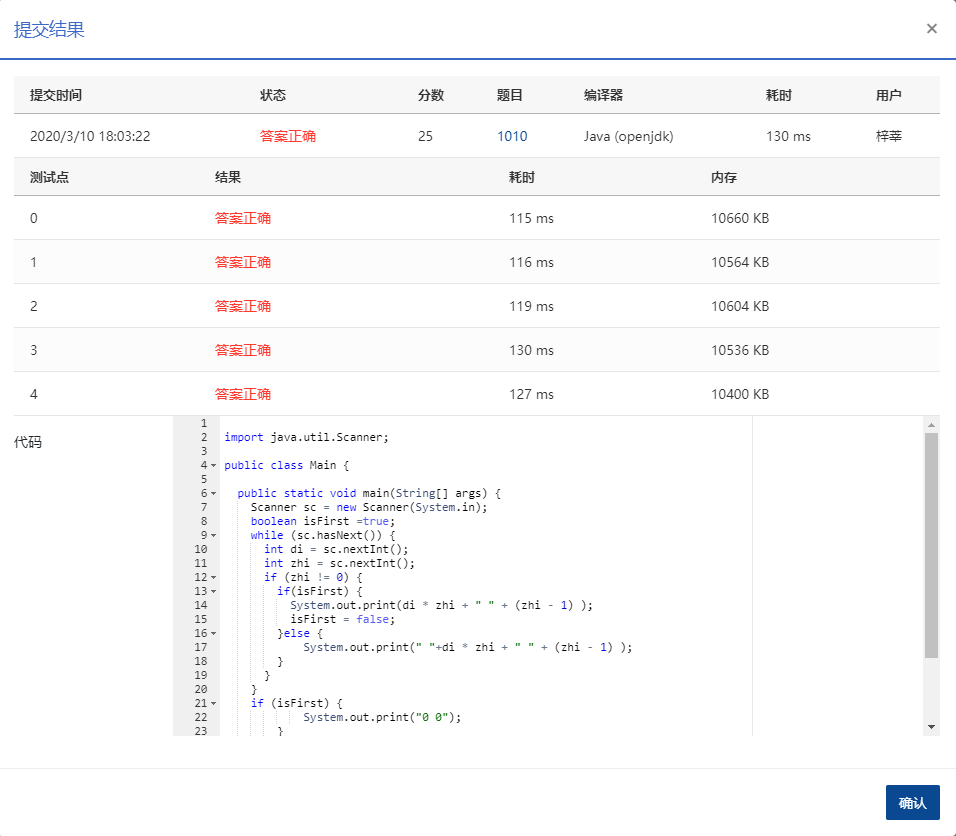

## 1010一元多项式求导

### 题目描述

设计函数求一元多项式的导数。（注：x<pub>n</pub>（*n*为整数）的一阶导数为nx<pub>n-1</pub>）

### **输入描述:**

```
以指数递降方式输入多项式非零项系数和指数（绝对值均为不超过 1000 的整数）。数字间以空格分隔。
```

### 输出描述:

```
以与输入相同的格式输出导数多项式非零项的系数和指数。数字间以空格分隔，但结尾不能有多余空格。注意“零多项式”的指数和系数都是 0，但是表示为 0 0。
```

### 输入例子:

```
3 4 -5 2 6 1 -2 0
```

### 输出例子

```
12 3 -10 1 6 0
```

### 代码

```java
package com.zixin.algorithm;

import java.util.Scanner;

public class PATB1010 {

	public static void main(String[] args) {
		Scanner sc = new Scanner(System.in);
		boolean isFirst =true;
		while (sc.hasNext()) {
			int di = sc.nextInt();
			int zhi = sc.nextInt();
			if (zhi != 0) {
				if(isFirst) {
					System.out.print(di * zhi + " " + (zhi - 1) );
					isFirst = false;
				}else {
				    System.out.print(" "+di * zhi + " " + (zhi - 1) );
				}
			}
		}
		//注意0次多项式的区分
		if (isFirst) {
            System.out.print("0 0");
        }
		sc.close();

	}

}

```


### 输入VS输出

```java
3 4 -5 2 6 1 -2 0
12 3 -10 1 6 0
```

### 提交




第二个应该更好一些，因为用时短，且代码少。

