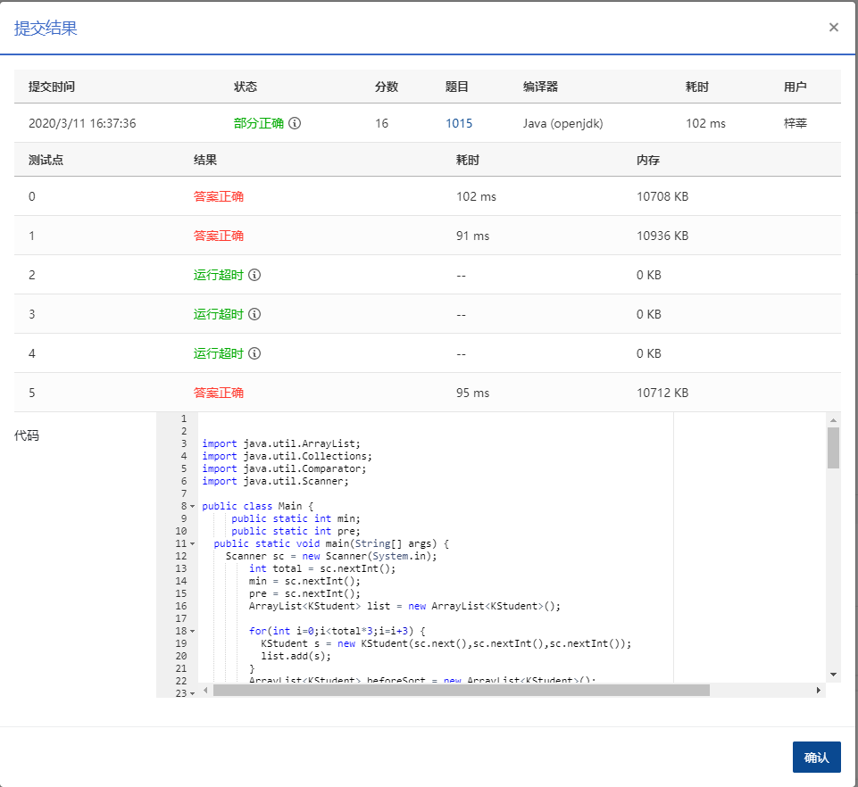

## 1015 德才论 (25分)

> 时间限制: 400 ms
>
> 内存限制: 64 MB
>
> 代码长度限制: 16 KB

### 题目描述

宋代史学家司马光在《资治通鉴》中有一段著名的“德才论”：“是故才德全尽谓之圣人，才德兼亡谓之愚人，德胜才谓之君子，才胜德谓之小人。凡取人之术，苟不得圣人，君子而与之，与其得小人，不若得愚人。”

现给出一批考生的德才分数，请根据司马光的理论给出录取排名。

### **输入描述:**

输入第一行给出 3 个正整数，分别为：*N*（≤10<pub>5</pub>），即考生总数；*L*（≥60），为录取最低分数线，即德分和才分均不低于 *L* 的考生才有资格被考虑录取；*H*（<100），为优先录取线——德分和才分均不低于此线的被定义为“才德全尽”，此类考生按德才总分从高到低排序；才分不到但德分到线的一类考生属于“德胜才”，也按总分排序，但排在第一类考生之后；德才分均低于 *H*，但是德分不低于才分的考生属于“才德兼亡”但尚有“德胜才”者，按总分排序，但排在第二类考生之后；其他达到最低线 *L* 的考生也按总分排序，但排在第三类考生之后。

随后 *N* 行，每行给出一位考生的信息，包括：`准考证号 德分 才分`，其中`准考证号`为 8 位整数，德才分为区间 [0, 100] 内的整数。数字间以空格分隔。

### 输出描述:

输出第一行首先给出达到最低分数线的考生人数 *M*，随后 *M* 行，每行按照输入格式输出一位考生的信息，考生按输入中说明的规则从高到低排序。当某类考生中有多人总分相同时，按其德分降序排列；若德分也并列，则按准考证号的升序输出。

### 输入例子:

```
14 60 80
10000001 64 90
10000002 90 60
10000011 85 80
10000003 85 80
10000004 80 85
10000005 82 77
10000006 83 76
10000007 90 78
10000008 75 79
10000009 59 90
10000010 88 45
10000012 80 100
10000013 90 99
10000014 66 60
```

### 输出例子

```
12
10000013 90 99
10000012 80 100
10000003 85 80
10000011 85 80
10000004 80 85
10000007 90 78
10000006 83 76
10000005 82 77
10000002 90 60
10000014 66 60
10000008 75 79
10000001 64 90
```


### 代码

```java
package com.zixin.algorithm;

import java.util.ArrayList;
import java.util.Collections;
import java.util.Comparator;
import java.util.Scanner;

public class PATB1015 {
     public static int min;
     public static int pre;
	public static void main(String[] args) {
		Scanner sc = new Scanner(System.in);
        int total = sc.nextInt();
        min = sc.nextInt();
        pre = sc.nextInt();
        ArrayList<KStudent> list = new ArrayList<KStudent>();
        
        for(int i=0;i<total*3;i=i+3) {
        	KStudent s = new KStudent(sc.next(),sc.nextInt(),sc.nextInt());
        	list.add(s);
        }
        ArrayList<KStudent> beforeSort = new ArrayList<KStudent>();
        for(int j=0;j<list.size();j++) {
        	KStudent ks = list.get(j);
        	if(ks.getDescore()>=min&&ks.getCaiscore()>=min) {
        		if(ks.getDescore()>=pre&&ks.getCaiscore()>=pre) {
        			ks.setLv(1);
        		}else if(ks.getDescore()>=pre && ks.getCaiscore()>=min) {
        			ks.setLv(2);
        		}else if(ks.getDescore()>=min && ks.getCaiscore()>=min&&ks.getDescore()>=ks.getCaiscore()) {
        			ks.setLv(3);
        		}else if(ks.getDescore()>=min&&ks.getCaiscore()>=min){
        			ks.setLv(4);
        		}else {
        			ks.setLv(5);
        		}
        		beforeSort.add(ks);
        	}
        }
        sc.close();
        Collections.sort(beforeSort, new KStudent.Com());
        System.out.println(beforeSort.size());
        for(int i=0;i<beforeSort.size();i++) {
        	System.out.println(beforeSort.get(i).getNo()+" "+beforeSort.get(i).getDescore()+" "+beforeSort.get(i).getCaiscore());
        }
	}

}

class KStudent{
	private String no;
	private int descore;
	private int caiscore;
	private int lv;
	public KStudent(String no, int descore, int caiscore) {
		super();
		this.no = no;
		this.descore = descore;
		this.caiscore = caiscore;
	}
	public String getNo() {
		return no;
	}
	public void setNo(String no) {
		this.no = no;
	}
	public int getDescore() {
		return descore;
	}
	public void setDescore(int descore) {
		this.descore = descore;
	}
	public int getCaiscore() {
		return caiscore;
	}
	public void setCaiscore(int caiscore) {
		this.caiscore = caiscore;
	}
	
	
	public int getLv() {
		return lv;
	}
	public void setLv(int lv) {
		this.lv = lv;
	}


	public static class Com implements Comparator<KStudent>{

		@Override
		public int compare(KStudent o1, KStudent o2) {
			//均大于预分数
			if(o1.lv<o2.lv) {
				return -1;
			}else if(o1.lv>o2.lv) {
				return 1;
			}else {
				if(o1.getDescore()+o1.getCaiscore()>o2.getDescore()+o2.getCaiscore()) {
					return -1;
				}else if(o1.getDescore()+o1.getCaiscore()<o2.getDescore()+o2.getCaiscore()) {
					return 1;
				}else {
					if(o1.getDescore()>o2.getDescore()) {
						return -1;
					}else if(o1.getDescore()<o2.getDescore()) {
						return 1;
					}else {
						if(Integer.parseInt(o1.getNo())<Integer.parseInt(o2.getNo())) {
							return -1;
						}else if(Integer.parseInt(o1.getNo())>Integer.parseInt(o2.getNo())) {
							return 1;
						}else {
							return 0;
						}
					}
				}
			}
			
	        
	        
		}
		
	}
	
	
}
```

### 输入VS输出

```java
14 60 80
10000001 64 90
10000002 90 60
10000011 85 80
10000003 85 80
10000004 80 85
10000005 82 77
10000006 83 76
10000007 90 78
10000008 75 79
10000009 59 90
10000010 88 45
10000012 80 100
10000013 90 99
10000014 66 60
12
10000013 90 99
10000012 80 100
10000003 85 80
10000011 85 80
10000004 80 85
10000007 90 78
10000006 83 76
10000005 82 77
10000002 90 60
10000014 66 60
10000008 75 79
10000001 64 90

```

### 提交




