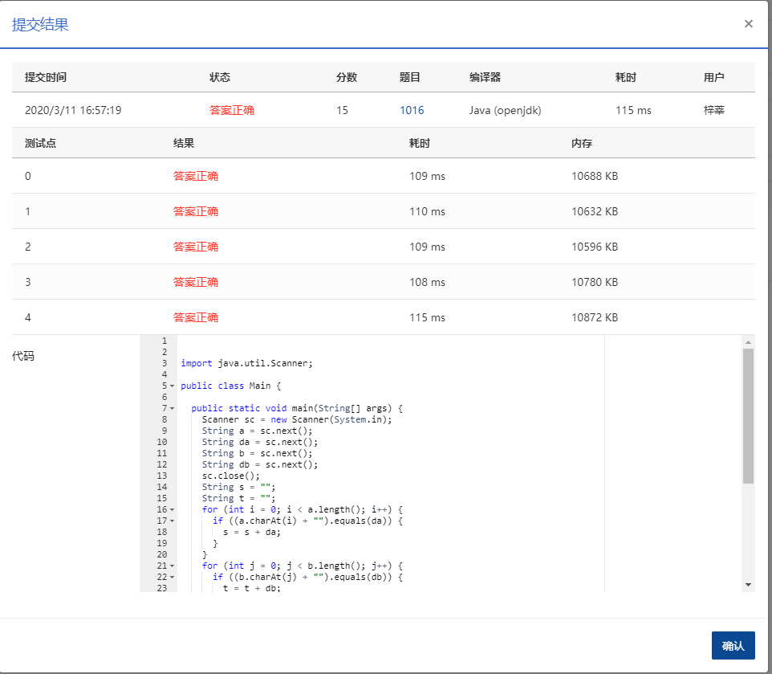

## **1016** **部分A+B** (15分)

> 时间限制:150 ms
>
> 内存限制: 64 MB
>
> 代码长度限制: 16 KB

### 题目描述

正整数 *A* 的“D<sub>A</sub>（为 1 位整数）部分”定义为由 *A* 中所有 D<sub>A</sub> 组成的新整数 P<sub>A</sub>。例如：给定 *A*=3862767，*D**A*=6，则 *A* 的“6 部分”P<sub>A</sub> 是 66，因为 *A* 中有 2 个 6。

现给定 *A*、D<sub>A</sub>、*B*、D<sub>B</sub>，请编写程序计算 P<sub>A</sub>+P<sub>B</sub>。

### **输入描述:**

输入在一行中依次给出 *A*、D<sub>A</sub>、*B*、D<sub>B</sub>，中间以空格分隔，其中 0<*A*,*B*<10<sup>10</sup>。

### 输出描述:

在一行中输出 P<sub>A</sub>+P<sub>B</sub> 的值。

### 输入例子:

```
3862767 6 13530293 3

```

### 输出例子

```
399
```


### 代码

```java
package com.zixin.algorithm;

import java.util.Scanner;

public class PATB1016 {

	public static void main(String[] args) {
		Scanner sc = new Scanner(System.in);
		String a = sc.next();
		String da = sc.next();
		String b = sc.next();
		String db = sc.next();
		sc.close();
		String s = "";
		String t = "";
		for (int i = 0; i < a.length(); i++) {
			if ((a.charAt(i) + "").equals(da)) {
				s = s + da;
			}
		}
		for (int j = 0; j < b.length(); j++) {
			if ((b.charAt(j) + "").equals(db)) {
				t = t + db;
			}
		}
		int a1 = 0;
		int a2 = 0;
		if (s != "") {
			a1 = Integer.parseInt(s);
		}
		if (t != "") {
			a2 = Integer.parseInt(t);
		}
		System.out.println(a1 + a2);

	}

}

```

### 输入VS输出

```java
3862767 1 13530293 8
0
```

### 提交




