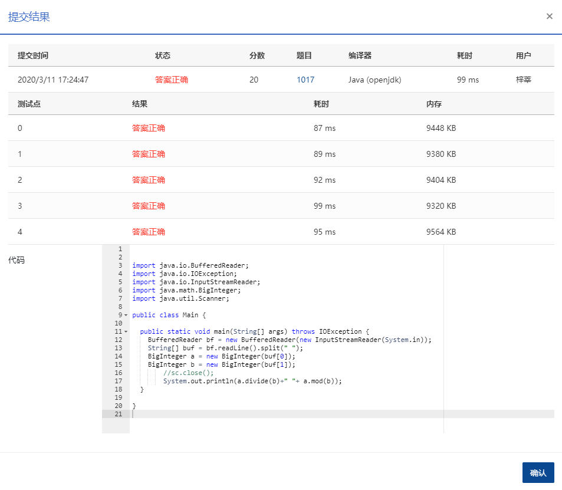

## 1017 A除以B (20分)

> 时间限制:100 ms
>
> 内存限制: 64 MB
>
> 代码长度限制: 16 KB

### 题目描述

本题要求计算 *A*/*B*，其中 *A* 是不超过 1000 位的正整数，*B* 是 1 位正整数。你需要输出商数 *Q* 和余数 *R*，使得 *A*=*B*×*Q*+*R* 成立。

### **输入描述:**

输入在一行中依次给出 *A* 和 *B*，中间以 1 空格分隔。

### 输出描述:

在一行中依次输出 *Q* 和 *R*，中间以 1 空格分隔。

### 输入例子:

```
123456789050987654321 7

```

### 输出例子

```
17636684150141093474 3
```


### 代码

```java
package com.zixin.algorithm;

import java.io.BufferedReader;
import java.io.IOException;
import java.io.InputStreamReader;
import java.math.BigInteger;
import java.util.Scanner;

public class PATB1017 {

	public static void main(String[] args) throws IOException {
		//使用Scanner提交超时 BufferedReader可以
		//Scanner sc = new Scanner(System.in);
		BufferedReader bf = new BufferedReader(new InputStreamReader(System.in));
		String[] buf = bf.readLine().split(" ");
		BigInteger a = new BigInteger(buf[0]);
		BigInteger b = new BigInteger(buf[1]);
        //sc.close();
        System.out.println(a.divide(b)+" "+ a.mod(b));
	}

}

```

### 输入VS输出

```java
123456789050987654321 7
17636684150141093474 3

```

### 提交




