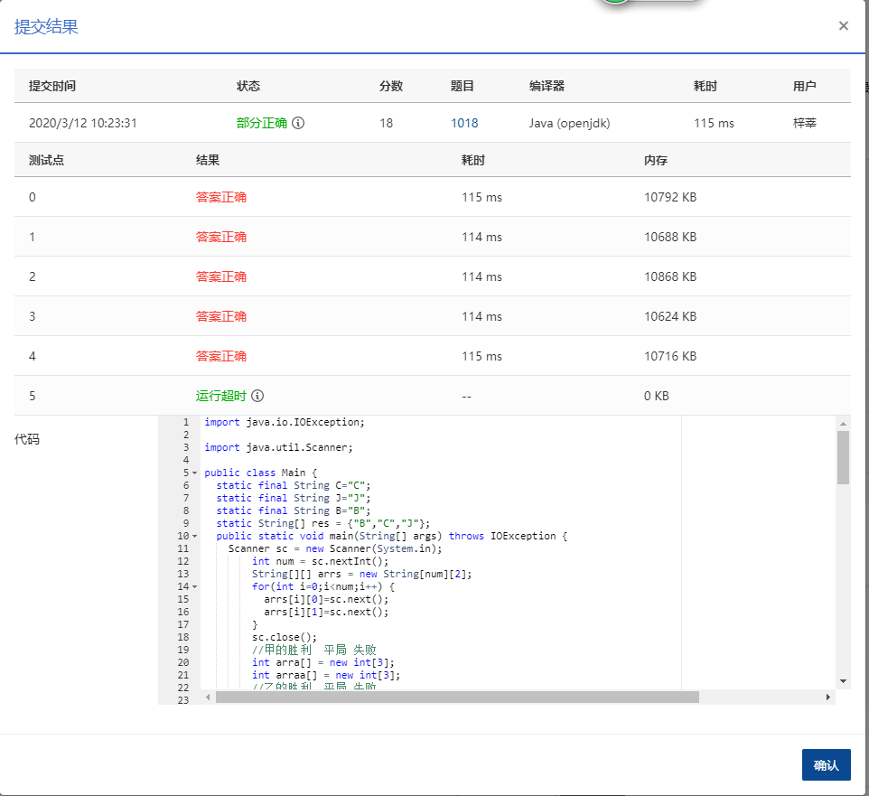

## **1018** **锤子剪刀布** (20分)

> 时间限制:200 ms
>
> 内存限制: 64 MB
>
> 代码长度限制: 16 KB

### 题目描述

大家应该都会玩“锤子剪刀布”的游戏：两人同时给出手势，胜负规则如图所示：

现给出两人的交锋记录，请统计双方的胜、平、负次数，并且给出双方分别出什么手势的胜算最大。

### **输入描述:**

输入第 1 行给出正整数 *N*（≤105），即双方交锋的次数。随后 *N* 行，每行给出一次交锋的信息，即甲、乙双方同时给出的的手势。`C` 代表“锤子”、`J` 代表“剪刀”、`B` 代表“布”，第 1 个字母代表甲方，第 2 个代表乙方，中间有 1 个空格。

### 输出描述:

输出第 1、2 行分别给出甲、乙的胜、平、负次数，数字间以 1 个空格分隔。第 3 行给出两个字母，分别代表甲、乙获胜次数最多的手势，中间有 1 个空格。如果解不唯一，则输出按字母序最小的解。

### 输入例子:

```
10
C J
J B
C B
B B
B C
C C
C B
J B
B C
J J

```

### 输出例子

```
5 3 2
2 3 5
B B
```


### 代码

```java
package com.zixin.algorithm;

import java.io.IOException;

import java.util.Scanner;

public class PATB1018 {
	static final String C="C";
	static final String J="J";
	static final String B="B";
	static String[] res = {"B","C","J"};
	public static void main(String[] args) throws IOException {
		Scanner sc = new Scanner(System.in);
        int num = sc.nextInt();
        String[][] arrs = new String[num][2];
        for(int i=0;i<num;i++) {
        	arrs[i][0]=sc.next();
        	arrs[i][1]=sc.next();
        }
        sc.close();
        //甲的胜利  平局 失败
        int arra[] = new int[3];
        int arraa[] = new int[3];
        //乙的胜利  平局 失败
        int arrb[] = new int[3];
        int arrbb[] = new int[3];
        for(int i=0;i<arrs.length;i++) {
        	int ba = battle(arrs[i][0],arrs[i][1]);
        	if(ba==1) {
        		arra[0]=arra[0]+1;
        		arrb[2]=arrb[2]+1;
        		if(arrs[i][0].equals(B)) {
        			arraa[0]=arraa[0]+1;
        		}else if(arrs[i][0].equals(C)) {
        			arraa[1]=arraa[1]+1;
        		}else {
        			arraa[2]=arraa[2]+1;
        		}
        	}else if(ba==0) {
        		arra[1]=arra[1]+1;
        		arrb[1]=arrb[1]+1;
        	}else {
        		arrb[0]=arrb[0]+1;
        		arra[2]=arra[2]+1;
        		if(arrs[i][1].equals(B)) {
        			arrbb[0]=arrbb[0]+1;
        		}else if(arrs[i][1].equals(C)) {
        			arrbb[1]=arrbb[1]+1;
        		}else {
        			arrbb[2]=arrbb[2]+1;
        		}
        	}
        }
        print(arra);
        print(arrb);
        //print(arraa);
        //print(arrbb);
        System.out.print(res[getMax(arraa)]+" "+res[getMax(arrbb)]);
        
	}
	
	private static void print(int[] arr) {
		for(int i=0;i<arr.length;i++) {
			if(i!=arr.length-1) {
				System.out.print(arr[i]+" ");
			}else {
				System.out.print(arr[i]);
			}
		
		}
		System.out.println();
	}
	private static int getMax(int[] arr) {
		int a = arr[0];
		int r=0;
		for(int i=1;i<arr.length;i++) {
			if(arr[i]>a) {
				a=arr[i];
				r=i;
			}
		
		}
		return r;
	}
	private static int battle(String first,String second) {
		if(first.equals(second)) {
			return 0;
		}else if((first.equals(C)&&second.equals(J))||(first.equals(J)&&second.equals(B))||(first.contentEquals(B)&&second.equals(C))) {
			return 1;
		}else if((second.equals(C)&&first.equals(J))||(second.equals(J)&&first.equals(B))||(second.contentEquals(B)&&first.equals(C))) {
			return -1;
		}
		return 0;
	}
	
	public static void main1(String[] args) {
		System.out.println(battle("C","B"));
	}
}

```

### 输入VS输出

```java
10
C J
J B
C B
B B
B C
C C
C B
J B
B C
J J
5 3 2
2 3 5
B B

```

### 提交




