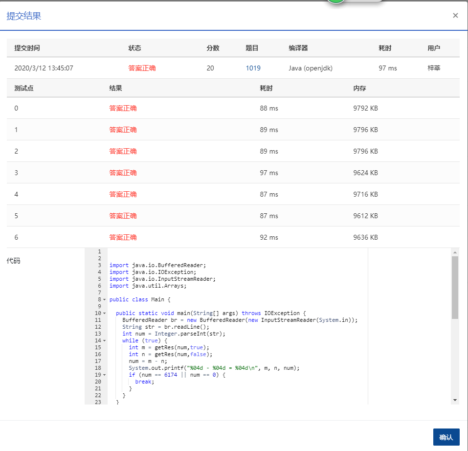

## **1019** **数字黑洞** (20分)

> 时间限制:200 ms
>
> 内存限制: 64 MB
>
> 代码长度限制: 16 KB

### 题目描述

给定任一个各位数字不完全相同的 4 位正整数，如果我们先把 4 个数字按非递增排序，再按非递减排序，然后用第 1 个数字减第 2 个数字，将得到一个新的数字。一直重复这样做，我们很快会停在有“数字黑洞”之称的 `6174`，这个神奇的数字也叫 Kaprekar 常数。

例如，我们从`6767`开始，将得到

> 7766 - 6677 = 1089 
>
> 9810 - 0189 = 9621 
>
> 9621 - 1269 = 8352 
>
> 8532 - 2358 = 6174 
>
> 7641 - 1467 = 6174

现给定任意 4 位正整数，请编写程序演示到达黑洞的过程。

### 输入描述:

输入给出一个 (0,10<sup>4</sup>) 区间内的正整数 *N*。

### 输出描述:

如果 *N* 的 4 位数字全相等，则在一行内输出 `N - N = 0000`；否则将计算的每一步在一行内输出，直到 `6174` 作为差出现，输出格式见样例。注意每个数字按 `4` 位数格式输出。

### 输入例子:

```
6767
```

### 输出例子

```
7766 - 6677 = 1089
9810 - 0189 = 9621
9621 - 1269 = 8352
8532 - 2358 = 6174
```


### 代码

```java
package com.zixin.algorithm;

import java.io.BufferedReader;
import java.io.IOException;
import java.io.InputStreamReader;
import java.util.Arrays;

public class PATB1019 {

	public static void main(String[] args) throws IOException {
		BufferedReader br = new BufferedReader(new InputStreamReader(System.in));
		String str = br.readLine();
		int num = Integer.parseInt(str);
		while (true) {
			int m = getRes(num,true);
			int n = getRes(num,false);
			num = m - n;
			System.out.printf("%04d - %04d = %04d\n", m, n, num);
			if (num == 6174 || num == 0) {
				break;
			}
		}
	}

	public static int getRes(int number, boolean desc) {
		char[] array = String.format("%04d", number).toCharArray();
		Arrays.sort(array);
		int temp = 0;
		if (desc) {
			for (int i = 3; i >= 0; i--) {
				temp = temp * 10 + (array[i] - '0');
			}
		} else {
			for (int i = 0; i < 4; i++) {
				temp = temp * 10 + (array[i] - '0');
			}
		}
		return temp;
	}

	public static int inc(int number) {
		char[] array = String.format("%04d", number).toCharArray();
		Arrays.sort(array);
		int temp = 0;
		for (int i = 3; i >= 0; i--) {
			temp = temp * 10 + (array[i] - '0');
		}
		return temp;
	}
}


```

### 输入VS输出

```java
2222
2222 - 2222 = 0000


```

### 提交




