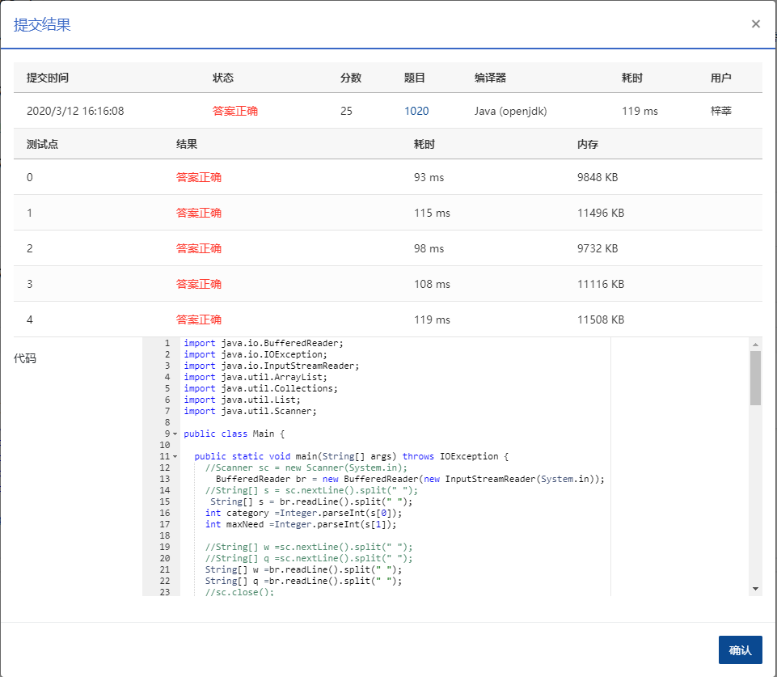

## 1020 月饼 (25分)

> 时间限制:150 ms
>
> 内存限制: 64 MB
>
> 代码长度限制: 16 KB

### 题目描述

月饼是中国人在中秋佳节时吃的一种传统食品，不同地区有许多不同风味的月饼。现给定所有种类月饼的库存量、总售价、以及市场的最大需求量，请你计算可以获得的最大收益是多少。

注意：销售时允许取出一部分库存。样例给出的情形是这样的：假如我们有 3 种月饼，其库存量分别为 18、15、10 万吨，总售价分别为 75、72、45 亿元。如果市场的最大需求量只有 20 万吨，那么我们最大收益策略应该是卖出全部 15 万吨第 2 种月饼、以及 5 万吨第 3 种月饼，获得 72 + 45/2 = 94.5（亿元）。

### 输入描述:

每个输入包含一个测试用例。每个测试用例先给出一个不超过 1000 的正整数 *N* 表示月饼的种类数、以及不超过 500（以万吨为单位）的正整数 *D* 表示市场最大需求量。随后一行给出 *N* 个正数表示每种月饼的库存量（以万吨为单位）；最后一行给出 *N* 个正数表示每种月饼的总售价（以亿元为单位）。数字间以空格分隔。

### 输出描述:

对每组测试用例，在一行中输出最大收益，以亿元为单位并精确到小数点后 2 位。

### 输入例子:

```
6767
```

### 输出例子

```
3 20
18 15 10
75 72 45
```


### 代码

```java
package com.zixin.algorithm;

import java.io.BufferedReader;
import java.io.IOException;
import java.io.InputStreamReader;
import java.util.ArrayList;
import java.util.Collections;
import java.util.List;
import java.util.Scanner;

public class PATB1020 {

	public static void main(String[] args) throws IOException {
		//Scanner sc = new Scanner(System.in);
		  BufferedReader br = new BufferedReader(new InputStreamReader(System.in));
		//String[] s = sc.nextLine().split(" ");
		 String[] s = br.readLine().split(" ");
		int category =Integer.parseInt(s[0]);
		int maxNeed =Integer.parseInt(s[1]);
		
		//String[] w =sc.nextLine().split(" ");
		//String[] q =sc.nextLine().split(" ");
		String[] w =br.readLine().split(" ");
		String[] q =br.readLine().split(" ");
		//sc.close();
		List<Packet> li = new ArrayList<Packet>();
		for (int j = 0; j < category; j++) {
			double m = Double.parseDouble(w[j]);
            double p = Double.parseDouble(q[j]);
            double value = p / m;
			Packet c = new Packet(m,p,value);
			li.add(c);
		}
		Collections.sort(li);
		/*
		 * for(int i=0;i<li.size();i++) {
		 * System.out.println(li.get(i).getNum()+" "+li.get(i).getTotal()); }
		 */
		double res = 0D;
		for(int i=0;i<li.size();i++) {
			if(maxNeed-li.get(i).getNum()>=0) {
				maxNeed=maxNeed-(int)li.get(i).getNum();
				res=res+li.get(i).getTotal();
			}else if(maxNeed-li.get(i).getNum()<=0&&maxNeed>0) {
				res=res+li.get(i).getPrice()*maxNeed;
				break;
			}
		}
		System.out.printf("%.2f",res);
		
	}
}

class Packet implements Comparable<Packet> {
	private double num;
	private double total;
	private double price;


	public Packet(double num, double total, double price) {
		super();
		this.num = num;
		this.total = total;
		this.price = price;
	}

	@Override
	public int compareTo(Packet o) {
	    return this.getPrice()>o.getPrice()?-1:1;
		
	}

	public double getNum() {
		return num;
	}

	public void setNum(double num) {
		this.num = num;
	}

	public double getTotal() {
		return total;
	}

	public void setTotal(double total) {
		this.total = total;
	}

	public double getPrice() {
		return price;
	}

	public void setPrice(double price) {
		this.price = price;
	}

	

}

```

### 输入VS输出

```java
3 20
18 15 10
75 72 45
94.50
```

### 提交




> 使用Scanner会有超时，数据什么都使用double