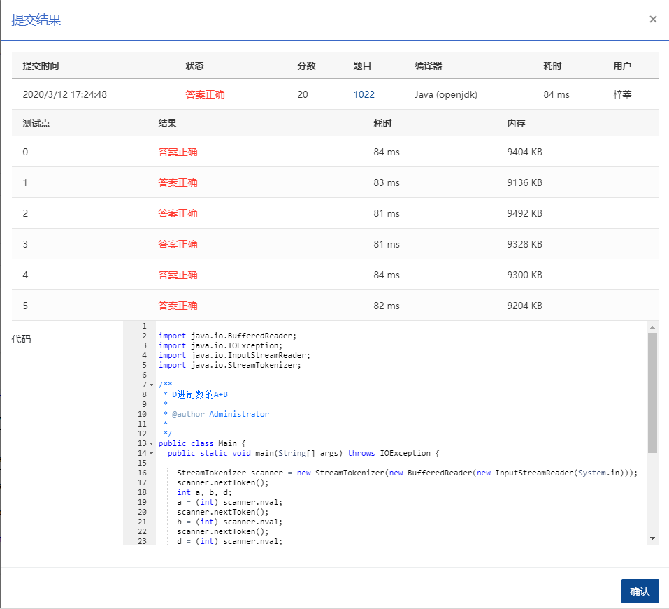

## 问题

输入两个非负 10 进制整数 A 和 B (≤2^30−1)，输出 A+B 的 D (1<D≤10)进制数。

输入格式：

输入在一行中依次给出 3 个整数 A、B 和 D。

输出格式：

输出 A+B 的 D 进制数。

## 解题思路

先算A+B（此时为十进制），然后把结果转换为D进制，而十进制转换为D进制的过程可以直接进行“除基取余法”

## 答案

```java
package com.zixin.algorithm;

import java.io.BufferedReader;
import java.io.IOException;
import java.io.InputStreamReader;
import java.io.StreamTokenizer;

/**
 * D进制数的A+B
 * 
 * @author Administrator
 *
 */
public class PATB1022 {
	public static void main(String[] args) throws IOException {

		StreamTokenizer scanner = new StreamTokenizer(new BufferedReader(new InputStreamReader(System.in)));
		scanner.nextToken();
		int a, b, d;
		a = (int) scanner.nval;
		scanner.nextToken();
		b = (int) scanner.nval;
		scanner.nextToken();
		d = (int) scanner.nval;
		int sum = a + b;//计算a+b
		int ans[] = new int[31];//找一个数组存放计算的每一个值
		int num = 0;
		do {
			ans[num++] = sum % d;
			sum = sum / d;

		} while (sum != 0);

		for (int i = num - 1; i >= 0; i--) {//逆序输出
			System.out.print(ans[i]);
		}
	}
}

```

## 提交




