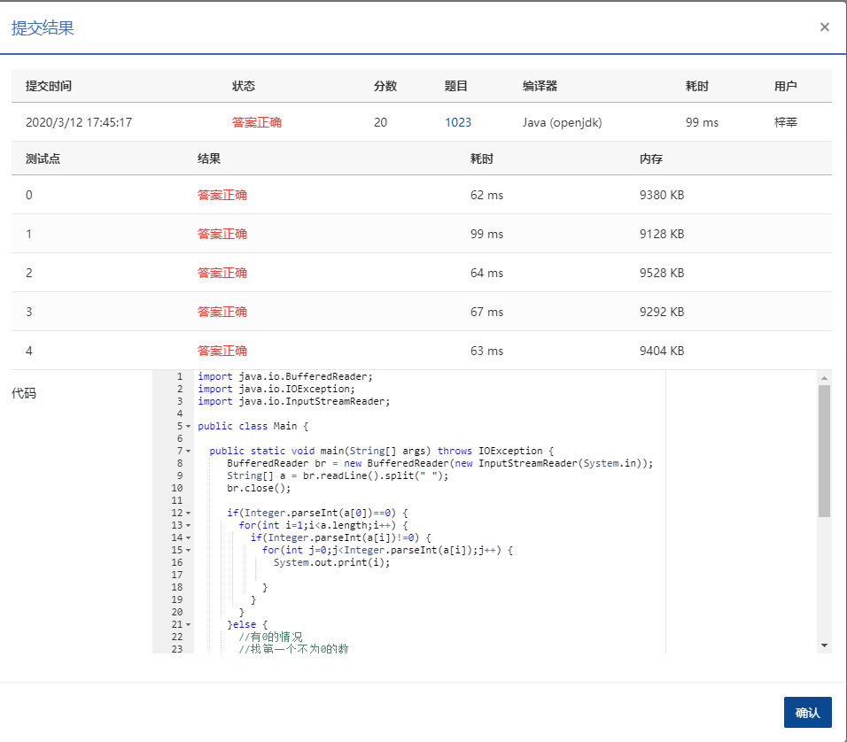

## 1023 组个最小数 (20分)

> 时间限制:400 ms
>
> 内存限制: 64 MB
>
> 代码长度限制: 16 KB

### 题目描述

给定一个 *k* 位整数 *N*=*d**k*−110*k*−1+⋯+*d*1101+*d*0 (0≤*d**i*≤9, *i*=0,⋯,*k*−1, *d**k*−1>0)，请编写程序统计每种不同的个位数字出现的次数。例如：给定 *N*=100311，则有 2 个 0，3 个 1，和 1 个 3。

### 输入描述:

每个输入包含 1 个测试用例，即一个不超过 1000 位的正整数 *N*。

### 输出描述:

对 *N* 中每一种不同的个位数字，以 `D:M` 的格式在一行中输出该位数字 `D` 及其在 *N* 中出现的次数 `M`。要求按 `D` 的升序输出。

### 输入例子:

```
100311
```

### 输出例子

```
0:2
1:3
3:1
```


### 代码

```java
package com.zixin.algorithm;

import java.io.BufferedReader;
import java.io.IOException;
import java.io.InputStreamReader;

public class PATB1023 {

	public static void main(String[] args) throws IOException {
		 BufferedReader br = new BufferedReader(new InputStreamReader(System.in));
		 String[] a = br.readLine().split(" ");
		 br.close();
		 
		 if(Integer.parseInt(a[0])==0) {
			 for(int i=1;i<a.length;i++) {
				 if(Integer.parseInt(a[i])!=0) {
					 for(int j=0;j<Integer.parseInt(a[i]);j++) {
						 System.out.print(i);
						 
					 }
				 }
			 }
		 }else {
			 //有0的情况
			 //找第一个不为0的数
			 for(int i=1;i<a.length;i++) {
				 if(Integer.parseInt(a[i])!=0) {
					 System.out.print(i);
					 a[i]=Integer.parseInt(a[i])-1+"";
					 break;
				 }
			 }
			 for(int i=0;i<a.length;i++) {
				 if(Integer.parseInt(a[i])!=0) {
					 for(int j=0;j<Integer.parseInt(a[i]);j++) {
						 System.out.print(i);
						 
					 }
				 }
			 }
		 }

	}

}

```

### 输入VS输出

```java
2 2 0 0 0 3 0 0 1 0
10015558

```

### 提交




