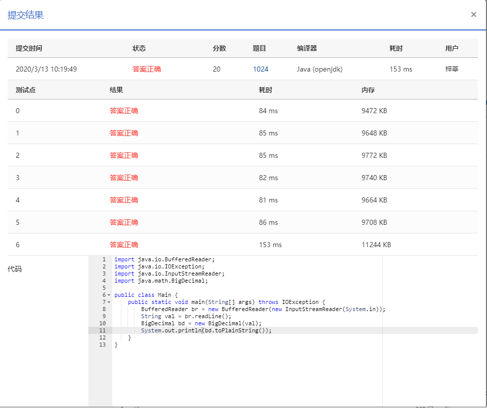

## 1024 科学计数法 (20分)

> 时间限制:200 ms
>
> 内存限制: 64 MB
>
> 代码长度限制: 16 KB

### 题目描述

科学计数法是科学家用来表示很大或很小的数字的一种方便的方法，其满足正则表达式 [+-][1-9]`.`[0-9]+E[+-][0-9]+，即数字的整数部分只有 1 位，小数部分至少有 1 位，该数字及其指数部分的正负号即使对正数也必定明确给出。

现以科学计数法的格式给出实数 *A*，请编写程序按普通数字表示法输出 *A*，并保证所有有效位都被保留。

### 输入描述:

每个输入包含 1 个测试用例，即一个以科学计数法表示的实数 *A*。该数字的存储长度不超过 9999 字节，且其指数的绝对值不超过 9999。

### 输出描述:

对每个测试用例，在一行中按普通数字表示法输出 *A*，并保证所有有效位都被保留，包括末尾的 0。

### 输入例子:

```
+1.23400E-03
-1.2E+10
```

### 输出例子

```
0.00123400
12000000000
```


### 代码

```java
package com.zixin.algorithm;

import java.io.BufferedReader;
import java.io.IOException;
import java.io.InputStreamReader;

public class PATB1023 {

	public static void main(String[] args) throws IOException {
	    BufferedReader br = new BufferedReader(new InputStreamReader(System.in));
        String val = br.readLine();
        BigDecimal bd = new BigDecimal(val);
        System.out.println(bd.toPlainString());
    }
}

```

### 输入VS输出

```java
+1.23400E-03
0.00123400
```

### 提交




