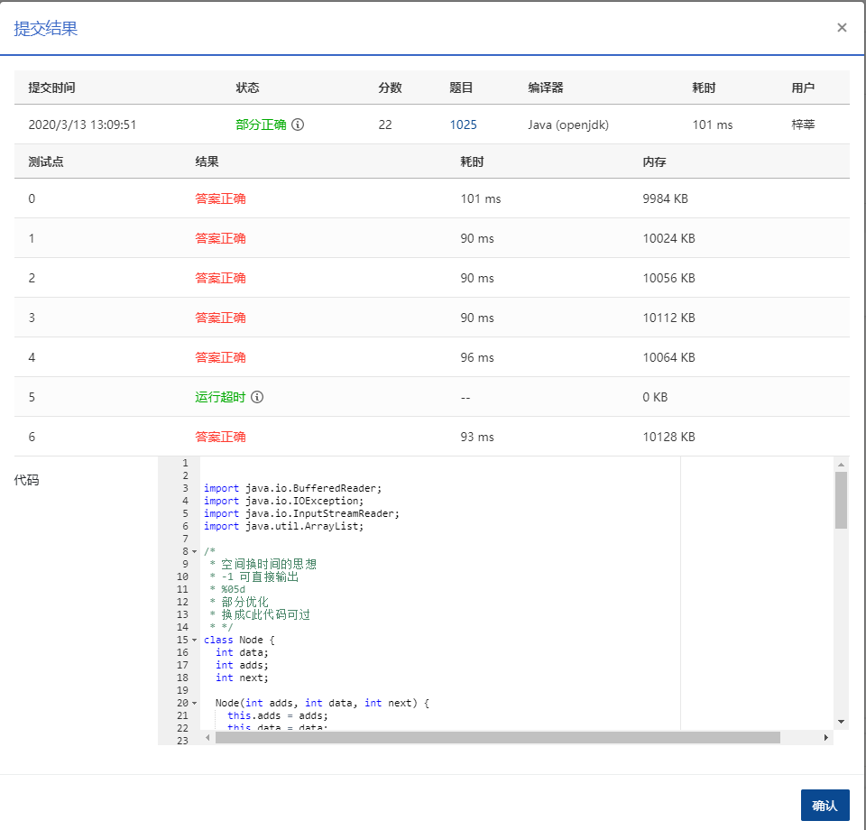

## 1025 反转链表 (25分)

> 时间限制:400 ms
>
> 内存限制: 64 MB
>
> 代码长度限制: 16 KB

### 题目描述

给定一个常数 *K* 以及一个单链表 *L*，请编写程序将 *L* 中每 *K* 个结点反转。例如：给定 *L* 为 1→2→3→4→5→6，*K* 为 3，则输出应该为 3→2→1→6→5→4；如果 *K* 为 4，则输出应该为 4→3→2→1→5→6，即最后不到 *K* 个元素不反转。

### 输入描述:

每个输入包含 1 个测试用例。每个测试用例第 1 行给出第 1 个结点的地址、结点总个数正整数 *N* (≤105)、以及正整数 *K* (≤*N*)，即要求反转的子链结点的个数。结点的地址是 5 位非负整数，NULL 地址用 −1 表示。

接下来有 *N* 行，每行格式为：

```
Address Data Next
```

其中 `Address` 是结点地址，`Data` 是该结点保存的整数数据，`Next` 是下一结点的地址。

### 输出描述:

对每个测试用例，顺序输出反转后的链表，其上每个结点占一行，格式与输入相同。

### 输入例子:

```
00100 6 4
00000 4 99999
00100 1 12309
68237 6 -1
33218 3 00000
99999 5 68237
12309 2 33218
```

### 输出例子

```
00000 4 33218
33218 3 12309
12309 2 00100
00100 1 99999
99999 5 68237
68237 6 -1
```


### 代码

```java
package com.zixin.algorithm;

import java.io.BufferedReader;
import java.io.IOException;
import java.io.InputStreamReader;
import java.util.ArrayList;

/*
 * 空间换时间的思想
 * -1 可直接输出
 * %05d
 * 部分优化
 * 换成C此代码可过
 * */
class Node {
	int data;
	int adds;
	int next;

	Node(int adds, int data, int next) {
		this.adds = adds;
		this.data = data;
		this.next = next;
	}

	public Node() {
	}
}

public class PATB1025 {

	public static void main(String[] args) throws IOException {
		BufferedReader in = new BufferedReader(new InputStreamReader(System.in));
		String s1[] = in.readLine().split(" ");
		int start = Integer.parseInt(s1[0]);
		int n = Integer.parseInt(s1[1]);
		int k = Integer.parseInt(s1[2]);
		ArrayList<Node> arrout = new ArrayList<Node>();
		Node arrin[] = new Node[100005];// 空间换时间
		while (n-- != 0) {
			String s2[] = in.readLine().split(" ");
			int adds = Integer.parseInt(s2[0]);
			int data = Integer.parseInt(s2[1]);
			int next = Integer.parseInt(s2[2]);
			arrin[adds] = new Node();
			arrin[adds].adds = adds;
			arrin[adds].data = data;
			arrin[adds].next = next;
		}
		Node temp = new Node();
		temp.adds = start;// 优化
		temp.data = arrin[start].data;
		temp.next = arrin[start].next;
		while (temp.next != -1) {
			arrout.add(new Node(temp.adds, temp.data, temp.next));
			temp.adds = arrin[temp.next].adds;
			temp.data = arrin[temp.next].data;
			temp.next = arrin[temp.next].next;
		}
		arrout.add(new Node(temp.adds, temp.data, temp.next));// 优化
		for (int i = 0; i < arrout.size(); i += k) {
			Outreverse(i, k, arrout);
		}
	}

	private static void Outreverse(int i, int k, ArrayList<Node> arrout) {
		if (i + k <= arrout.size()) {
			for (int p = i + k - 1; p >= i; p--) {
				if (p != i)
					System.out.printf("%05d %d %05d\n", arrout.get(p).adds, arrout.get(p).data, arrout.get(p - 1).adds);
				else {
					if (i + 2 * k <= arrout.size())
						System.out.printf("%05d %d %05d\n", arrout.get(p).adds, arrout.get(p).data,
								arrout.get(i + 2 * k - 1).adds);
					else {
						if (i + k >= arrout.size())
							System.out.printf("%05d %d -1\n", arrout.get(p).adds, arrout.get(p).data);
						else
							System.out.printf("%05d %d %05d\n", arrout.get(p).adds, arrout.get(p).data,
									arrout.get(i + k).adds);
					}
				}
			}
		} else {//长度不够不需要进行反转
			for (int p = i; p < arrout.size(); p++) {
				if (p == arrout.size() - 1) {//最后一个数字不需要格式化为5位 是-1
					System.out.printf("%05d %d -1\n", arrout.get(p).adds, arrout.get(p).data);
				}else {
					System.out.printf("%05d %d %05d\n", arrout.get(p).adds, arrout.get(p).data, arrout.get(p + 1).adds);
				}
			}
		}
	}
	
	
}
```

### 输入VS输出

```java
+1.23400E-03
0.00123400
```

### 提交




