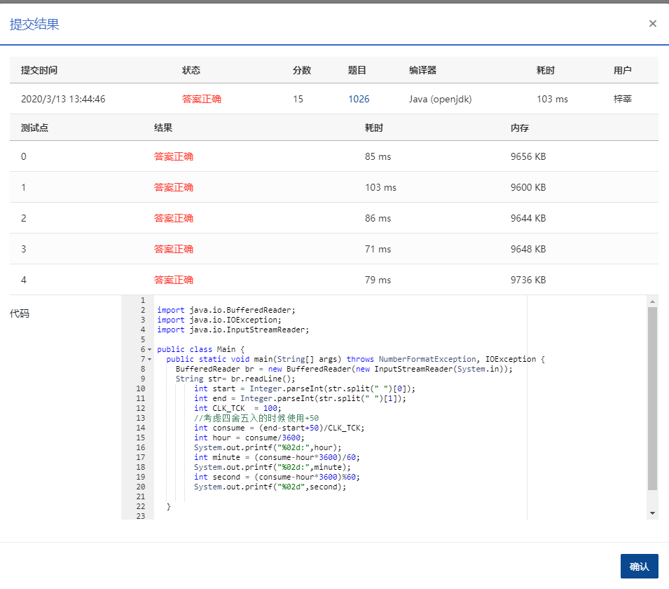

## 1026 程序运行时间 (15分)

### 题目描述

```
要获得一个 C 语言程序的运行时间，常用的方法是调用头文件 time.h，其中提供了 clock() 函数，可以捕捉从程序开始运行到 clock() 被调用时所耗费的时间。这个时间单位是 clock tick，即“时钟打点”。同时还有一个常数 CLK_TCK，给出了机器时钟每秒所走的时钟打点数。于是为了获得一个函数 f 的运行时间，我们只要在调用 f 之前先调用 clock()，获得一个时钟打点数 C1；在 f 执行完成后再调用 clock()，获得另一个时钟打点数 C2；两次获得的时钟打点数之差 (C2-C1) 就是 f 运行所消耗的时钟打点数，再除以常数 CLK_TCK，就得到了以秒为单位的运行时间。

这里不妨简单假设常数 CLK_TCK 为 100。现给定被测函数前后两次获得的时钟打点数，请你给出被测函数运行的时间。
```

### **输入描述:**

输入在一行中顺序给出 2 个整数 C1 和 C2。注意两次获得的时钟打点数肯定不相同，即 C1 < C2，并且取值在 [0,10<sup>7</sup>]

### 输出描述:

```
在一行中输出被测函数运行的时间。运行时间必须按照 hh:mm:ss（即2位的 时:分:秒）格式输出；不足 1 秒的时间四舍五入到秒。


```

### 输入例子:

```
123 4577973

```

### 输出例子

```
12:42:59

```

### 代码

```java
package com.zixin.algorithm;

import java.io.BufferedReader;
import java.io.IOException;
import java.io.InputStreamReader;

public class PATB1026 {
	public static void main(String[] args) throws NumberFormatException, IOException {
		BufferedReader br = new BufferedReader(new InputStreamReader(System.in));
		String str= br.readLine();
        int start = Integer.parseInt(str.split(" ")[0]);
        int end = Integer.parseInt(str.split(" ")[1]);
        int CLK_TCK  = 100; 
        //考虑四舍五入的时候使用+50 
        int consume = (end-start+50)/CLK_TCK;
        int hour = consume/3600;
        System.out.printf("%02d:",hour);
        int minute = (consume-hour*3600)/60;
        System.out.printf("%02d:",minute);
        int second = (consume-hour*3600)%60;
        System.out.printf("%02d",second);
       
	}

}

```


### 输入VS输出

```java
0 100
00:00:01
```

### 提交



