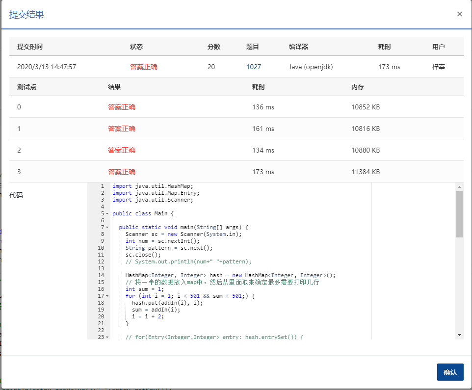

## 1027 打印沙漏 (20分)

### 题目描述

本题要求你写个程序把给定的符号打印成沙漏的形状。例如给定17个“*”，要求按下列格式打印

```
*****
 ***
  *
 ***
*****
```

所谓“沙漏形状”，是指每行输出奇数个符号；各行符号中心对齐；相邻两行符号数差2；符号数先从大到小顺序递减到1，再从小到大顺序递增；首尾符号数相等。

给定任意N个符号，不一定能正好组成一个沙漏。要求打印出的沙漏能用掉尽可能多的符号。

### 输入描述:

输入在一行给出1个正整数N（≤1000）和一个符号，中间以空格分隔。

### 输出描述:

```
首先打印出由给定符号组成的最大的沙漏形状，最后在一行中输出剩下没用掉的符号数。

```

### 输入例子:

```
19 *
```

### 输出例子

```
*****
 ***
  *
 ***
*****
2
```

### 代码

```java
package com.zixin.algorithm;

import java.util.HashMap;
import java.util.Map.Entry;
import java.util.Scanner;

public class PATB1027 {

	public static void main(String[] args) {
		Scanner sc = new Scanner(System.in);
		int num = sc.nextInt();
		String pattern = sc.next();
		sc.close();
		// System.out.println(num+" "+pattern);

		HashMap<Integer, Integer> hash = new HashMap<Integer, Integer>();
		// 将一半的数据放入map中，然后从里面取来确定最多需要打印几行
		int sum = 1;
		for (int i = 1; i < 501 && sum < 501;) {
			hash.put(addIn(i), i);
			sum = addIn(i);
			i = i + 2;
		}

		// for(Entry<Integer,Integer> entry: hash.entrySet()) {
		// System.out.println(entry.getValue()+" "+entry.getKey());
		// }

		int temp = (num + 1) / 2;
		while (!hash.containsKey(temp)) {
			temp = temp - 1;
		}
		int maxNum = hash.get(temp);
		int skip = 0;
		for (int j = maxNum; j >= 1; j = j - 2) {
			for (int k = 0; k < skip; k++) {
				System.out.print(" ");
			}
			for (int k = 0; k < j; k++) {
				System.out.print(pattern);
			}
			skip = skip + 1;
			System.out.println();

		}
		skip = skip - 1;
		for (int j = 3; j <= maxNum; j = j + 2) {
			skip = skip - 1;
			for (int k = 0; k < skip; k++) {
				System.out.print(" ");
			}
			for (int k = 0; k < j; k++) {
				System.out.print(pattern);
			}

			System.out.println();

		}
		System.out.println(num - (temp * 2 - 1));
	}

	private static int addIn(int i) {
		int sum = 0;
		for (int j = 1; j <= i; j = j + 2) {
			sum = sum + j;

		}
		return sum;
	}
}


```


### 输入VS输出

```java
19 *
*****
 ***
  *
 ***
*****
2

```

### 提交



