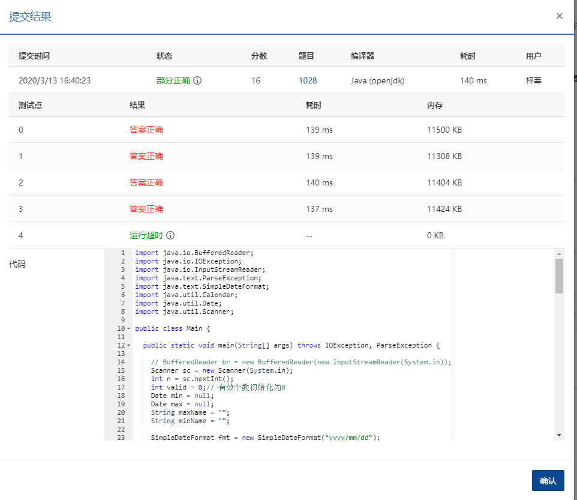

## 1028 人口普查 (20分)

> 需要改进    最后一个运行超时

### 题目描述

某城镇进行人口普查，得到了全体居民的生日。现请你写个程序，找出镇上最年长和最年轻的人。

这里确保每个输入的日期都是合法的，但不一定是合理的——假设已知镇上没有超过 200 岁的老人，而今天是 2014 年 9 月 6 日，所以超过 200 岁的生日和未出生的生日都是不合理的，应该被过滤掉。

### 输入描述:

输入在第一行给出正整数 *N*，取值在(0,10<sup>5</sup>]；随后 *N* 行，每行给出 1 个人的姓名（由不超过 5 个英文字母组成的字符串）、以及按 `yyyy/mm/dd`（即年/月/日）格式给出的生日。题目保证最年长和最年轻的人没有并列。

### 输出描述:

```
在一行中顺序输出有效生日的个数、最年长人和最年轻人的姓名，其间以空格分隔。
```

### 输入例子:

```
5
John 2001/05/12
Tom 1814/09/06
Ann 2121/01/30
James 1814/09/05
Steve 1967/11/20
```

### 输出例子

```
3 Tom John

```

### 代码

```java
package com.zixin.algorithm;

import java.io.IOException;
import java.text.ParseException;
import java.text.SimpleDateFormat;
import java.util.Calendar;
import java.util.Date;
import java.util.Scanner;

public class PATB1028 {

	public static void main(String[] args) throws IOException, ParseException {

		// BufferedReader br = new BufferedReader(new InputStreamReader(System.in));
		Scanner sc = new Scanner(System.in);
		int n = sc.nextInt();
		int valid = 0;// 有效个数初始化为0
		Date min = null;
		Date max = null;
		String maxName = "";
		String minName = "";
        String  current = "2014/09/06";
		SimpleDateFormat fmt = new SimpleDateFormat("yyyy/mm/dd");
		Date today = fmt.parse(current);
		// System.out.println(n);

		Calendar to = Calendar.getInstance();
		to.setTime(today);
		Calendar from = Calendar.getInstance();
		for (int i = 0; i < n; i++) {

			String name = sc.next();
			Date birth = fmt.parse(sc.next());
			from.setTime(birth);
			// 小于等于0说明日期是合法的
			if (birth.compareTo(today) <= 0 && isValieDay(current, fmt.format(birth))) {
				valid = valid + 1;
				if (min == null) {
					min = birth;
					minName = name;
				} else {
					if (differentDaysByDate(birth, today) < differentDaysByDate(min, today)) {
						min = birth;
						minName = name;
					}
				}

				if (max == null) {
					max = birth;
					maxName = name;
				} else {
					if (differentDaysByDate(birth, today) > differentDaysByDate(max, today)) {
						max = birth;
						maxName = name;
					}
				}
			}

		}
		sc.close();
		//注意这里如果没有有效的数据时的输出 
		if (valid == 0) {
			System.out.println("0");
		} else {
			System.out.println(valid + " " + maxName + " " + minName);
		}
	}

	public static boolean isValieDay(String fromDate, String toDate) {
		int fromYear = Integer.parseInt(fromDate.substring(0, 4));
		int toYear = Integer.parseInt(toDate.substring(0, 4));
		int fromMonth = Integer.parseInt(fromDate.substring(5, 7));
		int toMonth = Integer.parseInt(toDate.substring(5, 7));
		int fromDay = Integer.parseInt(fromDate.substring(8, 10));
		int toDay = Integer.parseInt(toDate.substring(8, 10));
		if (fromYear - toYear > 200) {
			return false;
		} else if (fromYear - toYear < 200) {
			return true;
		} else {// 年相同
			if (fromMonth < toMonth) {
				return true;
			} else if (fromMonth > toMonth) {
				return false;
			} else {
				if (fromDay <= toDay) {
					return true;
				} else {
					return false;
				}
			}
		}
	}

	public static int differentDaysByDate(Date date1, Date date2) {
		int days = (int) ((date2.getTime() - date1.getTime()) / (1000 * 3600 * 24));
		return days;
	}
}

```


### 输入VS输出

```java
1
James 1814/09/05
0  


```

### 提交



