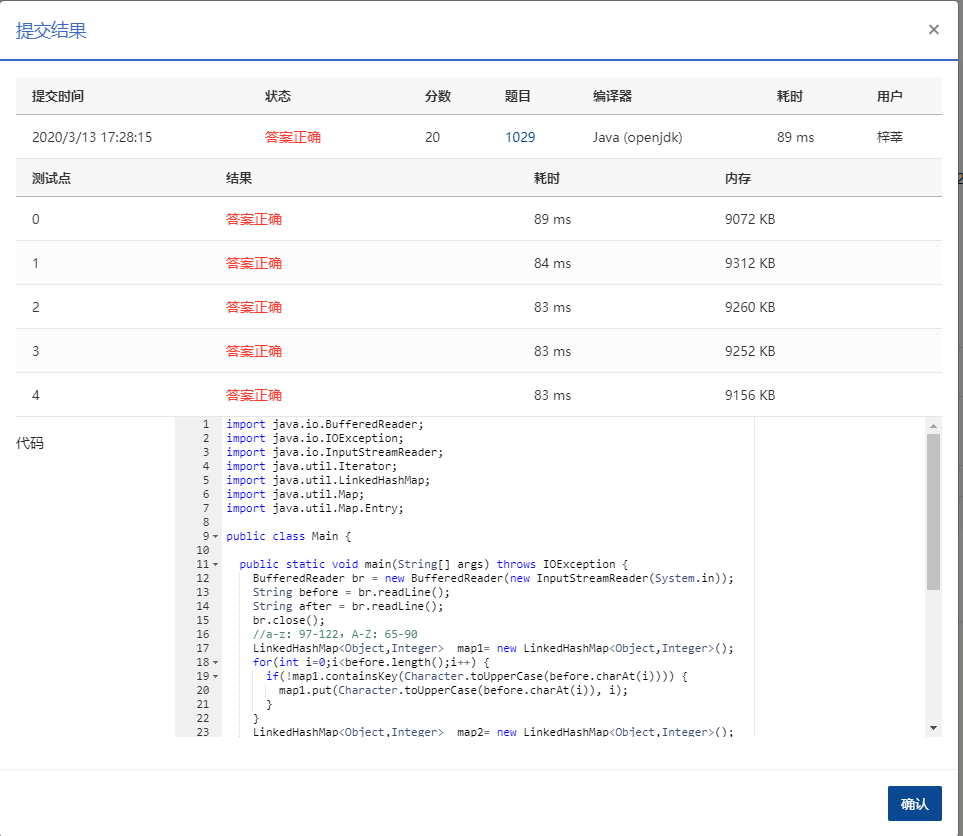

## 1029 旧键盘 (20分)

### 题目描述

旧键盘上坏了几个键，于是在敲一段文字的时候，对应的字符就不会出现。现在给出应该输入的一段文字、以及实际被输入的文字，请你列出肯定坏掉的那些键。

### 输入描述:

输入在 2 行中分别给出应该输入的文字、以及实际被输入的文字。每段文字是不超过 80 个字符的串，由字母 A-Z（包括大、小写）、数字 0-9、以及下划线 `_`（代表空格）组成。题目保证 2 个字符串均非空。

### 输出描述:

```
按照发现顺序，在一行中输出坏掉的键。其中英文字母只输出大写，每个坏键只输出一次。题目保证至少有 1 个坏键。
```

### 输入例子:

```
7_This_is_a_test
_hs_s_a_es
```

### 输出例子

```
7TI
```

### 代码

```java
package com.zixin.algorithm;

import java.io.BufferedReader;
import java.io.IOException;
import java.io.InputStreamReader;
import java.util.Iterator;
import java.util.LinkedHashMap;
import java.util.Map;
import java.util.Map.Entry;

public class PATB1029 {

	public static void main(String[] args) throws IOException {
		BufferedReader br = new BufferedReader(new InputStreamReader(System.in));
		String before = br.readLine();
		String after = br.readLine();
		br.close();
		//a-z：97-122，A-Z：65-90
		LinkedHashMap<Object,Integer>  map1= new LinkedHashMap<Object,Integer>();
		for(int i=0;i<before.length();i++) {
			if(!map1.containsKey(Character.toUpperCase(before.charAt(i)))) {
				map1.put(Character.toUpperCase(before.charAt(i)), i);
			}
		}
		LinkedHashMap<Object,Integer>  map2= new LinkedHashMap<Object,Integer>();
		for(int i=0;i<after.length();i++) {
			if(!map2.containsKey(Character.toUpperCase(after.charAt(i)))) {
				map2.put(Character.toUpperCase(after.charAt(i)), i);
			}
		}
		Iterator<Entry<Object, Integer>> it = map1.entrySet().iterator();
        while (it.hasNext()) {
            Map.Entry<Object, Integer> entry = (Map.Entry<Object, Integer>) it.next();
            //System.out.println("key:" + entry.getKey() + "   value:" + entry.getValue());
            if(!map2.containsKey(entry.getKey())) {
            	System.out.print(entry.getKey());
            }
        }

		
	}

}


```


### 输入VS输出

```java
7_This_is_a_test
_hs_s_a_es
7TI
```

### 提交



