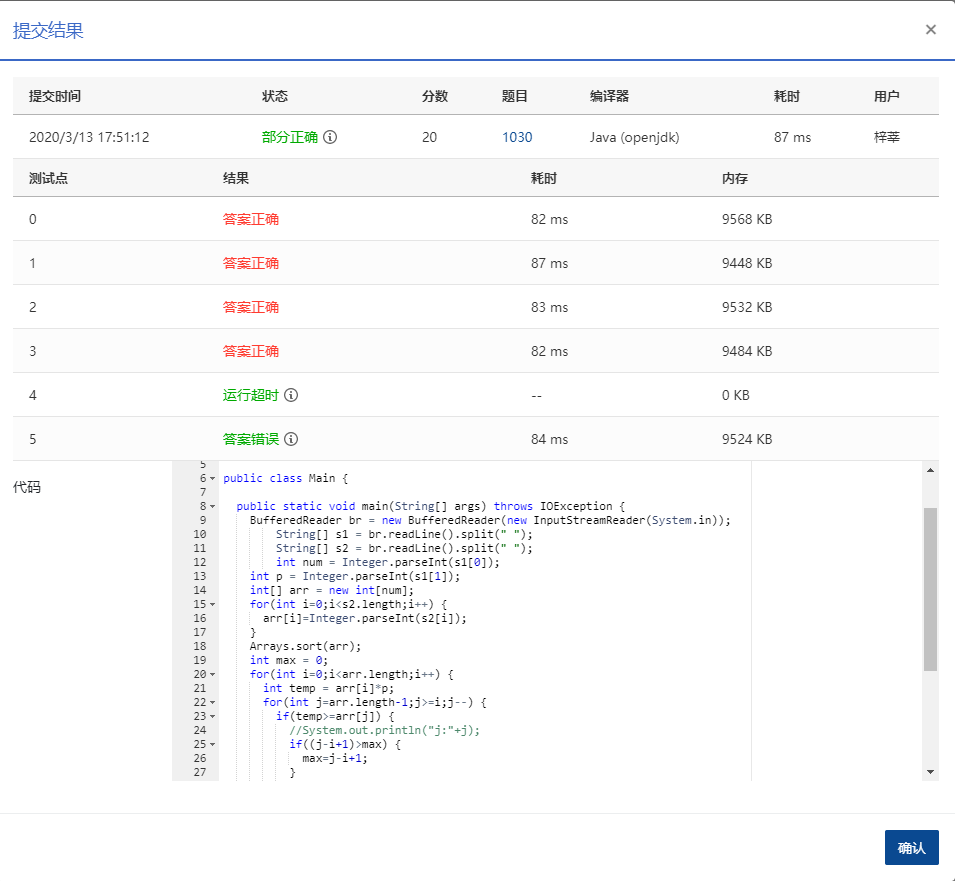
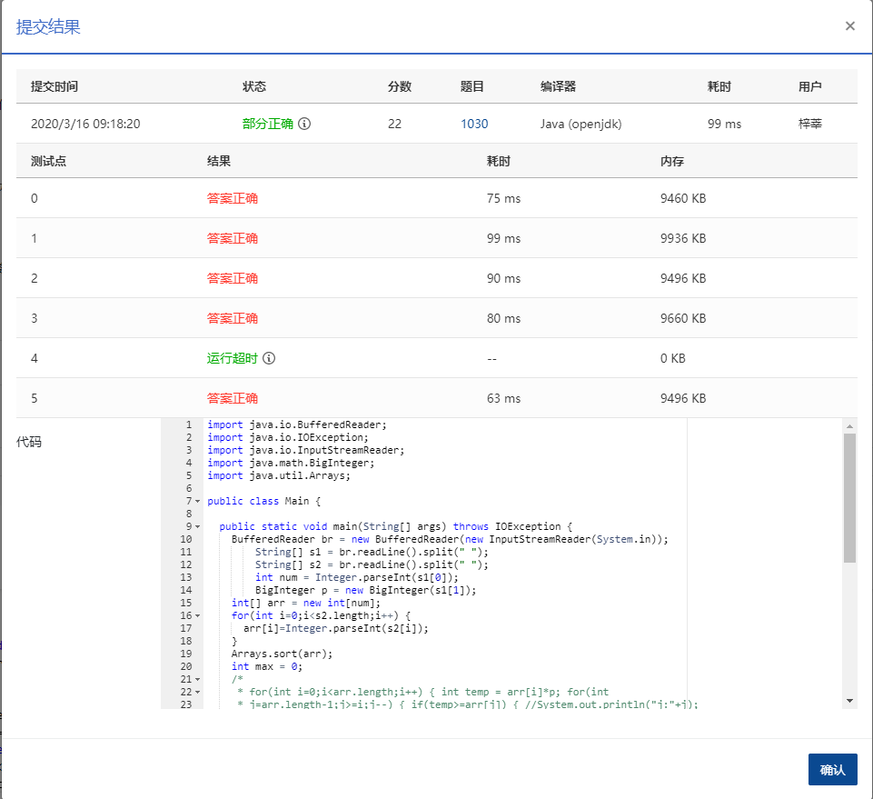

## **1030** **完美数列** (25分)

> 待改进

### 题目描述

给定一个正整数数列，和正整数 *p*，设这个数列中的最大值是 *M*，最小值是 *m*，如果 *M*≤mp，则称这个数列是完美数列。

现在给定参数 *p* 和一些正整数，请你从中选择尽可能多的数构成一个完美数列。

### 输入描述:

输入第一行给出两个正整数 *N* 和 *p*，其中 *N*（≤10<sup>5</sup>）是输入的正整数的个数，*p*（≤10<sup>9</sup>）是给定的参数。第二行给出 *N* 个正整数，每个数不超过 10<sup>9</sup>。

### 输出描述:

```
在一行中输出最多可以选择多少个数可以用它们组成一个完美数列。
```

### 输入例子:

```
10 8
2 3 20 4 5 1 6 7 8 9
```

### 输出例子

```
8
```

### 第一次提交代码

```java
package com.zixin.algorithm;

import java.io.BufferedReader;
import java.io.IOException;
import java.io.InputStreamReader;
import java.util.Arrays;

public class PATB1030 {

	public static void main(String[] args) throws IOException {
		BufferedReader br = new BufferedReader(new InputStreamReader(System.in));
        String[] s1 = br.readLine().split(" ");
        String[] s2 = br.readLine().split(" ");
        int num = Integer.parseInt(s1[0]);
		int p = Integer.parseInt(s1[1]);
		int[] arr = new int[num];
		for(int i=0;i<s2.length;i++) {
			arr[i]=Integer.parseInt(s2[i]);
		}
		Arrays.sort(arr);
		int max = 0;
		for(int i=0;i<arr.length;i++) {
			int temp = arr[i]*p;
			for(int j=arr.length-1;j>=i;j--) {
				if(temp>=arr[j]) {
					//System.out.println("j:"+j);
					if((j-i+1)>max) {
						max=j-i+1;
					}
					break;
				}else {
					j--;
				}
				
			}
			
		}
		System.out.println(max);
	}

}


```


### 输入VS输出

```java
10 8
2 3 20 4 5 1 6 7 8 9
```

### 提交



## 第二次提交代码

p改为了BigInteger

```java
package com.zixin.algorithm;

import java.io.BufferedReader;
import java.io.IOException;
import java.io.InputStreamReader;
import java.math.BigInteger;
import java.util.Arrays;

public class PATB1030 {

	public static void main(String[] args) throws IOException {
		BufferedReader br = new BufferedReader(new InputStreamReader(System.in));
        String[] s1 = br.readLine().split(" ");
        String[] s2 = br.readLine().split(" ");
        int num = Integer.parseInt(s1[0]);
        BigInteger p = new BigInteger(s1[1]);
		int[] arr = new int[num];
		for(int i=0;i<s2.length;i++) {
			arr[i]=Integer.parseInt(s2[i]);
		}
		Arrays.sort(arr);
		int max = 0;
		/*
		 * for(int i=0;i<arr.length;i++) { int temp = arr[i]*p; for(int
		 * j=arr.length-1;j>=i;j--) { if(temp>=arr[j]) { //System.out.println("j:"+j);
		 * if((j-i+1)>max) { max=j-i+1; } break; }else { j--; }
		 * 
		 * }
		 * 
		 * }
		 */
		int result = 0, temp = 0;
	    for (int i = 0; i < num; i++) {
	        for (int j = i + result; j < num; j++) {
	            if (BigInteger.valueOf(arr[j]).compareTo(BigInteger.valueOf(arr[i]).multiply(p))<=0) {
	                temp = j - i + 1;
	                if (temp > result)
	                    result = temp;
	            } else {
	                break;
	            }
	        }
	    }
		System.out.println(result);
	}
	
}

```

