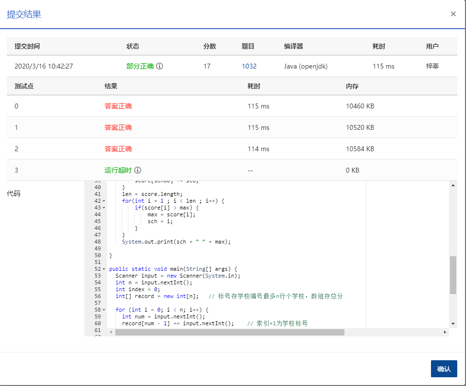

## **1032** **挖掘机技术哪家强** (20分)

> 时间限制 200 ms 内存限制 32768 KB 代码长度限制 100 KB 判断程序 Standard

### 题目描述

输入在第 1 行给出不超过 10<sup>5</sup> 的正整数 *N*，即参赛人数。随后 *N* 行，每行给出一位参赛者的信息和成绩，包括其所代表的学校的编号（从 1 开始连续编号）、及其比赛成绩（百分制），中间以空格分隔。

### **输入描述:**

```
输入第1行给出正整数T(<=10)，是测试用例的个数。随后给出T组测试用例，每组占一行，顺序给出A、B和C。整数间以空格分隔。
```

### 输出描述:

```
在一行中给出总得分最高的学校的编号、及其总分，中间以空格分隔。题目保证答案唯一，没有并列。
```

### 输入例子:

```
6
3 65
2 80
1 100
2 70
3 40
3 0
```

### 输出例子

```
2 150

```

### 代码

```java
package com.zixin.algorithm;

import java.math.BigInteger;
import java.util.Scanner;

public class PATB1032 {

	public static void main(String[] args) {
	Scanner input = new Scanner(System.in);
	int n = input.nextInt();
	int index = 0;
	int[] record = new int[n];   // 标号存学校编号最多n行个学校，数组存总分
	
	for (int i = 0; i < n; i++) {
		int num = input.nextInt();
		record[num - 1] += input.nextInt();    // 索引+1为学校标号
	}
	input.close();
	
	for (int i = 1; i < n; i++) {
		if (record[i] > record[index]) {
			index = i;
		}
	}
	System.out.println(index + 1 + " " + record[index]);

}
}

```

### 输入VS输出

```java
6
3 65
2 80
1 100
2 70
3 40
3 0
2 150
    
```

### 提交




