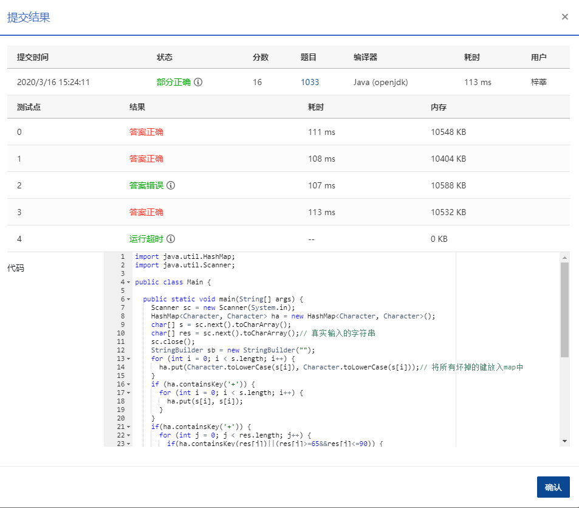

## **1033** **旧键盘打字** (20分)

### 题目描述

旧键盘上坏了几个键，于是在敲一段文字的时候，对应的字符就不会出现。现在给出应该输入的一段文字、以及坏掉的那些键，打出的结果文字会是怎样？

### 输入描述:

输入在 2 行中分别给出坏掉的那些键、以及应该输入的文字。其中对应英文字母的坏键以大写给出；每段文字是不超过 105 个字符的串。可用的字符包括字母 [`a`-`z`, `A`-`Z`]、数字 `0`-`9`、以及下划线 `_`（代表空格）、`,`、`.`、`-`、`+`（代表上档键）。题目保证第 2 行输入的文字串非空。

注意：如果上档键坏掉了，那么大写的英文字母无法被打出。

### 输出描述:

```
在一行中输出能够被打出的结果文字。如果没有一个字符能被打出，则输出空行。


```

### 输入例子:

```
7+IE.
7_This_is_a_test.
```

### 输出例子

```
_hs_s_a_tst

```

### 代码

```java
package com.zixin.algorithm;

import java.util.HashMap;
import java.util.Scanner;

public class PATB1033 {

	public static void main(String[] args) {
		Scanner sc = new Scanner(System.in);
		HashMap<Character, Character> ha = new HashMap<Character, Character>();
		char[] s = sc.next().toCharArray();
		char[] res = sc.next().toCharArray();// 真实输入的字符串
		sc.close();
		StringBuilder sb = new StringBuilder("");
		for (int i = 0; i < s.length; i++) {
			ha.put(Character.toLowerCase(s[i]), Character.toLowerCase(s[i]));// 将所有坏掉的键放入map中
		}
		if (ha.containsKey('+')) {
			for (int i = 0; i < s.length; i++) {
				ha.put(s[i], s[i]);
			}
		}
		if(ha.containsKey('+')) {
			for (int j = 0; j < res.length; j++) {
				if(ha.containsKey(res[j])||(res[j]>=65&&res[j]<=90)) {
					continue;
				}else {
					sb.append(res[j]);
				}
			}
		}else {
			for (int j = 0; j < res.length; j++) {
				if(ha.containsKey(res[j])) {
					continue;
				}else {
					sb.append(res[j]);
				}
			}
		}
	
		System.out.println(sb.toString());
	}

}


```


### 输入VS输出

```java
7+IE.
7_This_is_a_test.
_hs_s_a_tst

```

### 提交



有一个点错误和一个超时，暂时未找到原因

以下代码来自网络，可以A:https://blog.csdn.net/TonyHTY/article/details/102670726

```java
package not.die.in.here;
import java.io.*;
import java.util.Arrays;
 
public class _1033_BrokenkeyType {
 
	public static void main(String[] args) throws IOException {
		BufferedReader bf = new BufferedReader(new InputStreamReader(System.in));//buff加快读取速度
		 //StreamTokenizer st = new StreamTokenizer(bf);这个还没有完全搞懂，不过好像这玩意能更快
		String temp = bf.readLine();
		char[] broken = (temp+temp.toLowerCase()).toCharArray();//记录坏键
		//这里是个加快的原因，因为坏键撑死一百以内个，所以这里直接把所有的键位对应小写都变成坏键，并不会增加多少循环
		//后面直接比对就好了
		char[] type = bf.readLine().toCharArray();//记录需要打的键
		StringBuilder sb = new StringBuilder("");//用这个string变量来添加，比String块太多了，也比每次比对完就输出要快，输出很费事的
		Arrays.sort(broken);//因为要使用二分查找，所以先排序，默认字典顺序
		if(Arrays.binarySearch(broken, '+')==-1) {//判断是否大小写
			//大小写没坏，可以输出大写字母
			for(int i=0;i<type.length;i++) {
				if(Arrays.binarySearch(broken,type[i])<0) {
					sb.append(type[i]);//不是坏键，原样添加
				}
			}
		}
		else {//不可以输出大写字母
			for(int i=0;i<type.length;i++) {
				if((64<type[i] && type[i]<91)) {
					continue;//大写字母直接跳过
				}else {
					if(Arrays.binarySearch(broken,type[i])<0)
						sb.append(type[i]);	//这里的肯定不是大写字母，直接输出
				}
			}
		}
		System.out.println(sb);//输出结果
	}
}
```

