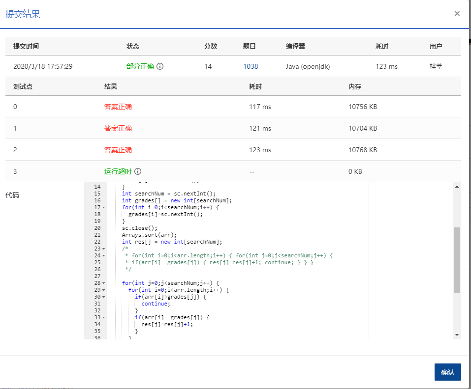

### 1038 统计同成绩学生 (20分)

本题要求读入 *N* 名学生的成绩，将获得某一给定分数的学生人数输出。

### 输入格式：

输入在第 1 行给出不超过 105 的正整数 *N*，即学生总人数。随后一行给出 *N* 名学生的百分制整数成绩，中间以空格分隔。最后一行给出要查询的分数个数 *K*（不超过 *N* 的正整数），随后是 *K* 个分数，中间以空格分隔。

### 输出格式：

在一行中按查询顺序给出得分等于指定分数的学生人数，中间以空格分隔，但行末不得有多余空格。

### 输入样例：

```in
10
60 75 90 55 75 99 82 90 75 50
3 75 90 88

      
    
```

### 输出样例：

```out
3 2 0
```

### 代码

```java
package com.zixin.algorithm;

import java.util.Arrays;
import java.util.Scanner;

public class PATB1038 {

	public static void main(String[] args) {
		Scanner sc = new Scanner(System.in);
		int gradeNum = sc.nextInt();
		int arr[] = new int[gradeNum];
		for(int i=0;i<gradeNum;i++) {
			arr[i] = sc.nextInt();
		}
		int searchNum = sc.nextInt();
		int grades[] = new int[searchNum];
		for(int i=0;i<searchNum;i++) {
			grades[i]=sc.nextInt();
		}
		sc.close();
		Arrays.sort(arr);
		int res[] = new int[searchNum];
		for(int j=0;j<searchNum;j++) {
			for(int i=0;i<arr.length;i++) {
				if(arr[i]>grades[j]) {
					continue;
				}
				if(arr[i]==grades[j]) {
					res[j]=res[j]+1;
				}
			}
		}
		for(int i=0;i<searchNum;i++) {
			if(i!=searchNum-1) {
				System.out.print(res[i]+" ");
			}else {
				System.out.print(res[i]);
			}
		}

	}

}

```

### 输入VS输出

```java
10
60 75 90 55 75 99 82 90 75 50
3 75 90 88
3 2 0
```

### 提交结果 

超时需改进

