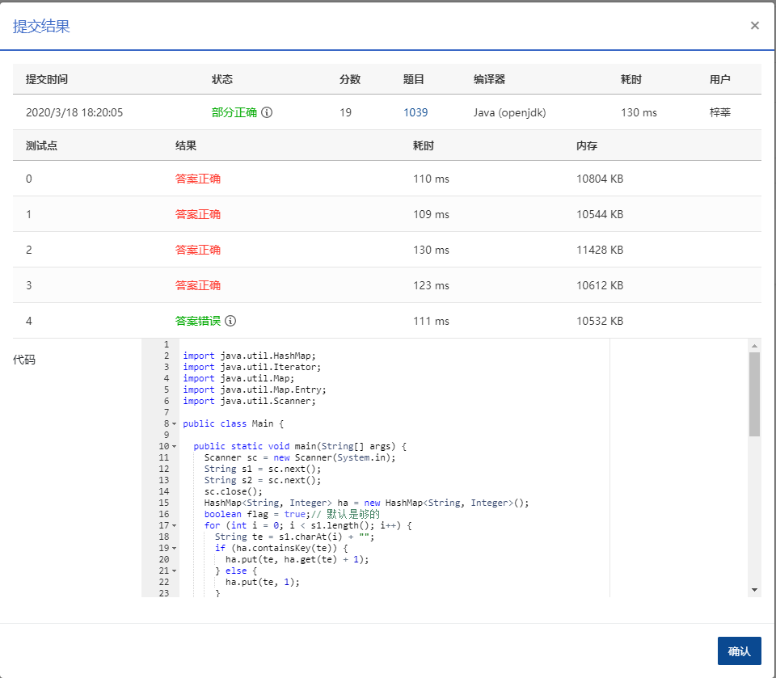
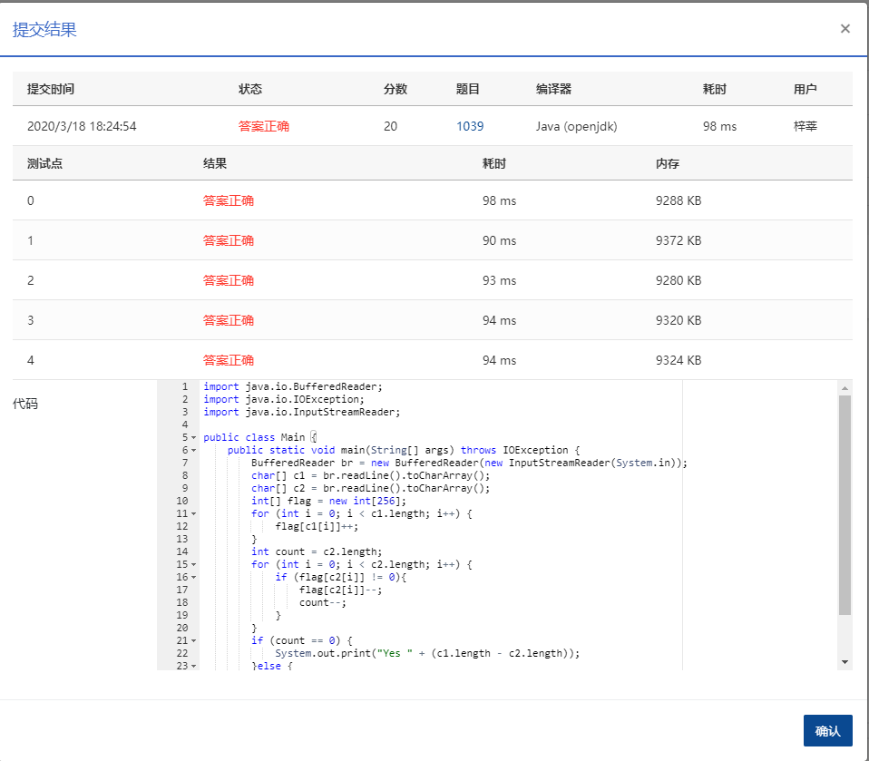

## 1039 到底买不买 (20分)

小红想买些珠子做一串自己喜欢的珠串。卖珠子的摊主有很多串五颜六色的珠串，但是不肯把任何一串拆散了卖。于是小红要你帮忙判断一下，某串珠子里是否包含了全部自己想要的珠子？如果是，那么告诉她有多少多余的珠子；如果不是，那么告诉她缺了多少珠子。

为方便起见，我们用[0-9]、[a-z]、[A-Z]范围内的字符来表示颜色。例如在图1中，第3串是小红想做的珠串；那么第1串可以买，因为包含了全部她想要的珠子，还多了8颗不需要的珠子；第2串不能买，因为没有黑色珠子，并且少了一颗红色的珠子。


图 1

### 输入格式：

每个输入包含 1 个测试用例。每个测试用例分别在 2 行中先后给出摊主的珠串和小红想做的珠串，两串都不超过 1000 个珠子。

### 输出格式：

如果可以买，则在一行中输出 `Yes` 以及有多少多余的珠子；如果不可以买，则在一行中输出 `No` 以及缺了多少珠子。其间以 1 个空格分隔。

### 输入样例 1：

```in
ppRYYGrrYBR2258
YrR8RrY

      
    
```

### 输出样例 1：

```out
Yes 8

      
    
```

### 输入样例 2：

```in
ppRYYGrrYB225
YrR8RrY

      
    
```

### 输出样例 2：

```out
No 2

      
    
```

作者: CHEN, Yue

单位: 浙江大学

时间限制: 150 ms

内存限制: 64 MB

 ### 代码

第一版：最后一个错误

```java
package com.zixin.algorithm;

import java.util.HashMap;
import java.util.Iterator;
import java.util.Map;
import java.util.Map.Entry;
import java.util.Scanner;

public class PATB1039 {

	public static void main(String[] args) {
		Scanner sc = new Scanner(System.in);
		String s1 = sc.next();
		String s2 = sc.next();
		sc.close();
		HashMap<String, Integer> ha = new HashMap<String, Integer>();
		boolean flag = true;// 默认是够的
		for (int i = 0; i < s1.length(); i++) {
			String te = s1.charAt(i) + "";
			if (ha.containsKey(te)) {
				ha.put(te, ha.get(te) + 1);
			} else {
				ha.put(te, 1);
			}
		}
		for (int j = 0; j < s2.length(); j++) {
			String t = s2.charAt(j) + "";
			if (ha.containsKey(t)) {
				ha.put(t, ha.get(t) - 1);
				if (ha.get(t) < 0) {// 小于0说明是不够的
					flag = false;// 不够的话将flag设置为false
				}
			} else {
				// 不包含的情况
				ha.put(t, -1);
			}
		}
		int res = 0;
		if (flag) {

			Iterator<Entry<String, Integer>> it = ha.entrySet().iterator();
			while (it.hasNext()) {
				Map.Entry<String, Integer> entry = (Map.Entry<String, Integer>) it.next();

				res += entry.getValue();

			}
			System.out.print("Yes" + " " + res);
		} else {
			Iterator<Entry<String, Integer>> it = ha.entrySet().iterator();
			while (it.hasNext()) {
				Map.Entry<String, Integer> entry = (Map.Entry<String, Integer>) it.next();
                if(entry.getValue()<0) {
                	res += entry.getValue();
                }

			}
			System.out.print("No" + " " + -res);
		}

	}

}

```

### 提交



### 正确代码来自网络

```java
import java.io.BufferedReader;
import java.io.IOException;
import java.io.InputStreamReader;

public class Main {
    public static void main(String[] args) throws IOException {
        BufferedReader br = new BufferedReader(new InputStreamReader(System.in));
        char[] c1 = br.readLine().toCharArray();
        char[] c2 = br.readLine().toCharArray();
        int[] flag = new int[256];
        for (int i = 0; i < c1.length; i++) {
            flag[c1[i]]++;
        }
        int count = c2.length;
        for (int i = 0; i < c2.length; i++) {
            if (flag[c2[i]] != 0){
                flag[c2[i]]--;
                count--;
            }
        }
        if (count == 0) {
            System.out.print("Yes " + (c1.length - c2.length));
        }else {
            System.out.print("No " + count);
        }
    }
}
```

### 提交结果

