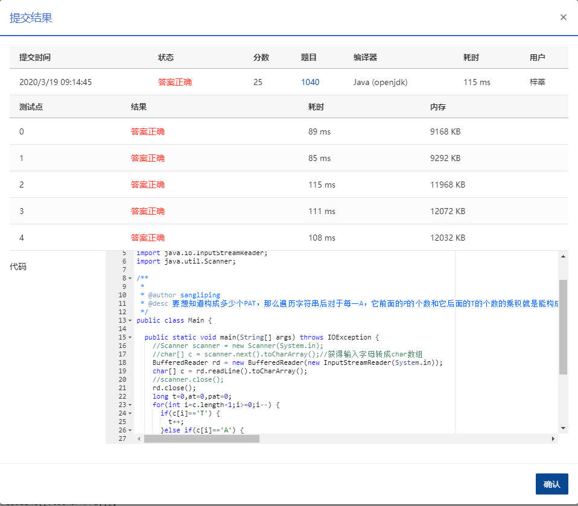

1040 有几个PAT (25分)

字符串 `APPAPT` 中包含了两个单词 `PAT`，其中第一个 `PAT` 是第 2 位(`P`)，第 4 位(`A`)，第 6 位(`T`)；第二个 `PAT` 是第 3 位(`P`)，第 4 位(`A`)，第 6 位(`T`)。

现给定字符串，问一共可以形成多少个 `PAT`？

### 输入格式：

输入只有一行，包含一个字符串，长度不超过105，只包含 `P`、`A`、`T` 三种字母。

### 输出格式：

在一行中输出给定字符串中包含多少个 `PAT`。由于结果可能比较大，只输出对 1000000007 取余数的结果。

### 输入样例：

```in
APPAPT  
```

### 输出样例：

```out
2
```

### 思路来自网络

要想知道构成多少个PAT，那么遍历字符串后对于每一A，它前面的P的个数和它后面的T的个数的乘积就是能构成的PAT的个数。然后把对于每一个A的结果相加即可

### 代码

```java
package com.zixin.algorithm;

import java.io.BufferedReader;
import java.io.IOException;
import java.io.InputStreamReader;
import java.util.Scanner;

/**
 * 
 * @author sangliping
 * @desc 要想知道构成多少个PAT，那么遍历字符串后对于每一A，它前面的P的个数和它后面的T的个数的乘积就是能构成的PAT的个数。然后把对于每一个A的结果相加即可
 *  */
public class PATB1040 {

	public static void main(String[] args) throws IOException {
		//Scanner scanner = new Scanner(System.in);
		//char[] c = scanner.next().toCharArray();//获得输入字母转成char数组
		BufferedReader rd = new BufferedReader(new InputStreamReader(System.in));
		char[] c = rd.readLine().toCharArray();
		//scanner.close();
		rd.close();
		long t=0,at=0,pat=0;
		for(int i=c.length-1;i>=0;i--) {
			if(c[i]=='T') {
				t++;
			}else if(c[i]=='A') {
				at = (t+at)%1000000007;
			}else {
				pat = (pat+at)%1000000007;
			}
		}
		System.out.println(pat%1000000007);

	}

}

```

### 输入VS输出

```
APPAPT
2
```

### 提交

